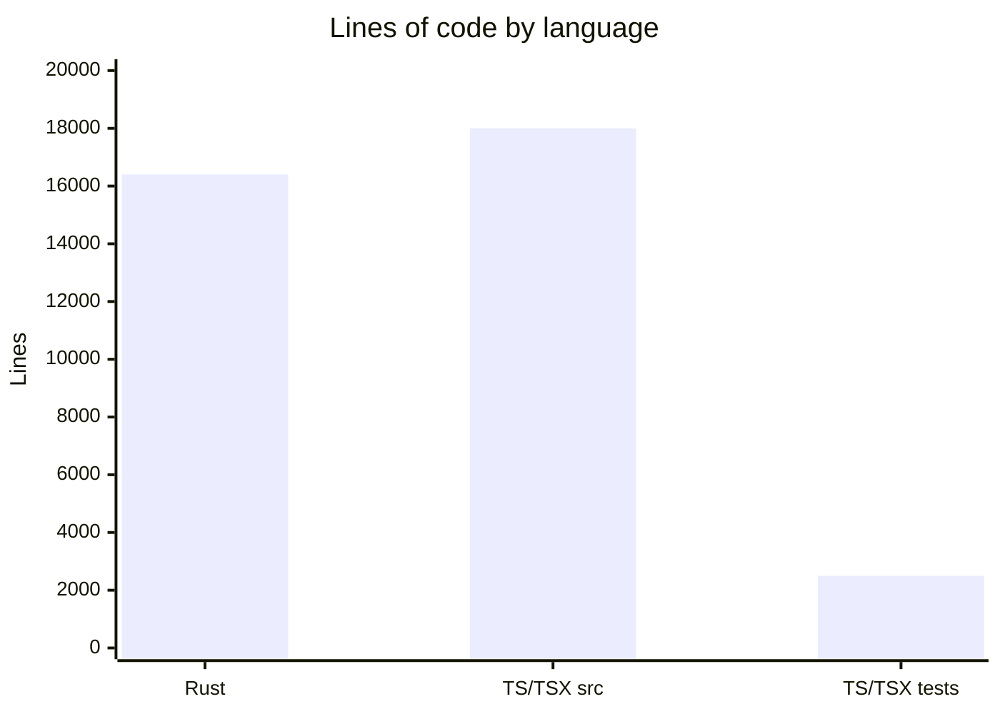

# By the numbers

Data collected on 2026-06-23.

## Size

The codebase is split between Rust (backend) and TypeScript/TSX (frontend). Rust is the larger portion by line count because it contains all the native logic (screen capture, keyboard hooks, image processing, audio playback, window management).

| Language | Source files | Lines of code |
|----------|-------------|---------------|
| Rust | 58 | ~16,400 |
| TypeScript/TSX (excl. tests) | 111 | ~18,000 |
| TypeScript/TSX (tests) | 14 | ~2,500 |
| CSS | 1 (App.css) | - |
| **Total** | ~184 | ~37,000 |

### Language breakdown

### File counts

| Category | Count |
|----------|-------|
| Rust source (.rs) | 58 |
| Frontend source (.ts/.tsx, excl. tests) | 111 |
| Frontend tests (.test.ts/.test.tsx) | 14 |
| shadcn/ui base components | ~60 |
| Tool page components | ~30 |
| React hooks | 13 |

## Activity

| Metric | Value |
|--------|-------|
| Total commits | 219 |
| Commits in last 90 days | 219 |
| Unique commit authors | 3 (IZRINO: 173, OMP Agent: 45, 徐跃: 1) |

The entire commit history falls within the last 90 days, indicating this is a young, actively developed project. The commit history was likely squashed or migrated at some point.

### Bot-attributed commits

The "OMP Agent" author (45 commits, ~20% of total) appears to be an AI agent co-author. This is a lower bound on AI-assisted work; inline AI tools leave no trace in git history.

## Complexity

### Largest Rust modules

| Module | Files | Description |
|--------|-------|-------------|
| `morse/` | 8 | Screen capture, binarization, contour detection, decoder, overlay, input |
| `hotkeys.rs` | 1 (large) | Shared keyboard hook, conflict detection, hold matching (~600+ lines with tests) |
| `audio/` | 6 | Three trigger modes, watcher loops, playback worker |
| `rapidfire/` | 4 | Session state machine, worker threads, hold callbacks |
| `logging/` | 4 | Format, writer, macros, public API |
| `theme/` | 6 | Built-in themes, token merge, import/export |

### Largest frontend files

The tool page containers (`morse-page.tsx`, `timer-page.tsx`, `rapidfire-page.tsx`, `audio-page.tsx`, `strategy-page.tsx`) and `App.tsx` are the largest frontend files, each containing state orchestration, form handling, and autosave logic.

### Test-to-code ratio

- Frontend: 14 test files / 111 source files (~13% file coverage)
- Rust: tests are inline in each module, focused on types, serde round-trips, and hotkey logic

### Bus factor

With 3 unique authors (one being an AI agent), the project has a bus factor of approximately 2 humans. The primary author (IZRINO) holds ~79% of commits.
