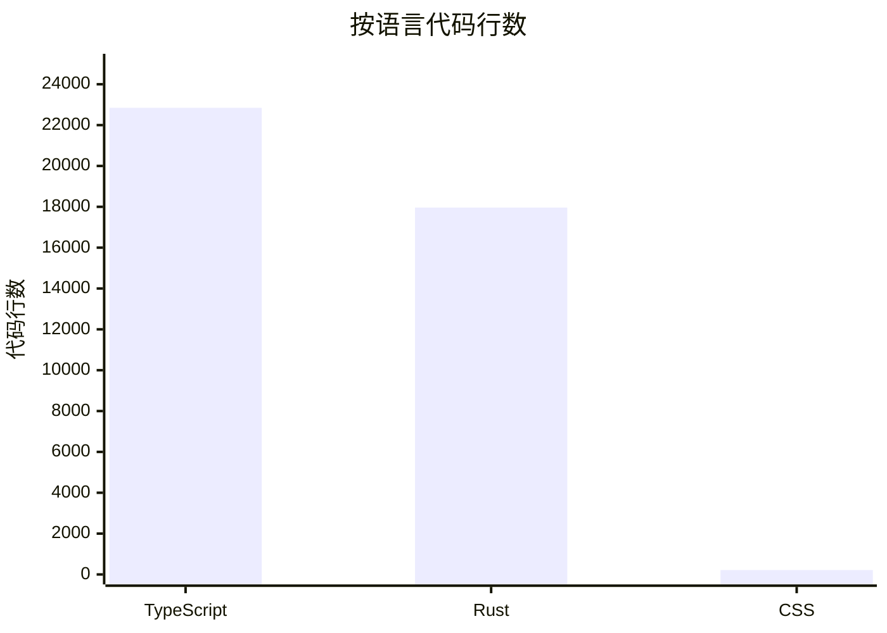
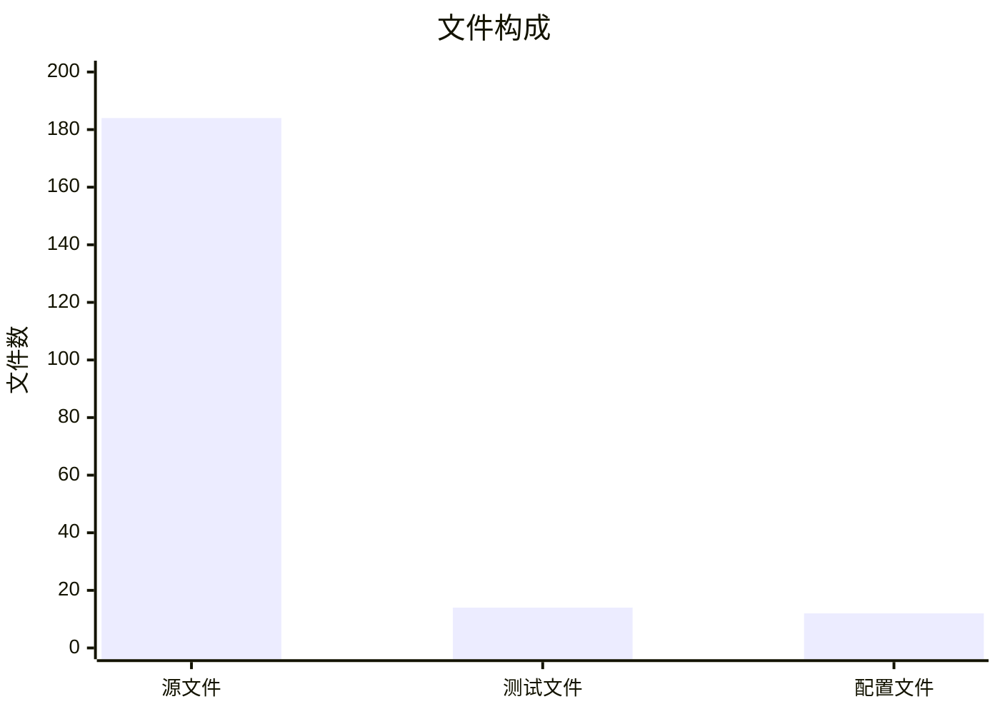
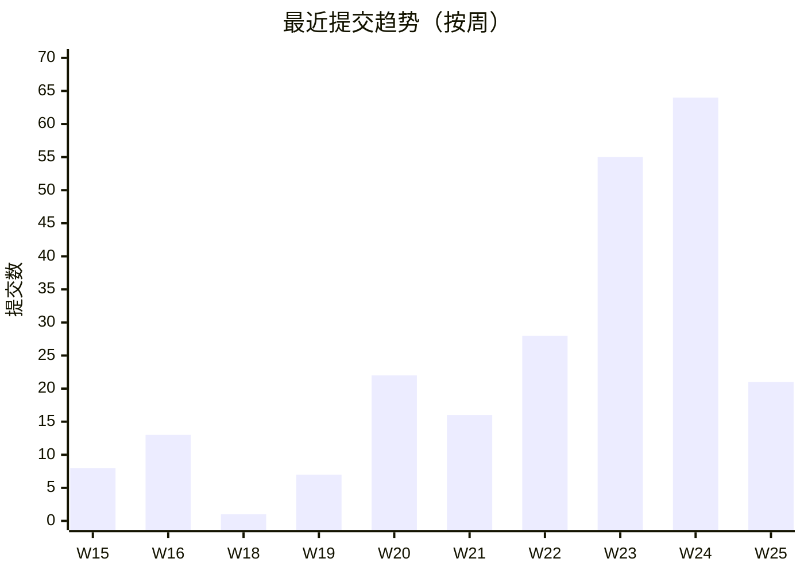
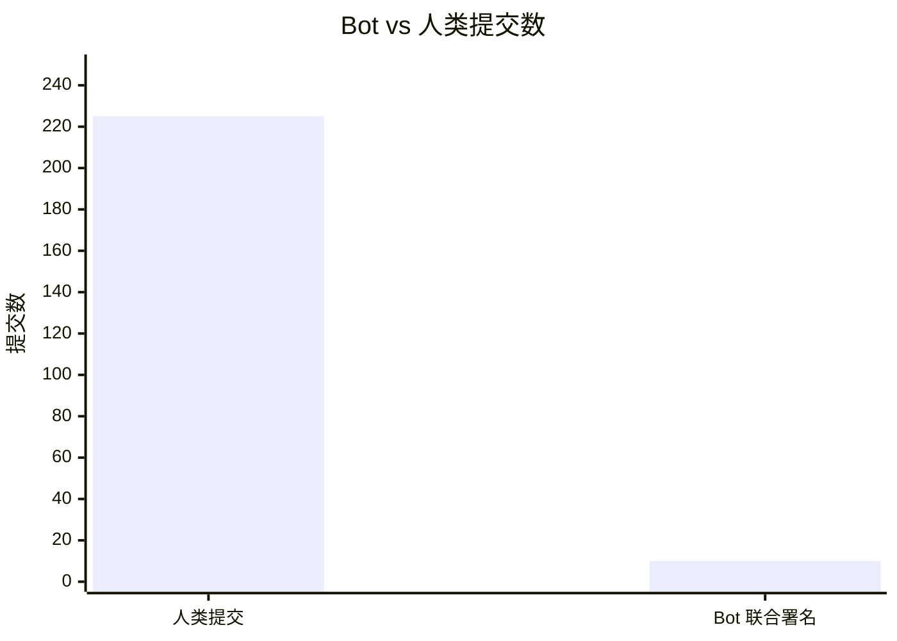

# 代码库统计

> 数据采集于 2026-06-25。所有数值来自 `git log`、文件系统枚举与正则符号统计，统计口径见各节说明。

## 规模

### 按语言的代码行数

统计口径：Rust 为 `src-tauri/src/` 下全部 `.rs` 文件；TypeScript 为 `src/` 下全部 `.ts`/`.tsx` 文件；CSS 为 `src/` 下全部 `.css` 文件。行数按物理行计（含空行与注释）。

| 语言 | 文件数 | 代码行数 | 占比 |
|------|-------:|---------:|-----:|
| TypeScript（`.ts`/`.tsx`） | 125 | 22,846 | 55.7% |
| Rust（`.rs`） | 58 | 17,964 | 43.8% |
| CSS（`.css`） | 1 | 214 | 0.5% |
| **合计** | **184** | **41,024** | **100%** |

### 文件构成

统计口径：源文件为业务代码文件；测试文件为前端 `*.test.ts`/`*.test.tsx`（Rust 测试以 `#[cfg(test)]` 内联模块形式存在，不单独计数）；配置文件为根目录与 `src-tauri/` 下的构建/清单/能力声明文件（`package.json`、`Cargo.toml`、`tauri.conf.json`、`capabilities/*.json`、`vite.config.ts`、`tsconfig*.json`、`bun.lock` 等）。

| 类别 | 数量 |
|------|-----:|
| 源文件（Rust + TS/TSX + CSS） | 184 |
| 测试文件（前端） | 14 |
| 配置文件 | 12 |
| **合计** | **210** |

### 模块数

统计口径：Rust 模块按 `src-tauri/src/` 下含源文件的子目录计；前端模块按 `src/` 下含源文件的子目录计。

| 端 | 模块数 |
|----|------:|
| Rust 后端 | 10 |
| 前端 | 6 |
| **合计** | **16** |

## 活跃度

### 提交趋势

统计口径：按 ISO 周聚合最近 120 天的提交数（`git log --since="120 days ago"`），格式为 `年-周序号`。

| 周 | 提交数 |
|----|------:|
| 2026-W15 | 8 |
| 2026-W16 | 13 |
| 2026-W18 | 1 |
| 2026-W19 | 7 |
| 2026-W20 | 22 |
| 2026-W21 | 16 |
| 2026-W22 | 28 |
| 2026-W23 | 55 |
| 2026-W24 | 64 |
| 2026-W25 | 21 |

- 总提交数：**235**
- 首次提交：**2026-04-18**
- 最近提交：**2026-06-24**
- 活跃跨度：约 **67 天**
- 日均提交：约 **3.5 次/天**
- 版本标签（Tag）数：**63**

### 最近 90 天最活跃变更（Churn Hotspots）

统计口径：`git log --since="90 days ago" --name-only`，按文件路径聚合变更次数（含修改/新增/删除），取前 15。

| 排名 | 文件/路径 | 变更次数 |
|-----:|----------|--------:|
| 1 | `src-tauri/Cargo.toml` | 89 |
| 2 | `package.json` | 85 |
| 3 | `src-tauri/Cargo.lock` | 85 |
| 4 | `src-tauri/tauri.conf.json` | 82 |
| 5 | `AGENTS.md` | 61 |
| 6 | `src-tauri/src/rapidfire/mod.rs` | 41 |
| 7 | `src-tauri/src/lib.rs` | 38 |
| 8 | `src/components/app/rapidfire-page.tsx` | 38 |
| 9 | `src/App.tsx` | 37 |
| 10 | `src/components/app/timer-page.tsx` | 35 |
| 11 | `README.md` | 34 |
| 12 | `src-tauri/src/timer/mod.rs` | 33 |
| 13 | `src/components/app/morse-page.tsx` | 23 |
| 14 | `src/components/app/strategy-page.tsx` | 21 |
| 15 | `CLAUDE.md` | 21 |

> 前四名为版本号同步与依赖锁文件，属高频机械变更；`rapidfire/mod.rs` 与 `rapidfire-page.tsx` 是近期功能开发的核心热点。

## Bot 贡献

统计口径：`git log --grep="Co-authored-by.*\[bot\]"`，统计 commit message 正文含 `Co-authored-by` 且署名为 `*[bot]` 的提交。一个提交若有多个 bot 联合署名则按署名分别计数，但提交数去重。

| 指标 | 数值 |
|------|-----:|
| 总提交数 | 235 |
| Bot 联合署名提交数 | 10 |
| Bot 贡献占比 | **4.3%** |

### Bot 署名分布

| Bot | 联合署名次数 |
|-----|-----------:|
| `factory-droid[bot]` | 10 |

> 当前所有 bot 贡献均来自 `factory-droid[bot]`（Factory 平台 AI 协作署名）。统计仅覆盖 commit message 中显式声明的联合署名，未声明 bot 身份的提交不计入。

## 复杂度

### 按目录的平均文件大小

统计口径：各目录下源文件的平均物理行数，按平均行数降序。

#### Rust 后端

| 目录 | 文件数 | 平均行数/文件 |
|------|------:|------------:|
| `src-tauri/src/rapidfire` | 4 | 662 |
| `src-tauri/src/audio` | 6 | 560 |
| `src-tauri/src/timer` | 4 | 402 |
| `src-tauri/src/profile` | 3 | 289 |
| `src-tauri/src/counter` | 5 | 289 |
| `src-tauri/src`（根） | 12 | 280 |
| `src-tauri/src/logging` | 4 | 253 |
| `src-tauri/src/morse` | 8 | 236 |
| `src-tauri/src/about` | 2 | 216 |
| `src-tauri/src/theme` | 6 | 155 |
| `src-tauri/src/strategy` | 4 | 102 |

#### 前端

| 目录 | 文件数 | 平均行数/文件 |
|------|------:|------------:|
| `src/components/app` | 45 | 318 |
| `src`（根） | 3 | 184 |
| `src/components/ui` | 56 | 109 |
| `src/hooks` | 16 | 94 |
| `src/lib` | 5 | 81 |

### 导出符号数最多的模块

统计口径：Rust 统计 `pub fn`/`pub struct`/`pub enum`/`pub trait` 数量；TypeScript 统计 `export` 声明的 `const`/`function`/`class`/`interface`/`type`/`enum` 数量。取前 15。

#### Rust 后端

| 排名 | 文件 | 总符号数 | 函数 | 结构体 | 枚举 | Trait |
|-----:|------|-------:|----:|-----:|----:|------:|
| 1 | `src-tauri/src/sync_tool.rs` | 21 | 10 | 4 | 1 | 6 |
| 2 | `src-tauri/src/hotkey_types.rs` | 18 | 10 | 3 | 5 | 0 |
| 3 | `src-tauri/src/audio/mod.rs` | 18 | 11 | 7 | 0 | 0 |
| 4 | `src-tauri/src/logging/mod.rs` | 17 | 13 | 3 | 1 | 0 |
| 5 | `src-tauri/src/hotkeys.rs` | 17 | 16 | 1 | 0 | 0 |
| 6 | `src-tauri/src/counter/mod.rs` | 15 | 13 | 2 | 0 | 0 |
| 7 | `src-tauri/src/timer/mod.rs` | 14 | 12 | 2 | 0 | 0 |
| 8 | `src-tauri/src/key_suppressor.rs` | 13 | 11 | 2 | 0 | 0 |
| 9 | `src-tauri/src/timer/types.rs` | 12 | 0 | 8 | 4 | 0 |
| 10 | `src-tauri/src/rapidfire/mod.rs` | 11 | 10 | 1 | 0 | 0 |
| 11 | `src-tauri/src/morse/mod.rs` | 11 | 10 | 1 | 0 | 0 |
| 12 | `src-tauri/src/morse/types.rs` | 10 | 0 | 9 | 1 | 0 |
| 13 | `src-tauri/src/counter/types.rs` | 9 | 0 | 8 | 1 | 0 |
| 14 | `src-tauri/src/profile/mod.rs` | 9 | 8 | 1 | 0 | 0 |
| 15 | `src-tauri/src/logging/writer.rs` | 9 | 8 | 1 | 0 | 0 |

#### 前端

| 排名 | 文件 | 导出符号数 |
|-----:|------|---------:|
| 1 | `src/components/app/rapidfire-types.ts` | 44 |
| 2 | `src/components/app/app-ui.tsx` | 29 |
| 3 | `src/components/app/timer-types.ts` | 27 |
| 4 | `src/components/app/strategy-utils.ts` | 26 |
| 5 | `src/components/app/morse-types.ts` | 22 |
| 6 | `src/components/app/favorites-utils.ts` | 19 |
| 7 | `src/components/app/timer-utils.ts` | 16 |
| 8 | `src/components/app/audio-types.ts` | 16 |
| 9 | `src/components/app/morse-utils.ts` | 11 |
| 10 | `src/components/app/counter-utils.ts` | 11 |
| 11 | `src/lib/tauri-events.ts` | 9 |
| 12 | `src/components/app/profile-utils.ts` | 9 |
| 13 | `src/components/app/theme-types.ts` | 8 |
| 14 | `src/components/app/theme-utils.ts` | 8 |
| 15 | `src/lib/logging.ts` | 8 |

### 最大文件 Top 10

#### Rust 后端

| 排名 | 文件 | 行数 |
|-----:|------|----:|
| 1 | `src-tauri/src/rapidfire/mod.rs` | 2,106 |
| 2 | `src-tauri/src/audio/watcher.rs` | 1,674 |
| 3 | `src-tauri/src/hotkeys.rs` | 1,363 |
| 4 | `src-tauri/src/timer/mod.rs` | 1,300 |
| 5 | `src-tauri/src/audio/mod.rs` | 1,155 |
| 6 | `src-tauri/src/counter/mod.rs` | 1,107 |
| 7 | `src-tauri/src/profile/mod.rs` | 665 |
| 8 | `src-tauri/src/morse/recognition.rs` | 518 |
| 9 | `src-tauri/src/morse/overlay.rs` | 514 |
| 10 | `src-tauri/src/key_suppressor.rs` | 501 |

#### 前端

| 排名 | 文件 | 行数 |
|-----:|------|----:|
| 1 | `src/components/app/audio-page.tsx` | 1,250 |
| 2 | `src/components/app/rapidfire-page.tsx` | 1,232 |
| 3 | `src/components/app/audio-utils.test.ts` | 803 |
| 4 | `src/components/app/rapidfire-types.ts` | 762 |
| 5 | `src/components/app/app-ui.tsx` | 740 |
| 6 | `src/components/app/counter-page.tsx` | 675 |
| 7 | `src/components/app/timer-page.tsx` | 646 |
| 8 | `src/components/ui/sidebar.tsx` | 643 |
| 9 | `src/components/app/favorites-page.tsx` | 619 |
| 10 | `src/components/app/morse-page.tsx` | 580 |

## 统计口径说明

| 指标 | 方法 |
|------|------|
| 代码行数 | 物理行（含空行与注释），`Get-Content \| Measure-Object -Line` |
| 文件数 | `Get-ChildItem -Recurse` 枚举，按扩展名/名称过滤 |
| 提交数 | `git log --oneline \| Measure-Object` |
| 提交日期 | `git log --format="%ai"`，首条为最新、`--reverse` 首条为最早 |
| Bot 提交 | `git log --grep="Co-authored-by.*\[bot\]"`，仅统计 commit message 显式声明 |
| Churn | `git log --since="90 days ago" --name-only` 按 `Group-Object` 聚合 |
| 符号数 | 正则匹配 `pub fn/struct/enum/trait`（Rust）与 `export` 声明（TypeScript） |
| 模块数 | 含源文件的子目录数 |
