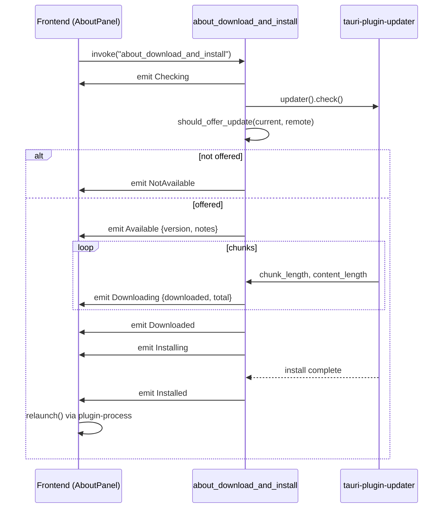

# About and updater

The About module (`src-tauri/src/about/`) is the surface that shows the app's version, license and dependency attribution, and it hosts the integrated Tauri auto-updater flow. It is exposed to the frontend through three commands and one progress event, and rendered by `AboutPanel` inside the unified `SettingsDialog`.

## Purpose

- Provide a single bootstrap payload (`AboutBootstrap`) carrying version, identifier, license text, repository URL and a hardcoded dependency acknowledgment list.
- Drive the official `tauri-plugin-updater` check → download → install pipeline entirely from Rust, streaming progress to the frontend via `about://update-progress`.
- Implement a SemVer full-order comparison (`should_offer_update`) so beta builds correctly upgrade to the same-numeric stable, but stable builds never downgrade to a beta.
- Offer a graceful fallback ("open GitHub Release page") when the updater is not configured (missing pubkey) or the release JSON cannot be fetched.

## Directory layout

```
src-tauri/src/about/
├── mod.rs          # AboutState-less module: commands, UpdateProgress enum, SemVer helpers, dependency list, error classification
└── events.rs       # UPDATE_PROGRESS event name constant ("about://update-progress")

src/components/app/
├── about-page.tsx     # AboutPanel (version/update/log-level/license/attributions) + AboutDialog thin wrapper
├── about-types.ts     # AboutBootstrap, UpdateInfo, UpdateProgress, Dependency TypeScript types
├── about-deps.ts      # DEPENDENCIES constant mirroring Rust built_in_dependencies() (frontend fallback)
└── settings-page.tsx  # SettingsDialog: theme / profile / about tabs (AboutPanel reused in about tab)

src/lib/tauri-events.ts  # ABOUT_EVENTS.updateProgress + listenEvent<T> helper
```

## Key abstractions

| Abstraction | Path | Role |
|---|---|---|
| `AboutBootstrap` | `src-tauri/src/about/mod.rs` | One-shot payload: name, version, identifier, target, tauriVersion, license, licenseUrl, repositoryUrl, dependencies[]. Returned by `about_get_bootstrap`. |
| `UpdateInfo` | `src-tauri/src/about/mod.rs` | Result of `about_check_for_update`: `{ available, version?, notes?, pubDate? }`. |
| `UpdateProgress` | `src-tauri/src/about/mod.rs` | Tagged enum (`#[serde(tag = "phase")]`) streamed via `about://update-progress`. Phases: `checking`, `notAvailable`, `available`, `downloading` (downloaded/total), `downloaded`, `installing`, `installed`, `error`. |
| `Dependency` | `src-tauri/src/about/mod.rs` | `{ name, kind ("frontend"|"runtime"), license, url }` — hardcoded acknowledgement list. |
| `should_offer_update` | `src-tauri/src/about/mod.rs` | Pure SemVer comparison: `version_rank(remote) > version_rank(current)`. |
| `version_rank` | `src-tauri/src/about/mod.rs` | `(major, minor, patch, is_stable, pre_release_str)` — stable ranks higher than same-numeric beta. |
| `AboutPanel` | `src/components/app/about-page.tsx` | React panel; activates data fetch only when `active` prop is true (lazy inside SettingsDialog about tab). |
| `SettingsDialog` | `src/components/app/settings-page.tsx` | Unified entry: theme / profile / about tabs; opens AboutPanel with `active={open && tab === "about"}`. |

## How it works

### Bootstrap

`about_get_bootstrap` is a synchronous command. It pulls `app.package_info()` for name/version, embeds `LICENSE` at compile time via `include_str!("../../../LICENSE")`, and returns `built_in_dependencies()` — a hardcoded `Vec<Dependency>` covering ~13 frontend deps (React, Vite, remixicon, tauri plugins, radix, shadcn, tailwind, sonner, date-fns) and ~19 Rust runtime deps (tauri, reqwest, enigo, willhook, xcap, image, rodio, tokio, serde, etc.). The frontend mirrors this list in `src/components/app/about-deps.ts` (`DEPENDENCIES`) as a fallback for browser preview mode; both lists must be kept in sync manually.

### Update check

`about_check_for_update` uses `tauri_plugin_updater::UpdaterExt` to query the configured GitHub Releases endpoint. Crucially, it does **not** trust the updater's own availability verdict blindly — it wraps the result with `should_offer_update(current, remote)` so the SemVer ordering is enforced on the Rust side:

```mermaid
flowchart TD
    A[about_check_for_update] --> B[app.updater().check]
    B -->|err| C[classify_check_error → Chinese msg]
    B -->|Some update| D{should_offer_update current, remote}
    D -->|true| E[UpdateInfo available=true, version, notes, pubDate]
    D -->|false| F[UpdateInfo available=false]
    B -->|None| F
```

### SemVer comparison

`should_offer_update(current, remote)` returns true only when `version_rank(remote) > version_rank(current)`. `version_rank` splits the version into the numeric tuple `(major, minor, patch)` (pre-release suffix stripped via `numeric_version_tuple`) plus an `is_stable` boolean and the raw pre-release string:

- `0.17.0-beta.5` → `(0, 17, 0, false, "beta.5")`
- `0.17.0` → `(0, 17, 0, true, "")`

Because `true > false`, the same-numeric stable ranks higher than its beta. This yields the three required outcomes:

| Current | Remote | Offer? | Reason |
|---|---|---|---|
| `0.17.0-beta.5` | `0.17.0` | yes | stable > beta (same numeric) |
| `0.17.0-beta.5` | `0.17.1` | yes | numeric higher |
| `0.17.0` | `0.17.0-beta.5` | no | stable never downgrades to beta |
| `0.17.0` | `0.17.1` | yes | numeric higher |

### Download and install

`about_download_and_install` is the streaming pipeline. It emits `UpdateProgress` to the `main` window at each phase, calls `should_offer_update` again (defensive), then `update.download_and_install(progress_cb, on_done_cb)`. On success it emits `Installed`; the frontend then prompts the user to `relaunch()` via `@tauri-apps/plugin-process`.



### Error classification

Two helper functions translate updater errors into user-facing Chinese strings:
- `classify_updater_error` — pubkey/signature errors become "自动更新未配置签名密钥，请前往 GitHub Release 页面手动下载更新".
- `classify_check_error` — fetch/release JSON/404 errors become "暂无可用更新文件…"; network/timeout/DNS errors become "网络连接失败: …".

Both also emit an `UpdateProgress::Error` event so the frontend can show the failure inline.

### Beta vs stable endpoints

Beta builds do **not** get a separate update channel. They query the same stable endpoint (`/releases/latest/download/latest.json`). Because GitHub's `/releases/latest` only resolves non-prerelease releases, a beta user sees "已是最新" until a higher stable is published, at which point `should_offer_update` returns true and the signed stable installer is downloaded. See the release workflow in `CLAUDE.md` for the full asset matrix (`setup.exe` + `.sig` + `latest.json` for stable; `setup.exe` only for beta).

## Integration points

- **`src-tauri/src/lib.rs`** — `about_get_bootstrap`, `about_check_for_update`, `about_download_and_install` must be registered in `generate_handler![]` (under the `about` group).
- **`src-tauri/capabilities/default.json`** — commands must be permitted.
- **`tauri.conf.json`** — `plugins.updater` configures the GitHub endpoint, `installMode: "passive"`, and `pubkey`. An empty `pubkey` causes `about_check_for_update` to return the pubkey error string; the frontend then degrades to "open GitHub Release page".
- **`src/lib/tauri-events.ts`** — `ABOUT_EVENTS.updateProgress` centralizes the event name; `AboutPanel` subscribes via `listenEvent`.
- **`src/hooks/use-native-shell.ts`** — `AboutPanel` gates all `invoke` calls behind `isNativeShell`; browser preview shows "更新功能仅在桌面端可用".
- **Logging** — `AboutPanel` also renders a log-level radio group that calls `getLogSettings`/`setLogSettings` from `src/lib/logging.ts` (see `../systems/logging.md`).

## Entry points for modification

- **Add a dependency to the acknowledgment list**: add to `built_in_dependencies()` in `src-tauri/src/about/mod.rs` **and** to `DEPENDENCIES` in `src/components/app/about-deps.ts`. Both must stay in sync.
- **Change update endpoint / pubkey**: edit `tauri.conf.json` `plugins.updater`; regenerate keys via `scripts/setup-update-key.ps1`.
- **Add a new `UpdateProgress` phase**: extend the enum in `src-tauri/src/about/mod.rs` (it uses `#[serde(tag = "phase")]`) and the `UpdateProgress` discriminated union in `src/components/app/about-types.ts`, then handle it in `AboutPanel`'s `statusItems` switch.
- **Change SemVer rules**: edit `should_offer_update` / `version_rank` and update the tests in `src-tauri/src/about/mod.rs` `#[cfg(test)]`.

## Key source files

| File | Purpose |
|---|---|
| `src-tauri/src/about/mod.rs` | Commands, `AboutBootstrap`, `UpdateProgress`, SemVer helpers, dependency list, error classification, unit tests. |
| `src-tauri/src/about/events.rs` | `UPDATE_PROGRESS = "about://update-progress"` constant. |
| `src/components/app/about-page.tsx` | `AboutPanel` (version/update/log-level/license/attributions UI) + `AboutDialog` thin wrapper. |
| `src/components/app/about-types.ts` | `AboutBootstrap`, `UpdateInfo`, `UpdateProgress`, `Dependency` TypeScript types. |
| `src/components/app/about-deps.ts` | `DEPENDENCIES` constant mirroring Rust list (frontend fallback). |
| `src/components/app/settings-page.tsx` | `SettingsDialog` with theme/profile/about tabs; about tab lazily mounts `AboutPanel`. |
| `src/lib/tauri-events.ts` | `ABOUT_EVENTS` + `listenEvent<T>` helper. |
