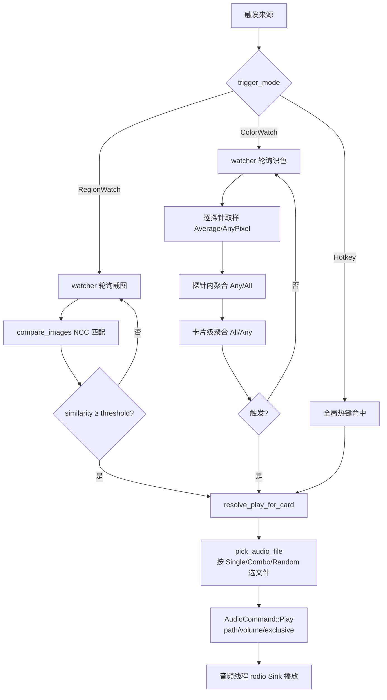

# 音频触发器

## 目的

音频触发器（Audio）模块在游戏运行时按需播放本地音频文件，支持三种触发方式：快捷键、屏幕区域图像匹配（RegionWatch）、屏幕区域识色匹配（ColorWatch）。在触发方式之上叠加文件选择策略（播放方式）：单文件（Single）、连杀（Combo，窗口内按序递增）、随机（Random，不重复上一次）。

典型用途：连杀提示音、技能冷却提示、战斗节拍音、基于屏幕状态变化触发的提示音（如血量条变色、UI 图标出现）。

音频触发器构建在共享工具基座之上，复用 [工具基座](../systems/tool-base.md) 的 `ToolLogic` / `ToolState<T>` 泛型基座，热键注册走 [热键系统](../systems/hotkeys.md)，区域框选通过透明 overlay 窗口完成（见 [透明叠加窗](../systems/overlay-windows.md)）。

## 目录结构

```text
src-tauri/src/audio/
├── mod.rs          # 模块入口：AudioLogic、Tauri commands、热键重启、设置规范化、pick_audio_file
├── types.rs        # AudioSettings / AudioCard / AudioTriggerMode / PlayMode / ColorProbe / ColorTarget 等
├── settings.rs     # audio_settings.json 读写
├── watcher.rs      # 区域监听 watcher（RegionWatch + ColorWatch 轮询）+ 图像匹配 NCC
├── player.rs       # 音频播放协调器（专用线程 + rodio OutputStream + Sink）
└── events.rs       # 事件名常量

src/components/app/
├── audio-page.tsx     # 前端容器页（Bootstrap/Form 双状态 + autosave）
├── audio-types.ts     # 前端 TypeScript 类型
└── audio-utils.ts     # settingsToForm / parseSettingsForm / 颜色转换等纯函数
```

## 关键抽象

| 抽象 | 定义位置 | 职责 |
|------|---------|------|
| `AudioLogic` | `audio/mod.rs` | 实现 `ToolLogic` trait，持有播放线程命令发送端 `playback_tx` 与卡片级运行时状态 `play_states` |
| `AudioState` | `audio/mod.rs` | `ToolState<AudioLogic>` 类型别名，共享工具基座的状态容器 |
| `AudioSettings` | `audio/types.rs` | 持久化结构：总开关 `audio_enabled` + 卡片列表 `cards`，落盘为 `audio_settings.json` |
| `AudioCard` | `audio/types.rs` | 单张音频卡片配置：触发模式、热键、监听区域/参考图/阈值/轮询间隔、音频文件列表、播放方式、音量、冷却、并发策略、识色探针 |
| `AudioTriggerMode` | `audio/types.rs` | 枚举 `Hotkey` / `RegionWatch` / `ColorWatch`，决定触发来源 |
| `PlayMode` | `audio/types.rs` | 枚举 `Single` / `Combo` / `Random`，决定多文件时的文件选择策略 |
| `ColorProbe` | `audio/types.rs` | 识色探针：`region`（可为 None 的草稿态）+ `targets`（多目标颜色）+ `probe_match_mode`（探针内聚合） |
| `ColorTarget` | `audio/types.rs` | 单个目标颜色 `[R,G,B]` + 独立容差 |
| `ColorMatchMode` | `audio/types.rs` | 多探针聚合：`All`（全部命中才触发）/ `Any`（任一命中即触发） |
| `ColorMatchMethod` | `audio/types.rs` | 单探针匹配方式：`Average`（区域平均色）/ `AnyPixel`（单像素命中） |
| `PlayState` | `audio/mod.rs` | 卡片级运行时状态（纯内存，不持久化）：`current_index` / `last_trigger_at` / `last_random_index` |
| `AudioCommand` | `audio/player.rs` | 播放线程命令枚举：`Play { path, volume, exclusive }` / `Shutdown` |
| `TestMatchResult` | `audio/mod.rs` | `audio_test_match` 返回：相似度 + 是否触发 + 匹配位置 |
| `ColorTestResult` | `audio/mod.rs` | `audio_test_color_match` 返回：是否触发 + 命中探针数 + 每探针/每目标详情 |

## 工作原理

### 三种触发模式

1. **Hotkey（快捷键）**：在 `restart_hotkey_listeners` 中为每张启用且 `trigger_mode == Hotkey` 的卡片注册全局热键，scope 为 `"audio"`，冲突策略 `ConflictPolicy::AllowHold`（允许与计时器/计数器普通 scope 同键共存）。命中时调用 `trigger_audio_play` → `resolve_audio_path` 选出文件 → 通过 `playback_tx` 发送 `AudioCommand::Play`。

2. **RegionWatch（区域图像监听）**：`watcher::run_region_watcher` 在独立 tokio task 中按 `watch_poll_interval_ms`（最小 100ms）轮询。每轮截取 `watch_region` 区域，与参考图像做滑动窗口 RGB NCC 模板匹配（`compare_images`），相似度 ≥ `watch_match_threshold` 即触发。命中后受 `cooldown_ms` 冷却约束。

3. **ColorWatch（区域识色监听）**：`watcher::run_color_watcher` 轮询所有探针。每探针截取其 `region`，按 `color_match_method` 取样：
   - `Average`：取区域平均 RGB
   - `AnyPixel`：逐像素比对，任一像素命中即记命中
   
   每探针含多个 `ColorTarget`（各自独立容差），探针内按 `probe_match_mode`（`Any`/`All`）聚合。所有探针结果再按卡片级 `color_match_mode`（`All`/`Any`）聚合决定是否触发。

### 播放方式（pick_audio_file）

`pick_audio_file` 根据当前 `PlayState` 与 `PlayMode` 选出本次播放文件：

- **Single**：直接返回 `files[0]`，不更新状态
- **Combo**：距上次触发 < 当前 index 的连杀窗口 → `current_index+1`（封顶末首）；否则复位 0。per-segment 窗口取自 `combo_windows[current_index]`，缺省 index 回落到 `combo_window_ms`（Issue #62）
- **Random**：`random_index` 伪随机选一个，避免与 `last_random_index` 重复

### 识色探针草稿态

`ColorProbe.region` 可为 `None`（用户刚新增探针、尚未框选区域）。`restart_watchers` 会跳过含 None 探针的卡片，使其能作为中间态被保存（Issue #61/#60），避免 autosave 因 region 缺失而整体失败。

### 播放协调器

`player.rs` 启动专用音频线程（`audio-playback`）持有 rodio `OutputStream`（非 Send/Sync，必须在创建线程持有）。前端/热键/watcher 通过 `mpsc::Sender<AudioCommand>` 发送播放命令。`allow_simultaneous=false` 时 `exclusive=true`，停止当前 primary sink 再播放（互斥）；`true` 时追加到 `simultaneous_sinks` 并发播放。

### 流程图



## 集成点

### Tauri commands

| 命令 | 作用 |
|------|------|
| `audio_get_bootstrap` | 返回 `AudioBootstrap`（settings + hotkey_error），由 `tool_base::get_bootstrap` 转发 |
| `audio_save_settings` | 规范化 → 写盘 → 更新内存 → 释放状态锁 → 重启热键 listener → 重启 watcher → emit state + 更新 profile snapshot。热键注册失败时回滚到旧设置 |
| `audio_begin_region_selection` | 创建透明全屏 overlay 窗口（`audio-overlay-{cardId}`）用于框选，识色模式透传 `probe_index` |
| `audio_overlay_submit_selection` | 提交框选区域：识色写探针 region，区域监听写 `watch_region`；重启 watcher 并 emit state |
| `audio_overlay_cancel_selection` | 取消并关闭 overlay 窗口 |
| `audio_test_play` | 立即播放该卡片当前选中的文件（测试用） |
| `audio_test_match` | 区域监听测试：截图 + 比对参考图，返回相似度/是否触发/匹配位置 |
| `audio_test_color_match` | 识色测试：返回是否触发 + 命中探针数 + 每探针每目标详情 |
| `audio_read_reference_image` | 读取参考图返回 base64 PNG data URL 供前端预览 |

### 事件

| 事件名 | 常量 | 触发时机 |
|--------|------|---------|
| `audio://state-changed` | `STATE_CHANGED` | 保存设置后 emit `AudioBootstrap` |
| `audio://hotkey-triggered` | `HOTKEY_TRIGGERED` | 快捷键触发播放成功 |
| `audio://region-matched` | `REGION_MATCHED` | RegionWatch 命中阈值 |
| `audio://hotkey-error` | `HOTKEY_ERROR` | 快捷键触发播放失败 |

### 依赖关系

- **工具基座**：`ToolLogic` trait、`ToolState<AudioLogic>`、`get_bootstrap`
- **热键系统**：scope `"audio"`，`ConflictPolicy::AllowHold`，录制时暂停 scope
- **全局总开关**：watcher 循环内实时读 `GlobalState`，关闭时跳过截图与匹配
- **透明叠加窗**：区域框选 overlay，`?mode=audio-overlay`
- **持久化**：`audio_settings.json`（通过 `settings.rs`）
- **Profile 快照**：保存后 `profile::update_active_profile_snapshot` 写入 `ActiveProfileSnapshotPatch::Audio`

## 修改入口

| 需求 | 修改位置 |
|------|---------|
| 新增触发模式 | `AudioTriggerMode` 枚举 + `watcher.rs` 新增 watcher + `restart_watchers` 分支 + `audio_test_*` |
| 调整连杀/随机文件选择逻辑 | `pick_audio_file`（`mod.rs`），配套单测在 `#[cfg(test)] mod tests` |
| 新增播放方式 | `PlayMode` 枚举 + `pick_audio_file` 分支 + 前端 `AudioPlayMode` 类型 |
| 调整识色匹配算法 | `watcher.rs` 的 `probe_hit_targets` / `aggregate_probe_hits_pub` |
| 调整图像匹配算法 | `watcher.rs` 的 `compare_images`（NCC 滑动窗口） |
| 新增 Tauri command | `mod.rs` 定义 + `src-tauri/src/lib.rs` `generate_handler!` 注册 + `capabilities/default.json` |
| 调整播放并发策略 | `player.rs` 的 `AudioCommand::Play.exclusive` 与 `allow_simultaneous` 字段 |
| 设置迁移/规范化 | `normalize_settings`（`mod.rs`） |

## 关键源文件

| 文件 | 仓库根路径 |
|------|-----------|
| 模块入口 | `src-tauri/src/audio/mod.rs` |
| 数据类型 | `src-tauri/src/audio/types.rs` |
| 设置读写 | `src-tauri/src/audio/settings.rs` |
| 区域/识色 watcher | `src-tauri/src/audio/watcher.rs` |
| 播放协调器 | `src-tauri/src/audio/player.rs` |
| 事件常量 | `src-tauri/src/audio/events.rs` |
| 前端容器页 | `src/components/app/audio-page.tsx` |
| 前端类型 | `src/components/app/audio-types.ts` |
| 前端工具函数 | `src/components/app/audio-utils.ts` |

## 相关系统

- [工具基座](../systems/tool-base.md)
- [热键系统](../systems/hotkeys.md)
- [透明叠加窗](../systems/overlay-windows.md)
