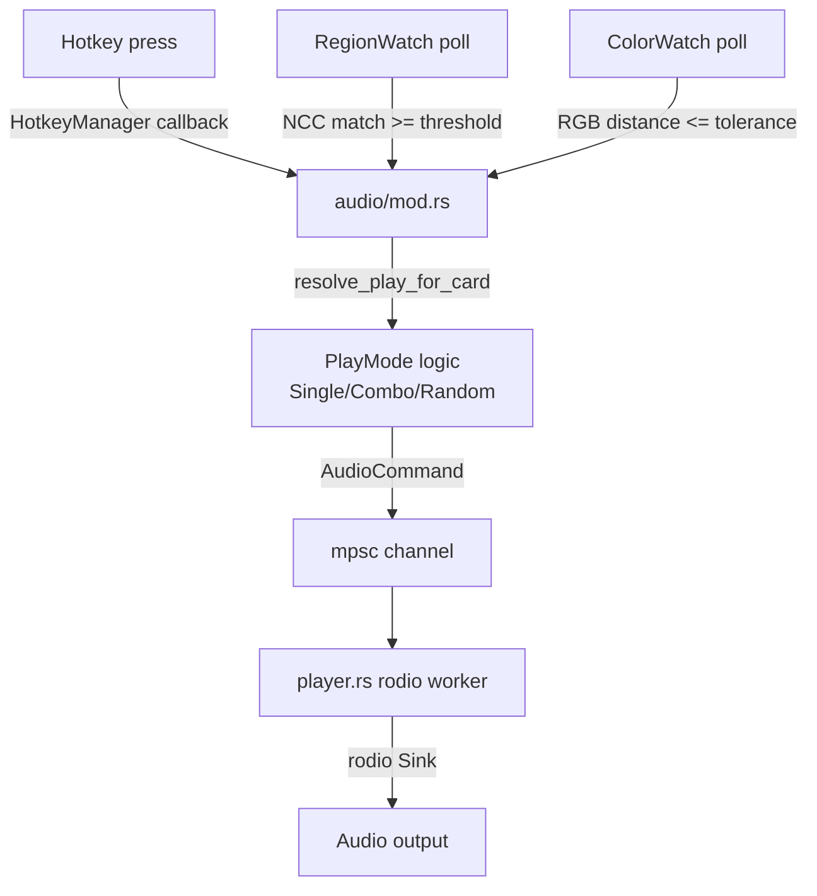

# Audio

The audio feature plays sound files in response to three kinds of triggers: keyboard hotkeys, screen region image matching (RegionWatch), and multi-region color matching (ColorWatch). Each card is an independent trigger-playback unit with its own volume, cooldown, play mode, and file list.

## Directory layout

```
src-tauri/src/audio/
├── mod.rs          # AudioState, command registration, hotkey/watcher orchestration
├── types.rs        # AudioSettings, AudioCard, ColorProbe, ColorTarget, enums
├── events.rs       # event name constants
├── watcher.rs      # run_region_watcher (NCC template match), run_color_watcher (RGB distance)
├── player.rs       # rodio playback worker, concurrency control
└── settings.rs     # audio_settings.json persistence

src/components/app/
├── audio-page.tsx       # frontend container, card config, overlay region selection
├── audio-types.ts       # frontend types
└── audio-utils.ts       # rgbToHex/hexToRgb/probeToForm/parseProbeForm conversions
```

## Key abstractions

| Type | File | Description |
|------|------|-------------|
| `AudioState` | `src-tauri/src/audio/mod.rs` | Tool state wrapping settings, watchers, and the playback channel |
| `AudioSettings` | `src-tauri/src/audio/types.rs` | Root config: `audio_enabled` + `cards: Vec<AudioCard>` |
| `AudioCard` | `src-tauri/src/audio/types.rs` | Single trigger-playback unit: trigger mode, files, volume, cooldown, probes |
| `AudioTriggerMode` | `src-tauri/src/audio/types.rs` | Enum: `Hotkey`, `RegionWatch`, `ColorWatch` |
| `PlayMode` | `src-tauri/src/audio/types.rs` | File selection: `Single`, `Combo` (sequential kill-streak), `Random` |
| `ColorProbe` | `src-tauri/src/audio/types.rs` | Region + multiple `ColorTarget`s + probe-level match mode |
| `ColorTarget` | `src-tauri/src/audio/types.rs` | RGB color + tolerance (euclidean distance threshold) |
| `ColorMatchMode` | `src-tauri/src/audio/types.rs` | `All` (all probes must hit) or `Any` (any probe hits) |
| `ColorMatchMethod` | `src-tauri/src/audio/types.rs` | `Average` (mean region RGB) or `AnyPixel` (single pixel match) |
| `AudioBootstrap` | `src-tauri/src/audio/types.rs` | Settings + hotkey_error returned to frontend |

## How it works

The audio module registers hotkeys (for Hotkey mode cards) and spawns watcher tasks (for RegionWatch/ColorWatch cards) when settings are saved. All playback goes through a single `player::AudioCommand` mpsc channel consumed by a rodio worker thread.



### Trigger modes

- **Hotkey** - Registers a normal-scope hotkey via `HotkeyManager::replace_scope`. On key-down, resolves the file per `PlayMode` and sends a play command.
- **RegionWatch** - Spawns `run_region_watcher`, an async loop that captures the card's `watch_region` every `watch_poll_interval_ms`, compares it against a saved reference image using normalized cross-correlation (NCC). When the match score exceeds `watch_match_threshold` (default 0.75), it triggers playback (subject to cooldown). Requires a `watch_reference_image_path`.
- **ColorWatch** - Spawns `run_color_watcher`, which samples each `ColorProbe`'s region, computes either the average RGB or checks every pixel (per `ColorMatchMethod`), and compares against each `ColorTarget` using euclidean distance. A probe "hits" when one of its targets is within tolerance (or all, per `probe_match_mode`). The card triggers when probes aggregate per `color_match_mode` (`All` or `Any`). No reference image needed.

### Play modes

- **Single** - Plays the single file (or first in `audio_files`).
- **Combo** - Sequential kill-streak: plays `audio_files[i]`, advances to `i+1` if the next trigger fires within `combo_windows[i]` (or `combo_window_ms` default 60000ms if not specified for that index). Stays on last file after the list is exhausted. Resets to first on timeout.
- **Random** - Picks a random file, avoiding repeat of the last one.

### Concurrency

Cards are mutually exclusive by default (one plays at a time). Setting `allow_simultaneous: true` on a card lets its audio overlap with other cards. The player worker handles this via mutex-guarded sink management.

### Legacy field migration

`AudioCard` has `legacy_audio_file_path` (old single-value field) that `normalize_settings` migrates into `audio_files`. Similarly, `ColorProbe` has `legacy_target_color`/`legacy_tolerance` migrated into `targets`. These legacy fields use `skip_serializing` so new JSON only outputs the modern shape.

## Integration points

- **HotkeyManager** - Hotkey-mode cards register under the `"audio"` scope. See [hotkeys](../systems/hotkeys.md).
- **Overlay windows** - Region/color probe selection reuses the `audio-overlay` label, sharing the overlay flow with Morse. See [overlay windows](../systems/overlay-windows.md).
- **GlobalState** - Watcher loops check `GlobalState::enabled()` each tick and skip when the global switch is off.
- **xcap** - Screen capture for both watcher modes.
- **rodio** - Audio playback engine.
- **Profile** - Settings are snapshotted by the profile system.

## Entry points for modification

To add a new trigger mode, extend `AudioTriggerMode`, add the watcher launch logic in `src-tauri/src/audio/mod.rs::save_settings`, and add the polling loop in `src-tauri/src/audio/watcher.rs`. To change the color matching algorithm, modify `match_color_probes` and the per-probe distance functions in `watcher.rs`. To add a new play mode, extend `PlayMode` and update `resolve_play_for_card` in `mod.rs`.

## Key source files

| File | Purpose |
|------|---------|
| `src-tauri/src/audio/mod.rs` | AudioState, command handlers, watcher/hotkey orchestration |
| `src-tauri/src/audio/types.rs` | All audio data structures and enums |
| `src-tauri/src/audio/watcher.rs` | RegionWatch (NCC) and ColorWatch (RGB distance) polling loops |
| `src-tauri/src/audio/player.rs` | rodio playback worker with concurrency control |
| `src-tauri/src/audio/settings.rs` | audio_settings.json load/save + normalize_settings |
| `src-tauri/src/audio/events.rs` | Event name constants: state-changed, hotkey-triggered, region-matched |
| `src/components/app/audio-page.tsx` | Frontend container with card config and overlay selection |
| `src/components/app/audio-types.ts` | Frontend TypeScript types |
| `src/components/app/audio-utils.ts` | Color conversion and form parsing utilities |
