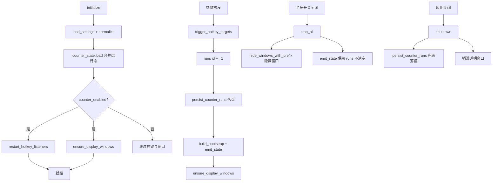

# 计数器

> 多计数器系统，每个分组拥有独立的透明叠加显示窗口。计数器跟踪累积值，运行态独立持久化，应用重启后恢复。支持热键触发递增、手动调整与重置。

## 用途

计数器模块为《三角洲行动》玩家提供游戏内计数辅助。典型场景包括击杀计数、物资统计、回合记录等。计数器以透明叠加窗形式覆盖在游戏画面之上，保持置顶与点击穿透，不干扰游戏操作。

核心能力：

- **多计数器**：不限数量的计数器条目，按分组组织，每个分组拥有独立的透明显示窗口。
- **起始值**：每个计数器可配置 `startValue`，重置时回到该值。
- **运行态持久化**：计数器实际累加到的值独立保存到 `counter_state.json`，与配置文件分离，应用重启后恢复。
- **热键递增**：每个计数器绑定独立热键，按下即递增 1。
- **手动调整**：`counter_adjust` 支持任意正负 delta（下限为 0）。
- **重置**：`counter_reset` 将指定计数器回到 `startValue`。
- **位置校准**：每个分组可通过独立的位置设置窗口拖拽定位透明显示窗。

> 计数器与计时器原为同一工具，于 v0.15.3（2026-06-15）拆分为两个独立工具，各自拥有独立页面与独立的状态管理。

## 目录结构

```
src-tauri/src/counter/
├── mod.rs              # 模块入口：状态、commands、透明窗口管理、位置状态机
├── types.rs            # CounterSettings / CounterItem / CounterGroup / CounterRunState 等类型
├── counter_state.rs    # 运行态独立持久化（counter_state.json，含旧文件迁移）
├── settings.rs         # load_settings / save_settings（持久化到 counter_settings.json）
└── events.rs           # 事件名常量

src/components/app/
├── counter-page.tsx    # 计数器页面组件（配置、运行态、透明窗预览、调整/重置）
├── counter-utils.ts    # settingsToForm / parseSettingsForm 等表单转换
└── timer-types.ts      # 前端 TypeScript 类型（计数器类型也定义在此文件）
```

## 关键抽象

| 抽象 | 定义位置 | 职责 |
|------|----------|------|
| `CounterSettings` | `counter/types.rs` | 顶层配置：总开关、显示设置、分组列表、计数器列表 |
| `CounterItem` | `counter/types.rs` | 单个计数器配置：startValue、hotkey、enabled |
| `CounterGroup` | `counter/types.rs` | 计数器分组：id、name、enabled、display（独立透明窗位置与透明度） |
| `CounterRunState` | `counter/types.rs` | 序列化的运行态：id + 当前累加值，随 Bootstrap 返回前端 |
| `CounterRunStateSnapshot` | `counter/counter_state.rs` | 运行态持久化结构：`BTreeMap<counter_id, value>`，key 有序便于 diff |
| `CounterLogic` | `counter/mod.rs` | `SyncToolLogic` + `RunsSync` 实现，持有 `runs: HashMap<String, i64>` 与位置设置会话 |
| `CounterState` | `counter/mod.rs` | 顶层状态：`ToolState<CounterLogic>` |
| `CounterBootstrap` | `counter/types.rs` | 前端拉取的完整快照：settings + counter_runs + hotkey_error |

## 工作原理

### 生命周期



### 运行态持久化

计数器的运行态（实际累加值）与配置**分离存储**，这是计数器与计时器的关键差异：

| 文件 | 内容 | 写入时机 |
|------|------|----------|
| `counter_settings.json` | 配置（总开关、分组、计数器列表、显示位置） | `counter_save_settings` |
| `counter_state.json` | 运行态（每个 counter id 的当前值） | 每次累加、每次重置、每次 adjust、应用关闭兜底 |

`counter_state.rs` 的 `load` 函数：

1. 优先读取 `counter_state.json`。
2. 若不存在，尝试从旧文件 `timer_counter_state.json` 迁移（计数器与计时器拆分前的遗留文件），读取成功后写入新文件。
3. 解析失败或 IO 错误时回落到空快照。

`initialize` 时合并配置与运行态：遍历 `settings.counters`，若 `counter_state` 中有对应 id 则用保存的值，否则用 `startValue`。孤儿 ID（配置中已删除但状态文件中残留）被丢弃。

> 使用 `BTreeMap` 而非 `HashMap`，让 JSON 序列化的 key 有序，方便 diff 与 git 跟踪。

### 热键绑定

`SyncToolLogic::build_hotkey_bindings` 将所有启用计数器按热键分组，注册为普通 scope 快捷键（`bindings.normal`）。计数器**不使用 hold scope**（无 Release 触发模式），因此 `bindings.hold` 始终为空。

冲突策略为 `ConflictPolicy::AllowHold`（`SyncToolLogic` 默认值），允许计数器普通 scope 与计时器普通 scope、连发器 hold scope 共享同一热键。详见 [热键系统](../systems/hotkeys.md)。

### 透明显示窗口

每个启用的分组拥有独立的透明显示窗口：

- 窗口 label：默认分组为 `counter-display`，其他分组为 `counter-display-{groupId}`。
- 窗口属性：无边框（`decorations(false)`）、透明（`transparent(true)`）、置顶（`always_on_top(true)`）、点击穿透（`set_ignore_cursor_events(true)`）、跳过任务栏。
- 查询参数：`?mode=counter-display&groupId={groupId}`，前端据此渲染对应分组的计数器列表。
- `ensure_display_windows` 在每次状态变更后同步窗口位置、大小与可见性，并销毁已不存在的分组窗口。

### 位置校准（复用共享状态机）

计数器位置校准复用 `sync_tool` 模块的共享位置状态机：

- `PendingCounterPosition` 通过 `pending_counter_to_sync` 转换为 `PendingPosition<CounterRect>`。
- `counter_position_commit` / `counter_position_cancel` / `counter_position_moved` 调用 `apply_position_event<CounterRect, CounterSelectionKind>` 统一处理状态转移。
- `CounterRect` 实现 `SyncRect` trait，`CounterSelectionKind` 实现 `PositionKinds` trait。

这与计时器不同（计时器自行实现位置状态机）。详见 [同步工具基座](../systems/sync-tool.md)。

### 全局开关行为（Issue #64）

全局开关关闭时，`stop_all` 的行为经过专门设计（Issue #64 修复）：

- **保留** `runs` 中的累积值（不清空）。
- 通过 `hide_windows_with_prefix` **隐藏**透明窗口（不销毁）。
- 重新打开全局开关时，`ensure_display_windows` 直接 `show` 恢复窗口，累积值不丢失。

这确保玩家在关闭再打开全局开关后，计数器的累加值与窗口位置完整恢复。

`counter_run_states` 函数在构建 Bootstrap 时优先取 `runs` 中的值，仅在缺失时回落到 `startValue`，配合上述保留逻辑确保累积值正确呈现。

## 集成点

| 集成方 | 关系 |
|--------|------|
| [工具基座](../systems/tool-base.md) | `CounterLogic` 实现 `ToolLogic` trait，复用 `ToolState<T>` / `ToolStateInner<T>` / `get_bootstrap` 泛型基座 |
| [同步工具基座](../systems/sync-tool.md) | `CounterLogic` 实现 `SyncToolLogic` + `RunsSync`，复用 `normalize_sync_settings`、`restart_sync_hotkeys`、`apply_position_event`；`CounterSettings` 实现 `SyncSettings`，`CounterItem`/`CounterGroup` 实现 `SyncItem`/`SyncGroup`，`CounterRect` 实现 `SyncRect`，`CounterSelectionKind` 实现 `PositionKinds` |
| [热键系统](../systems/hotkeys.md) | scope 名 `"counter"`，冲突策略 `AllowHold`；仅使用普通 scope（无 hold） |
| [透明叠加窗](../systems/overlay-windows.md) | 每个分组一个透明显示窗 + 位置校准窗，均无边框/透明/置顶/点击穿透 |
| Profile | `ActiveProfileSnapshotPatch::Counter` 在保存设置时同步到当前 Profile 快照；`reset_runs_to_start_values` 供 Profile 切换时按需重置 |

### 持久化

| 文件 | 内容 |
|------|------|
| `counter_settings.json` | 完整配置（总开关、分组、计数器列表、显示位置） |
| `counter_state.json` | 运行态（每个 counter id 的当前累加值，独立于配置） |

## Tauri Commands

| Command | 签名 | 说明 |
|---------|------|------|
| `counter_get_bootstrap` | `() -> CounterBootstrap` | 拉取完整快照（settings + counter_runs + hotkey_error） |
| `counter_save_settings` | `(settings: CounterSettings) -> CounterBootstrap` | 规范化并保存配置，重启热键监听，刷新透明窗口，合并运行态 |
| `counter_trigger` | `(counterIds: string[]) -> CounterBootstrap` | 热键/手动触发指定计数器（递增 1） |
| `counter_reset` | `(counterId: string) -> CounterBootstrap` | 重置指定计数器到 startValue |
| `counter_adjust` | `(counterId: string, delta: number) -> CounterBootstrap` | 手动调整计数器值（正负 delta，下限 0） |
| `counter_begin_position_selection` | `(groupId?: string) -> CounterSelectionOutcome` | 启动位置校准流程（async） |
| `counter_position_commit` | `() -> CounterBootstrap` | 提交校准位置并持久化 |
| `counter_position_cancel` | `() -> void` | 取消校准，回滚位置 |
| `counter_position_moved` | `(x, y) -> CounterRect` | 校准过程中实时更新暂存位置 |

## 事件

| 事件名 | 常量 | Payload | 说明 |
|--------|------|---------|------|
| `counter://state-changed` | `events::STATE_CHANGED` | `CounterBootstrap` | 状态变更（触发、重置、调整、保存）广播到主窗口与各显示窗口 |
| `counter://hotkey-error` | `events::HOTKEY_ERROR` | `String` | 热键触发执行失败时的错误信息 |
| `counter://hotkey-triggered` | `events::HOTKEY_TRIGGERED` | `string[]` | 成功触发的计数器 ID 列表 |

前端通过 `src/lib/tauri-events.ts` 的 `COUNTER_EVENTS` 字符串常量与显式泛型 `listen<CounterBootstrap>(COUNTER_EVENTS.stateChanged, callback)` 订阅。

## 修改入口

| 需求 | 修改位置 |
|------|----------|
| 新增计数器配置字段 | `counter/types.rs`（`CounterItem`）+ `counter/mod.rs`（`normalize_counter`、`trigger_hotkey_targets`）+ `timer-types.ts`（`CounterItem`）+ `counter-utils.ts` |
| 修改运行态持久化 | `counter/counter_state.rs`（`CounterRunStateSnapshot`、`load`、`save`） |
| 修改全局开关行为 | `counter/mod.rs` 的 `stop_all`（保留 runs + 隐藏窗口） |
| 新增透明窗口行为 | `counter/mod.rs` 的 `ensure_overlay_window` / `ensure_display_windows` |
| 修改位置校准逻辑 | `counter/mod.rs` 的 `counter_position_*` commands（调用 `sync_tool::apply_position_event`） |
| 新增 Tauri command | `counter/mod.rs`（`#[tauri::command]`）+ `src-tauri/src/lib.rs`（`generate_handler!`）+ `src-tauri/capabilities/default.json` |
| 新增事件 | `counter/events.rs`（常量）+ `src/lib/tauri-events.ts`（`COUNTER_EVENTS`） |

## 关键源文件

| 文件 | 路径 |
|------|------|
| 模块入口 | `src-tauri/src/counter/mod.rs` |
| 类型定义 | `src-tauri/src/counter/types.rs` |
| 运行态持久化 | `src-tauri/src/counter/counter_state.rs` |
| 设置持久化 | `src-tauri/src/counter/settings.rs` |
| 事件常量 | `src-tauri/src/counter/events.rs` |
| 同步工具基座 | `src-tauri/src/sync_tool.rs` |
| 工具泛型基座 | `src-tauri/src/tool_base.rs` |
| 热键管理 | `src-tauri/src/hotkeys.rs` |
| 叠加窗工具 | `src-tauri/src/overlay_utils.rs` |
| 前端页面 | `src/components/app/counter-page.tsx` |
| 前端类型 | `src/components/app/timer-types.ts` |
| 前端表单转换 | `src/components/app/counter-utils.ts` |
| 事件订阅 | `src/lib/tauri-events.ts` |
