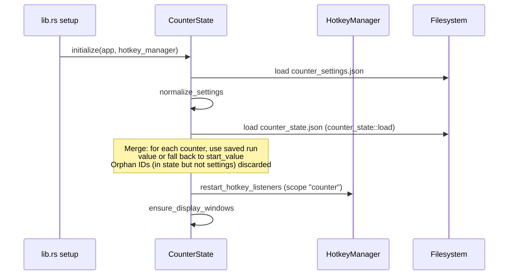

# Counter board

## Purpose

The counter board is a multi-counter tally panel. It lets players define any number of counter cards, each with its own hotkey, start value, and enabled flag. Triggering a hotkey increments all counters bound to that hotkey by one. The current values are rendered on a transparent, always-on-top, click-through overlay window so the player can track counts without leaving the game.

A key design decision is that **run-state is persisted separately** from user config: the counter definitions (name, hotkey, start value) live in `counter_settings.json`, while the accumulated values live in `counter_state.json`. This decouples editing a counter's configuration from losing its current count. When counters are deleted, their orphaned run values are cleaned up automatically.

## Directory layout

Backend (Rust):

```
src-tauri/src/counter/
├── mod.rs            # CounterState, CounterLogic, trigger/reset/adjust, transparent/position windows, stop_all, shutdown, initialize
├── types.rs          # CounterSettings, CounterItem, CounterGroup, CounterDisplaySettings, CounterBootstrap, CounterRunState, selection outcome
├── events.rs         # event name string constants (STATE_CHANGED, HOTKEY_TRIGGERED, HOTKEY_ERROR)
├── settings.rs       # counter_settings.json load/save helpers
└── counter_state.rs  # counter_state.json independent run-state persistence (load/save, legacy migration, orphan cleanup)
```

Frontend (React/TypeScript):

```
src/components/app/
├── counter-page.tsx           # Counter page container: bootstrap/form state, autosave, card list, display/position UI
├── timer-types.ts             # Shared types: CounterItem, CounterSettings, CounterBootstrap, CounterRunState, CounterItemForm, CounterSettingsForm, constants
├── counter-utils.ts           # counterSettingsToForm/parseCounterSettingsForm, overlay bootstrap hook, moveCounterItem, counterRunsById, dirty check
├── sync-overlay-window.tsx    # Shared CounterDisplayOverlay + CounterPositionOverlay components (also used by timer)
└── sync-card-list.tsx         # Shared card list layout with AddCardButton + drag reorder section grid
```

Persistence:

```
<app_config_dir>/counter_settings.json   # user config: counter cards, groups, display rect, font opacity, master switch
<app_config_dir>/counter_state.json      # run-state: { runs: { "<counterId>": <value> } } (BTreeMap, sorted keys)
```

## Key abstractions

| Abstraction | Location | Description |
|-------------|----------|-------------|
| `CounterState` | `src-tauri/src/counter/mod.rs` | Wraps `ToolState<CounterLogic>`. No extra fields beyond the tool base. |
| `CounterLogic` | `src-tauri/src/counter/mod.rs` | Implements `ToolLogic`; owns `runs: HashMap<String, i64>` (accumulated values) and `pending_position`. |
| `CounterSettings` | `src-tauri/src/counter/types.rs` | Root config: `counter_enabled`, `display`, `counter_groups`, `counters`. |
| `CounterItem` | `src-tauri/src/counter/types.rs` | One counter card: `id`, `group_id`, `name`, `start_value` (i64), `hotkey`, `enabled`. |
| `CounterGroup` | `src-tauri/src/counter/types.rs` | A display group with its own `display` rect/opacity; multiple groups get separate overlay windows. |
| `CounterBootstrap` | `src-tauri/src/counter/types.rs` | Snapshot sent to frontend: `settings` + `counter_runs` + `hotkey_error`. |
| `CounterRunState` | `src-tauri/src/counter/types.rs` | Read-only run snapshot for a single counter: `{ id, value }`. |
| `CounterRunStateSnapshot` | `src-tauri/src/counter/counter_state.rs` | Persisted run-state: `runs: BTreeMap<String, i64>`. Uses `BTreeMap` for deterministic, sorted JSON keys. |
| `CounterSelectionOutcome` | `src-tauri/src/counter/types.rs` | Result of a position-selection flow: `Selected` / `Cancelled` / `Closed` + `rect` + `group_id`. |

## How it works

### Initialization: merging settings with saved runs

`initialize()` (`src-tauri/src/counter/mod.rs`) loads and normalizes `counter_settings.json`, then loads `counter_state.json` via `counter_state::load()`. It merges the two: for each counter in settings, it looks up the saved run value; if none exists it falls back to `start_value`. Orphan IDs (run values for counters that no longer exist in settings) are discarded. The merged `runs` HashMap becomes the in-memory `CounterLogic.runs`.



### Trigger, reset, and adjust

- **`counter_trigger(counter_ids)`**: Locks the inner state, and for each valid (enabled, group-enabled) counter, increments its run value by 1 (inserting `start_value` if no run exists yet). Calls `persist_counter_runs()` to write `counter_state.json`, emits `counter://state-changed`, ensures display windows, and emits `counter://hotkey-triggered`.
- **`counter_reset(counter_id)`**: Sets the counter's run value back to its `start_value`, persists, emits state.
- **`counter_adjust(counter_id, delta)`**: Adjusts the run value by `delta` (clamped to >= 0), persists, emits state. Used for manual +/- from the UI.

```mermaid
flowchart TB
    A[Hotkey pressed] --> B[trigger_hotkey_targets]
    B --> C{counter_enabled?}
    C -- No --> D[Return current bootstrap]
    C -- Yes --> E[For each target counter]
    E --> F{Enabled & group enabled?}
    F -- No --> G[Skip]
    F -- Yes --> H[runs[id] = runs[id] or start_value]
    H --> I[runs[id] += 1]
    I --> J{Any changed?}
    J -- Yes --> K[persist_counter_runs -> counter_state.json]
    J -- No --> L[Skip persist]
    K --> M[emit counter://state-changed]
    L --> M
    M --> N[ensure_display_windows]
    N --> O[emit counter://hotkey-triggered]
```

### Independent run-state persistence

`counter_state::load()` (`src-tauri/src/counter/counter_state.rs`) reads `counter_state.json`. If the file is missing or corrupt, it attempts a one-time migration from the legacy file `timer_counter_state.json` (when timer and counter shared state) and writes it to the new path. On any error it returns an empty default snapshot.

`persist_counter_runs()` in `mod.rs` builds a `BTreeMap` from the current `settings.counters` and `logic.runs` (only counters that still exist in settings are included), then saves via `counter_state::save()`. This is called on every trigger, reset, adjust, and on `shutdown()` as a final flush.

The `BTreeMap` ensures JSON keys are sorted, making `counter_state.json` diff-friendly for git tracking.

### Hotkey registration

`restart_hotkey_listeners()` groups enabled counters by hotkey string. Each group becomes a normal `HotkeyAction` binding registered under scope `"counter"` with `ConflictPolicy::AllowHold`. When a hotkey fires, `trigger_hotkey_targets()` increments all counters bound to that hotkey. Counters do not use the hold mechanism (unlike timers with release-trigger mode).

Because both timer and counter use `ConflictPolicy::AllowHold`, the same key can be bound to a timer (normal scope) and a counter (normal scope) simultaneously; the hotkey manager dispatches to both scopes. See `../systems/hotkeys.md` for conflict policy details.

### Transparent overlay windows

Each counter group gets its own display window. The label is `counter-display` for the default group (`DEFAULT_COUNTER_GROUP_ID = "default-counter-group"`) and `counter-display-<groupId>` for custom groups. The query mode is `counter-display&groupId=<encoded>`. Windows are created borderless, transparent, always-on-top, click-through, skipped from the taskbar, and non-focused. Minimum width is 320px (`COUNTER_DISPLAY_WIDTH`); height is computed by `display_height(item_count)` = `max(96, 48 + max(1, count) * 30)`.

`ensure_display_windows()` destroys stale display windows via `destroy_stale_windows`.

Position setting uses a separate window with label `counter-position` (or `counter-position-<groupId>`), mode `counter-position&groupId=<encoded>`. It uses a `oneshot` channel to communicate the outcome back to `counter_begin_position_selection`, and commits via `counter_position_commit` / cancels via `counter_position_cancel`. Drag updates flow through `counter_position_moved`.

See `../systems/overlay-windows.md` for the shared overlay/position window infrastructure.

### Master switch, stop_all, and shutdown

`counter_save_settings()` normalizes and saves settings, restarts hotkey listeners, retains runs for counters that still exist (and seeds any new counters with `start_value`), and if `counter_enabled` is false resets all runs to `start_value` and hides display windows. It also pushes the new settings to the active profile snapshot.

`stop_all()` destroys display windows and emits the current state (it does **not** clear `runs`, so accumulated values are preserved). This is an intentional regression guard: clearing runs on stop_all would lose counts. The accumulated values survive in `logic.runs` and are persisted.

`shutdown()` clears the hotkey scope, flushes `persist_counter_runs()` as a final save, and destroys all position and display windows.

### Profile apply: reset to start values

When a profile is applied (`profile::apply_snapshot_to_tools`), `reset_runs_to_start_values()` is called. It replaces `logic.runs` with each counter's `start_value` from the newly-loaded settings and persists. This ensures switching profiles resets counts to the new profile's configured starting points.

## Integration points

- **ToolBase** (`../systems/tool-base.md`): `CounterLogic` implements `ToolLogic`; shared `settings` and `hotkey_error` live in `ToolStateInner<CounterLogic>`.
- **Hotkeys** (`../systems/hotkeys.md`): Registers scope `"counter"` with `ConflictPolicy::AllowHold`. Same-key coexistence with timer (normal) and rapidfire (hold) scopes is allowed; conflicts with morse (Strict) are rejected.
- **Overlay windows** (`../systems/overlay-windows.md`): Display and position windows use the shared helpers in `src-tauri/src/overlay_utils.rs` (`destroy_stale_windows`, `destroy_window`, `hide_window`, `safe_label_component`, `encoded_query_value`).
- **Profile** (`src-tauri/src/profile/`): `counter_save_settings` and `counter_position_commit` push `ActiveProfileSnapshotPatch::Counter`. Profile apply calls `reset_runs_to_start_values`.
- **GlobalState** (`src-tauri/src/global_state.rs`): Disabling the global switch calls `counter::stop_all`, which destroys display windows (accumulated values are preserved).
- **Frontend events** (`src/lib/tauri-events.ts`): `COUNTER_EVENTS.stateChanged`, `.hotkeyTriggered`, `.hotkeyError` centralize the event names from `src-tauri/src/counter/events.rs`.

## Entry points for modification

| Task | Start here |
|------|-----------|
| Add a new counter field | `CounterItem` in `src-tauri/src/counter/types.rs` → `normalize_counter` / `normalize_settings` in `src-tauri/src/counter/mod.rs` → `timer-types.ts` (CounterItem/CounterItemForm) + `counter-utils.ts` (counterSettingsToForm/parseCounterSettingsForm) → `counter-page.tsx` UI |
| Change run-state persistence | `counter_state.rs` (load/save/snapshot) + `persist_counter_runs` in `src-tauri/src/counter/mod.rs` |
| Change transparent window creation | `ensure_overlay_window` / `ensure_display_windows` in `src-tauri/src/counter/mod.rs` |
| Change overlay rendering | `CounterDisplayOverlay` in `src/components/app/sync-overlay-window.tsx` |
| Add a new Tauri command | Define in `src-tauri/src/counter/mod.rs` → register in `lib.rs` `generate_handler![]` → add to `src-tauri/capabilities/default.json` |
| Change position window behavior | `counter_begin_position_selection` / `counter_position_commit` / `counter_position_cancel` / `counter_position_moved` + `PositionOverlay` in `src/components/ui/position-overlay.tsx` |
| Change profile reset behavior | `reset_runs_to_start_values` in `src-tauri/src/counter/mod.rs` |
| Change hotkey conflict policy | `restart_hotkey_listeners` in `src-tauri/src/counter/mod.rs` (see `../systems/hotkeys.md`) |

## Key source files

| File | Role |
|------|------|
| `src-tauri/src/counter/mod.rs` | Core state, trigger/reset/adjust, hotkey registration, transparent/position windows, all Tauri commands, `initialize`/`shutdown`/`stop_all`/`reset_runs_to_start_values`/`persist_counter_runs` |
| `src-tauri/src/counter/types.rs` | All DTOs and enums with `#[serde(rename_all = "camelCase")]` |
| `src-tauri/src/counter/events.rs` | Event name constants: `STATE_CHANGED`, `HOTKEY_TRIGGERED`, `HOTKEY_ERROR` |
| `src-tauri/src/counter/settings.rs` | `counter_settings.json` load/save via shared `settings` helpers |
| `src-tauri/src/counter/counter_state.rs` | `counter_state.json` independent run-state persistence, legacy migration from `timer_counter_state.json`, `CounterRunStateSnapshot` |
| `src/components/app/counter-page.tsx` | Frontend container: bootstrap/form dual-state, autosave, card list, display/position UI |
| `src/components/app/timer-types.ts` | Shared frontend types: `CounterItem`, `CounterSettings`, `CounterBootstrap`, `CounterRunState`, `CounterItemForm`, `CounterSettingsForm`, constants |
| `src/components/app/counter-utils.ts` | Settings↔form conversion, overlay bootstrap hook, `moveCounterItem`, `counterRunsById`, dirty check |
| `src/components/app/sync-overlay-window.tsx` | Shared `CounterDisplayOverlay` and `CounterPositionOverlay` |
| `src/components/app/sync-card-list.tsx` | Shared card list section grid with `AddCardButton` |
| `src/lib/tauri-events.ts` | `COUNTER_EVENTS` constant object + `listenEvent<T>` helper |
