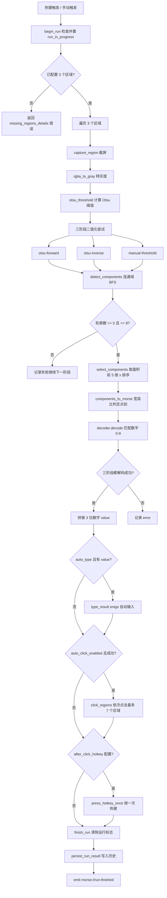
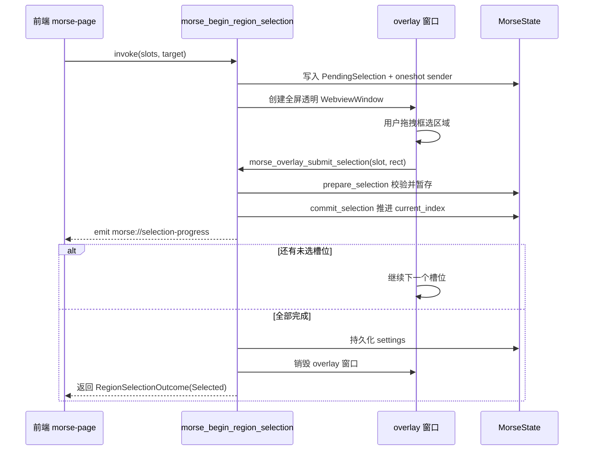

# 摩斯密码识别

## 用途

摩斯密码识别模块用于自动破解《三角洲行动》游戏内的摩斯密码谜题。用户通过热键触发识别流程，模块会截取屏幕上预设的 3 个区域，对每个区域进行二值化与连通域分析，识别其中的摩斯码（点 `.` 与划 `-`），再匹配到数字 0-9，最后将识别结果自动输入到游戏，并可选地执行一组自动点击与按键动作。

该模块基于 [工具基座](../systems/tool-base.md) 泛型基座实现（`MorseLogic` 实现 `ToolLogic` trait），使用 `ConflictPolicy::Strict` 热键冲突策略，与任何其他工具的 scope 都不允许共享热键，详见 [热键系统](../systems/hotkeys.md)。区域选择通过同窗口透明 overlay 完成，详见 [透明叠加窗](../systems/overlay-windows.md)。

## 目录结构

```text
src-tauri/src/morse/
├── mod.rs           # 模块入口、Tauri command、状态、ToolLogic 实现、识别流程编排
├── recognition.rs   # 截屏→灰度→二值化→连通域检测→摩斯码提取
├── decoder.rs       # 摩斯码→数字 0-9 映射表
├── types.rs         # MorseSettings / MorseBootstrap / MorseRunResult / RegionRect / ClickRegion 等
├── overlay.rs       # 区域选择 overlay 窗口与多步骤选择会话
├── input.rs         # enigo 自动输入、自动点击区域、点击完成后按键
├── settings.rs      # 设置加载与持久化（morse_settings.json）
└── events.rs        # 事件名常量

src/components/app/
├── morse-page.tsx   # 前端页面（Bootstrap/Form 双状态 + autosave）
├── morse-types.ts   # 前端 TypeScript 类型定义
├── morse-utils.ts   # 表单转换、热键格式化、区域格式化等工具函数
└── morse-overlay.tsx# 区域选择 overlay 组件（?mode=overlay 分支）
```

## 关键源文件

| 文件 | 说明 |
|------|------|
| `src-tauri/src/morse/mod.rs` | 模块入口，定义 `MorseLogic`、`MorseState`、`ToolLogic` 实现、所有 `#[tauri::command]`、识别流程编排 `run_recognition_flow` |
| `src-tauri/src/morse/recognition.rs` | 截屏与图像处理核心：`run_recognition`、`capture_region`、`detect_morse`、Otsu 阈值、连通域检测 `detect_components` |
| `src-tauri/src/morse/decoder.rs` | 摩斯码到数字的映射表 `MORSE_DIGIT_MAP` 与 `decode` 函数 |
| `src-tauri/src/morse/types.rs` | 所有对外序列化结构体（均使用 `#[serde(rename_all = "camelCase")]`） |
| `src-tauri/src/morse/overlay.rs` | `PendingSelection` 会话、overlay 窗口创建与销毁、`prepare_selection` / `commit_selection` / `finish_early` / `cancel_selection` |
| `src-tauri/src/morse/input.rs` | `type_result`（自动输入）、`click_regions`（自动点击）、`press_hotkey_once`（点击完成后按键） |
| `src-tauri/src/morse/events.rs` | 事件名常量 `RUN_FINISHED` / `SELECTION_PROGRESS` / `HOTKEY_ERROR` |
| `src/components/app/morse-page.tsx` | 前端页面，使用 `useBootstrapForm` + `useAutosave` + `useHotkeyRecorder` hooks |
| `src/components/app/morse-types.ts` | 前端类型，与 Rust 结构体字段名一一对应（camelCase） |

## 关键抽象

| 抽象 | 定义位置 | 说明 |
|------|----------|------|
| `MorseLogic` | `mod.rs` | 实现 `ToolLogic` trait 的逻辑层，持有历史记录、最近结果、待处理选择、运行标志 |
| `MorseState` | `mod.rs` | `ToolState<MorseLogic>` 别名，由 `app.manage()` 注册 |
| `MorseSettings` | `types.rs` | 持久化设置：热键、3 个区域、二值化阈值、自动输入延迟、点击完成后按键、自动点击开关、点击区域列表 |
| `MorseBootstrap` | `types.rs` | 初始规范态：settings + history + latest_run + hotkey_error |
| `MorseRunResult` | `types.rs` | 单次识别结果：value（拼接的数字串）、details（每个区域的明细）、triggered_by、auto_typed、error |
| `RegionRect` | `types.rs` | 区域矩形 `x/y/width/height`，用于采样区域与点击区域 |
| `ClickRegion` | `types.rs` | 点击区域 = `rect` + `delay_ms`（默认 500ms） |
| `PendingSelection` | `overlay.rs` | 多步骤选择会话状态：target、slots、current_index、staged、oneshot sender |
| `PreparedSelection` | `overlay.rs` | 单步提交的预备结果：expected_slot、is_complete、progress |

> **serde 约定**：`types.rs` 中所有对外序列化的结构体均使用 `#[serde(rename_all = "camelCase")]`，前端 TypeScript 类型字段名必须匹配 camelCase（如 `binaryThreshold`、`autoInputDelay`、`autoClickEnabled`、`clickRegions`）。

## 工作原理

### 识别流程



### 区域选择 overlay 会话

区域选择支持两种目标（`target`）：

- **sampling**（采样模式）：选择 3 个摩斯码识别区域（A/B/C），最多 3 个槽位
- **click**（点击模式）：选择自动点击区域，最多 7 个槽位

选择流程通过 `PendingSelection` 维护多步骤状态，使用 `tokio::sync::oneshot` channel 在 overlay 窗口与 command 之间回传结果：



支持提前结束（`morse_overlay_finish_early`，仅 click 模式）与取消（`morse_overlay_cancel_selection`）。

### 摩斯码识别算法细节

1. **截屏**：`capture_region` 通过 `xcap::Monitor` 遍历显示器，定位区域所在显示器并处理高 DPI 缩放（`scale_factor`），调用 `monitor.capture_region` 获取 RGBA 图像。区域必须完全落在单个显示器内，否则报错。
2. **灰度化**：`rgba_to_gray` 将 RGBA 转为 `GrayImage`。
3. **Otsu 阈值**：`otsu_threshold` 计算直方图最大类间方差得到自动阈值。
4. **三阶段二值化**：依次尝试 `otsu-forward`（正向）、`otsu-inverse`（反向）、`manual`（用户配置的 `binary_threshold`），第一个能解码成功的阶段即采用。
5. **连通域检测**：`detect_components` 使用 BFS 4/8 邻域洪填充，记录每个连通域的 `min_x/max_x/min_y/max_y/area`。
6. **轮廓筛选**：过滤 `area < MIN_CONTOUR_AREA(10)`，要求轮廓数在 `[5, 8]` 之间（`TARGET_SYMBOL_COUNT=5`，`MAX_COMPONENTS_TO_KEEP=8`）。
7. **选区排序**：`select_components` 按面积降序取前 5，再按 `min_x` 升序排列（从左到右）。
8. **点划判定**：`components_to_morse` 按 `width / height >= DASH_RATIO_THRESHOLD(2.0)` 判定划 `-`，否则为点 `.`。
9. **解码**：`decoder::decode` 在 `MORSE_DIGIT_MAP` 中匹配 5 符号模式到数字 0-9（如 `.----`→`1`、`-----`→`0`）。

### 自动输入与自动点击

- **自动输入**：`input::type_result` 使用 enigo 逐字符 `Key::Click`，每个字符间等待 `auto_input_delay`（默认 50ms）。
- **自动点击**：识别成功且 `auto_click_enabled` 开启时，`input::click_regions` 依次点击配置的点击区域（最多 7 个），每个区域使用独立 `delay_ms`，点击中心点 `(x + width/2, y + height/2)`。
- **点击完成后按键**：自动点击全部成功后，若配置了 `after_click_hotkey`，`input::press_hotkey_once` 按一次该热键（支持修饰键组合）。

## 集成点

### 工具基座

`MorseLogic` 实现 `ToolLogic` trait（[工具基座](../systems/tool-base.md)）：

- `type Settings = MorseSettings` / `type Bootstrap = MorseBootstrap`
- `const NAME = "摩斯"`
- `load_settings` / `save_settings` 委托给 `settings.rs`
- `build_bootstrap` 组装 settings + history + latest_run + hotkey_error
- `emit_state` 为空实现：Morse 不通过 emit_state 推送完整 bootstrap，仅在识别完成（`morse://run-finished`）和区域选择进度（`morse://selection-progress`）时推送事件

### 热键系统

- 使用 `HotkeyManager::replace_scope` 注册 `morse` scope，冲突策略为 `ConflictPolicy::Strict`
- 热键回调触发 `run_recognition_flow(app, "hotkey", true)`
- 录制热键时通过 `set_scope_enabled("morse", false)` 暂停 scope，详见 [热键系统](../systems/hotkeys.md)
- 热键冲突或注册失败时写入 `hotkey_error` 并通过 `morse://hotkey-error` 事件推送

### Profile 快照

`morse_save_settings` 成功后调用 `profile::update_active_profile_snapshot` 写入 `ActiveProfileSnapshotPatch::Morse`，支持多配置快照切换。

### 前端模式分支

`?mode=overlay` 查询参数进入区域选择 overlay 模式（`RegionSelectionOverlay` 组件），不可用路由替代。主窗口与 overlay 共用 `morse-page.tsx`，通过 `overlayMode` prop 区分。

## 修改入口

| 需求 | 修改位置 |
|------|----------|
| 调整识别算法（阈值、轮廓数、点划判定） | `recognition.rs` 的常量 `DASH_RATIO_THRESHOLD` / `MIN_CONTOUR_AREA` / `TARGET_SYMBOL_COUNT` / `MAX_COMPONENTS_TO_KEEP` 与 `detect_morse` / `select_components` / `components_to_morse` |
| 扩展摩斯码映射（如支持字母） | `decoder.rs` 的 `MORSE_DIGIT_MAP` 与 `decode` |
| 新增/修改设置字段 | `types.rs` 的 `MorseSettings` + `normalize_settings`（`mod.rs`）+ 前端 `morse-types.ts` 的 `MorseSettings` / `MorseSettingsForm` + `morse-utils.ts` 的 `settingsToForm` / `parseSettingsForm` |
| 新增 Tauri command | `mod.rs` 定义 `#[tauri::command]` + 注册到 `src-tauri/src/lib.rs` 的 `generate_handler![]` + `src-tauri/capabilities/default.json` |
| 新增事件 | `events.rs` 定义常量 + 前端 `src/lib/tauri-events.ts` 的 `MORSE_EVENTS` |
| 调整区域选择流程 | `overlay.rs` 的 `PendingSelection` / `begin_region_selection` / `prepare_selection` / `commit_selection` |
| 调整自动输入/点击行为 | `input.rs` 的 `type_result` / `click_regions` / `press_hotkey_once` |

## Tauri Command 清单

| Command | 说明 |
|---------|------|
| `morse_get_bootstrap` | 返回 `MorseBootstrap`（settings + history + latest_run + hotkey_error） |
| `morse_save_settings` | 归一化并保存设置，热键变更时重启监听，同步 profile 快照，返回新的 bootstrap |
| `morse_set_hotkey_recording` | 录制热键时暂停/恢复 `morse` scope |
| `morse_begin_region_selection` | 启动多步骤区域选择会话，创建 overlay 窗口，返回 `RegionSelectionOutcome` |
| `morse_overlay_submit_selection` | 提交单个槽位的选择，推进会话，emit `morse://selection-progress` |
| `morse_overlay_cancel_selection` | 取消当前槽位的选择，销毁 overlay |
| `morse_overlay_finish_early` | 提前结束选择（仅 click 模式），保存已选区域 |
| `morse_run_recognition` | 手动触发识别流程，`auto_type` 可选 |

## 事件清单

| 事件名 | 触发时机 | 载荷 |
|--------|----------|------|
| `morse://run-finished` | 识别流程结束（成功或失败） | `MorseRunResult` |
| `morse://selection-progress` | 区域选择每步提交后 | `RegionSelectionProgress` |
| `morse://hotkey-error` | 热键触发识别失败 | `String`（错误信息） |

> Morse 命令返回 `Result<T, String>`（中文错误字符串），与其他工具的 `Result<T, AppError>` 不同。
