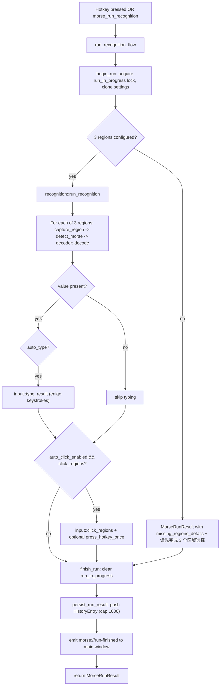

# Morse code recognition

> Screen-capture Morse decoder for Delta Force. Captures three screen regions, binarizes, detects contours, decodes Morse patterns to digits `0`-`9`, and optionally auto-types the result plus chained clicks.

## Purpose

The Morse feature lets players bind a hotkey that, when pressed, captures three preconfigured screen regions, binarizes each captured image, detects the 5 dot/dash contours of a Morse digit, decodes the pattern into a single digit (`0`-`9` only), concatenates the three digits into a 3-digit code, and (by default) types that code into the foreground window. It supports an auto-click chain: after a successful recognition, it can sequentially click up to 7 configured click regions (each with its own delay) and then optionally press a single hotkey once.

This feature is intentionally narrow: the decoder only maps the 10 Morse digit patterns (`.----` through `-----`). It does not decode letters or punctuation.

## Directory layout

```
src-tauri/src/morse/
├── mod.rs          # MorseState, command registration, run_recognition_flow, restart_hotkey_listener
├── types.rs        # MorseSettings, MorseBootstrap, MorseRunResult, HistoryEntry, RegionRect, ClickRegion, RegionSelectionProgress/Outcome/Kind
├── events.rs       # Event name string constants (RUN_FINISHED / SELECTION_PROGRESS / HOTKEY_ERROR)
├── decoder.rs      # Morse pattern -> digit 0-9 decoder (10 entries only)
├── recognition.rs  # capture -> binarize -> contour -> decode pipeline, Otsu threshold, DPI scaling
├── overlay.rs      # Multi-step region selection session (oneshot channels), overlay window lifecycle
├── input.rs        # enigo keyboard typing + mouse click chain + after-click hotkey press
└── settings.rs     # morse_settings.json load/save via shared crate::settings helpers

src/components/app/
├── morse-page.tsx      # Frontend container: state orchestration, three-step wizard, autosave, event listeners
├── morse-panels.tsx    # Panel subcomponents (SelectionPanel / WorkbenchControlPanel / ResultPanel / HistoryPanel)
├── morse-overlay.tsx   # Overlay region selection UI (drag-to-select, Enter/Esc handling)
├── morse-types.ts      # Frontend TypeScript types and constants (REGION_LABELS, AUTOSAVE_DELAY_MS, etc.)
└── morse-utils.ts      # Pure logic: settingsToForm / parseSettingsForm, region formatting, hotkey recorder formatting, overlay slot parsing

src/lib/tauri-events.ts  # MORSE_EVENTS constants and listenEvent<T> helper
```

## Key abstractions

| Abstraction | Location | Role |
|--------------|----------|------|
| `MorseState` | `src-tauri/src/morse/mod.rs` | `ToolState<MorseLogic>` — the shared `ToolBase` generic wrapper holding settings + hotkey_error + Morse-specific logic. |
| `MorseLogic` | `src-tauri/src/morse/mod.rs` | `ToolLogic` impl. Holds `history` (VecDeque, capped at 1000), `latest_run`, `next_history_id`, `pending_selection`, `run_in_progress`. |
| `MorseSettings` | `src-tauri/src/morse/types.rs` | Persisted config: `hotkey`, `regions: [Option<RegionRect>; 3]`, `binary_threshold`, `auto_input_delay`, `after_click_hotkey`, `auto_click_enabled`, `click_regions: Vec<ClickRegion>`. |
| `MorseBootstrap` | `src-tauri/src/morse/types.rs` | The immutable canonical state returned to the frontend: settings + history + latest_run + hotkey_error. |
| `MorseRunResult` | `src-tauri/src/morse/types.rs` | One recognition run output: `value` (3-digit string or null), `details` (per-region Morse/contour/digit/error), `triggered_by`, `auto_typed`, `occurred_at_ms`, `error`. |
| `HistoryEntry` | `src-tauri/src/morse/types.rs` | Persisted history row (id, result, success, triggered_by, auto_typed, occurred_at_ms, error). Capped at 1000 entries. |
| `PendingSelection` | `src-tauri/src/morse/overlay.rs` | Active multi-step region selection session: target ("sampling" or "click"), slots, current_index, staged regions, and a `oneshot::Sender<RegionSelectionKind>` used to resolve the `morse_begin_region_selection` command. |
| `RegionSelectionProgress` | `src-tauri/src/morse/types.rs` | Emitted after each slot commit: current_slot, regions, completed_slots, target, optional click_regions. |
| `RegionSelectionOutcome` | `src-tauri/src/morse/types.rs` | Final result returned by `morse_begin_region_selection`: kind (Selected/Cancelled/Closed), regions, target, optional click_regions. |
| `MORSE_EVENTS` | `src/lib/tauri-events.ts` | Frontend typed event-name constants mirroring `src-tauri/src/morse/events.rs`. |
| `MorsePage` | `src/components/app/morse-page.tsx` | Frontend container. Bootstrap/Form dual-state, autosave, event subscription, region selection orchestration. |
| `RegionSelectionOverlay` | `src/components/app/morse-overlay.tsx` | The `?mode=overlay` window content: drag-to-select rects, submits to `morse_overlay_submit_selection`, Enter finishes early (click mode), Esc cancels. |

## Key source files

| File | Purpose |
|------|---------|
| `src-tauri/src/morse/mod.rs` | MorseState definition, all Tauri command handlers, `run_recognition_flow` orchestration, `restart_hotkey_listener`, `initialize`, history persistence. |
| `src-tauri/src/morse/types.rs` | All Morse DTOs and the `MorseSettings::default()` (hotkey `F1`, threshold `127`, auto_input_delay `50`). |
| `src-tauri/src/morse/recognition.rs` | Capture pipeline: `run_recognition`, `region_to_capture_bounds` (DPI scaling), Otsu threshold, multi-stage threshold attempt (otsu-forward / otsu-inverse / manual), connected-component contour detection, dash/dot classification by `DASH_RATIO_THRESHOLD = 2.0`. |
| `src-tauri/src/morse/decoder.rs` | The 10-entry `MORSE_DIGIT_MAP` and `decode(&str) -> Result<char, String>`. |
| `src-tauri/src/morse/overlay.rs` | `begin_region_selection` (creates fullscreen transparent overlay window), `prepare_selection`, `commit_selection`, `cancel_selection`, `finish_early`; `parse_slots` validation; oneshot resolution. |
| `src-tauri/src/morse/input.rs` | `type_result` (per-character `enigo::Key::Unicode` Click with delay), `click_regions` (mouse move + left click per region with per-region delay), `press_hotkey_once` (modifier-ordered Press/Click/Release). |
| `src-tauri/src/morse/settings.rs` | Thin wrapper around `crate::settings` for `morse_settings.json`. |
| `src-tauri/src/morse/events.rs` | `RUN_FINISHED = "morse://run-finished"`, `SELECTION_PROGRESS = "morse://selection-progress"`, `HOTKEY_ERROR = "morse://hotkey-error"`. |
| `src/components/app/morse-page.tsx` | React container; wires `useBootstrapForm`, `useAutosave`, `useHotkeyRecorder`; subscribes to `MORSE_EVENTS`; three-tab wizard (selection / workbench / result / history). |
| `src/components/app/morse-panels.tsx` | Presentational subcomponents used by older layouts (SelectionPanel / WorkbenchControlPanel / ResultPanel / HistoryPanel). |
| `src/components/app/morse-overlay.tsx` | Overlay drag-select UI; honors `?mode=overlay&target=sampling|click&slots=0,1,2`. |
| `src/components/app/morse-types.ts` | Frontend types and constants (`REGION_LABELS = ["位置 1", "位置 2", "位置 3"]`, `CLICK_REGION_LABELS`, `AUTOSAVE_DELAY_MS = 400`, `MIN_SELECTION_WIDTH = 10`, `MIN_SELECTION_HEIGHT = 5`). |
| `src/components/app/morse-utils.ts` | `settingsToForm` / `parseSettingsForm` (int<->string + validation), `formatRegion`, `getSelectionRect`, `normalizeRunDetails`, `parseOverlaySlots`, `parseOverlayTarget`, `formatRecordedHotkey`. |
| `src/lib/tauri-events.ts` | `MORSE_EVENTS` object and `listenEvent<T>` helper. |

## How it works

### Recognition flow

A recognition run is triggered either by the bound hotkey (the `HotkeyAction` registered by `restart_hotkey_listener` spawns `run_recognition_flow(app, "hotkey", true)`) or manually via the `morse_run_recognition` command (which calls `run_recognition_flow(app, "manual", autoType ?? true)`).

`run_recognition_flow` is the single orchestration point. It:

1. Calls `begin_run` to acquire `inner.logic.run_in_progress` (rejects concurrent runs or runs while a region selection is pending) and clones the current settings.
2. If fewer than 3 regions are configured, short-circuits with a `MorseRunResult` carrying `missing_regions_details` and the error "请先完成 3 个区域选择".
3. Otherwise calls `recognition::run_recognition(&settings, triggered_by)`, which iterates the 3 `settings.regions` and for each configured region calls `recognize_slot` -> `capture_region` -> `detect_morse` -> `decoder::decode`.
4. If `auto_type` is true and a `value` was produced, calls `input::type_result` to type the 3 digits into the foreground window.
5. If `auto_click_enabled` is true, `value` is present, no error, and `click_regions` is non-empty, calls `input::click_regions` then (if `after_click_hotkey` is set) `input::press_hotkey_once`.
6. Always calls `finish_run` (clears `run_in_progress`), then `persist_run_result` (pushes a `HistoryEntry` into the in-memory VecDeque, bumping `next_history_id`), then emits `morse://run-finished` to the "main" window label.
7. Returns the `MorseRunResult`.

### Recognition pipeline (per region)

`recognition.rs::run_recognition` iterates the 3 configured `regions`. For each `Some(region)`:

- `capture_region(region)` finds the monitor whose bounds fully contain the logical rect (via `region_to_capture_bounds`) and calls `xcap::Monitor::capture_region` with physical-pixel coordinates. On high-DPI monitors the logical overlay coordinates are scaled by `scale_factor`; regions spanning multiple monitors are rejected with "所选区域未完全落在单个显示器内，请重新框选".
- `detect_morse(image, binary_threshold)` converts RGBA -> gray, computes an Otsu threshold, and tries three stages in order: `otsu-forward`, `otsu-inverse`, `manual`. The first stage whose decoded Morse string passes `decoder::decode` wins; otherwise the last failure is returned.
- `detect_morse_with_threshold` binarizes (foreground 255), runs `detect_components` (BFS connected-component labeling), filters components with `area >= MIN_CONTOUR_AREA` (10), rejects if fewer than `TARGET_SYMBOL_COUNT` (5) or more than `MAX_COMPONENTS_TO_KEEP` (8) components, otherwise `select_components` keeps the top 5 by area (ties broken by `min_x`), sorts them by `min_x`, and `components_to_morse` maps each component to `-` if `width / height >= DASH_RATIO_THRESHOLD` (2.0) else `.`.
- `decoder::decode(morse)` looks up the 5-char pattern in `MORSE_DIGIT_MAP` and returns the matching digit `char` or an error.

### Region selection overlay

Region selection is a multi-step overlay session mediated by `oneshot` channels so the `morse_begin_region_selection` Tauri command can `await` completion while the frontend drives each step:

1. Frontend calls `morse_begin_region_selection({ slots, target })` (`target` is `"sampling"` for the 3 recognition regions, `"click"` for up to 7 click regions). `overlay::begin_region_selection` validates slots (`parse_slots`), creates a `oneshot::channel`, stores `PendingSelection` in `inner.logic.pending_selection`, destroys any stale overlay window, and builds a new fullscreen transparent always-on-top `WebviewWindow` with label `morse-overlay` and URL `index.html?mode=overlay&target={target}&slots={slots}`. It registers a `WindowEvent` handler that resolves the pending sender as `Closed` on destroy/close, then `await`s the receiver.
2. The overlay React component (`RegionSelectionOverlay` in `morse-overlay.tsx`) renders a fullscreen drag-to-select surface. Each `mouseup` invokes `morse_overlay_submit_selection({ slot, rect })`.
3. `morse_overlay_submit_selection` calls `overlay::prepare_selection` (validates the slot matches the expected current slot and the rect meets `width > 10 && height > 5`), then `overlay::commit_selection`. If this was the last slot, it takes the `PendingSelection`, writes the staged regions into `inner.settings.regions` (or `inner.settings.click_regions` for click mode), saves settings, updates the active profile snapshot, destroys the overlay window, and sends `RegionSelectionKind::Selected` on the oneshot. Otherwise it advances `current_index` and emits `morse://selection-progress`.
4. `morse_overlay_cancel_selection({ slot })` takes the pending, validates slot match, destroys the overlay, and sends `Cancelled`.
5. `morse_overlay_finish_early` (Enter key, click mode only) takes the pending, saves currently staged click regions, destroys the overlay, and sends `Selected`.

### Hotkey registration

`initialize` and `morse_save_settings` both call `restart_hotkey_listener`, which builds a `HotkeyAction` (an `Arc` closure that spawns `run_recognition_flow(app, "hotkey", true)` on the tokio runtime) and calls `hotkey_manager.replace_scope("morse", [(hotkey, action)], "摩斯密码解析", ConflictPolicy::Strict)`. Morse uses `ConflictPolicy::Strict`, meaning the Morse hotkey cannot share a key with any other scope (timer, counter, or rapidfire). On conflict the previous error is saved into `inner.hotkey_error` and surfaced to the frontend via `MorseBootstrap.hotkeyError`. See `../systems/hotkeys.md` and `../systems/tool-base.md` for the shared `HotkeyManager` and `ToolBase` machinery.

During hotkey recording the frontend calls `morse_set_hotkey_recording({ recording: true })`, which calls `set_scope_enabled("morse", false)` to pause the Morse scope so the recorded keystrokes don't trigger a recognition run.

### Persistence

Settings are stored as `morse_settings.json` in the app config dir via `crate::settings` helpers. Runtime state (`history`, `latest_run`, `pending_selection`, `run_in_progress`, `next_history_id`) lives only in memory; history is not persisted to disk. On save, `normalize_settings` trims the hotkey, validates it is non-empty, normalizes `after_click_hotkey` through `hotkey_types::hotkey_to_string`, and truncates `click_regions` to 7 entries. Saving also pushes a `ActiveProfileSnapshotPatch::Morse` update to the profile system.

### Frontend container

`MorsePage` (`morse-page.tsx`) is the container. It uses the shared `useBootstrapForm` hook (specifying `morse_get_bootstrap` / `morse_save_settings`, `settingsToForm`, `parseSettingsForm`) and `useAutosave` (debounced 400ms, gated on `!overlayMode && isNativeShell && !loading && !recorder.isRecording && selectingSlot === null`). It subscribes to three events via `listenEvent(MORSE_EVENTS.*)`:

- `morse://run-finished` updates `bootstrap.latestRun` and triggers a `syncBootstrap({ syncMode: "none" })` to refresh history.
- `morse://selection-progress` updates `bootstrap.settings.regions` and `form.regions`.
- `morse://hotkey-error` updates `bootstrap.hotkeyError`.

The overlay branch (`overlayMode === true`) early-returns `<RegionSelectionOverlay slots={overlaySlots} />` and skips bootstrap load, autosave, and event subscription. `useNativeShell()` disables all `invoke` calls in browser preview mode.

The page renders a four-tab wizard: **窗位** (selection, the 3 sampling regions), **校准** (workbench: hotkey recorder, binary threshold, auto-input delay, auto-click toggle + click region editor + verification input), **报码** (latest 3-digit result + per-region detail), **档案** (history list, scrollable).



## Integration points

- **`HotkeyManager`** (`src-tauri/src/hotkeys.rs`): Morse registers scope `"morse"` with `ConflictPolicy::Strict`. See `../systems/hotkeys.md`.
- **`ToolBase`** (`src-tauri/src/tool_base.rs`): `MorseState = ToolState<MorseLogic>`, `MorseLogic: ToolLogic`. Morse overrides `emit_state` as a no-op (it emits `morse://run-finished` and `morse://selection-progress` directly instead of a full bootstrap push). See `../systems/tool-base.md`.
- **Profile system** (`src-tauri/src/profile/`): `morse_save_settings` and region-commit commands call `profile::update_active_profile_snapshot` with `ActiveProfileSnapshotPatch::Morse(settings)` so the active profile snapshot stays in sync.
- **Global state** (`src-tauri/src/global_state.rs`): the global on/off switch gates whether hotkey callbacks should execute (Morse's `HotkeyAction` should respect `GlobalState::enabled()` before running recognition).
- **Shared settings** (`src-tauri/src/settings.rs`): `morse_settings.json` persistence reuses the shared `settings_path` / `load_settings` / `save_settings` / `ensure_config_dir` helpers.
- **Capabilities** (`src-tauri/capabilities/default.json`) and **handler registration** (`src-tauri/src/lib.rs` `generate_handler![]`): every Morse command must be registered in both places.
- **Frontend events** (`src/lib/tauri-events.ts`): `MORSE_EVENTS` mirrors `src-tauri/src/morse/events.rs`; the frontend must subscribe via `listenEvent(MORSE_EVENTS.*)` rather than hardcoding event strings.

## Entry points for modification

- **Add a new Morse command**: define the `#[tauri::command]` fn in `src-tauri/src/morse/mod.rs`, register it in `src-tauri/src/lib.rs` `generate_handler![]` (under the morse group), and add the permission to `src-tauri/capabilities/default.json`. Add the typed event (if any) to both `src-tauri/src/morse/events.rs` and `MORSE_EVENTS` in `src/lib/tauri-events.ts`.
- **Change the recognition pipeline** (e.g. add a new threshold stage or letter support): edit `src-tauri/src/morse/recognition.rs`. To extend decoding beyond digits 0-9, extend `MORSE_DIGIT_MAP` in `src-tauri/src/morse/decoder.rs` (note: this also requires changing the `TARGET_SYMBOL_COUNT = 5` assumption and the per-region digit concatenation in `run_recognition`).
- **Change the region selection UX**: the drag/select logic lives in `src/components/app/morse-overlay.tsx`; the backend session lifecycle and validation live in `src-tauri/src/morse/overlay.rs` (`prepare_selection` enforces `width > 10 && height > 5` and slot match).
- **Change defaults** (hotkey, threshold, auto-input delay, max click regions): edit `MorseSettings::default()` in `src-tauri/src/morse/types.rs` and the `click_regions.len() > 7` truncation in `normalize_settings` (`src-tauri/src/morse/mod.rs`). Keep `src/components/app/morse-types.ts` constants (`REGION_LABELS`, `CLICK_REGION_LABELS`, `MIN_SELECTION_WIDTH`, `MIN_SELECTION_HEIGHT`) in sync.
- **Change history cap**: `push_history_with_limit` in `src-tauri/src/morse/mod.rs` uses a hardcoded `1000`.
- **Change autosave delay**: `AUTOSAVE_DELAY_MS = 400` in `src/components/app/morse-types.ts`.
- **Add a new setting field**: add it to `MorseSettings` (`src-tauri/src/morse/types.rs`, with `#[serde(default)]` if optional), mirror it in `MorseSettingsForm` and `settingsToForm` / `parseSettingsForm` (`src/components/app/morse-types.ts` and `morse-utils.ts`), and update the workbench UI in `morse-page.tsx`.
