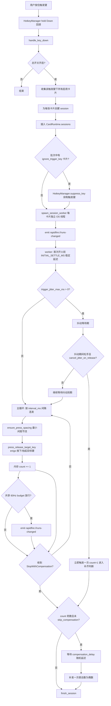
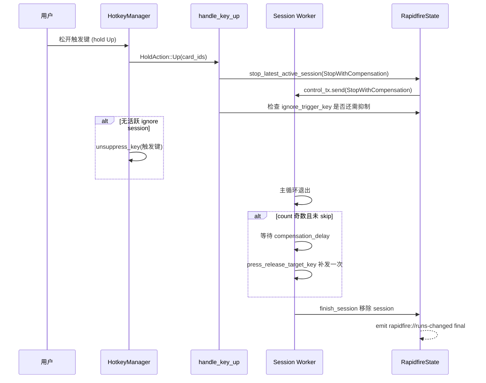

# 连发器

## 用途

连发器模块用于在用户按住触发键时，以可配置的间隔高速连发目标键。松开触发键后，若连发次数为奇数，会自动补发一次使总次数为偶数（除非开启 `skip_compensation`）。每张卡片可独立配置触发键、目标键、间隔、抖动、间距等参数，并通过分组系统管理各自的透明显示窗口。

该模块基于 [同步工具基座](../systems/sync-tool.md) 实现（`RapidfireLogic` 实现 `SyncToolLogic` trait），使用 `ConflictPolicy::AllowHold` 热键冲突策略，可与计时器/计数器的普通 scope 共享热键，详见 [热键系统](../systems/hotkeys.md)。透明显示窗口与位置校准遵循 [透明叠加窗](../systems/overlay-windows.md) 约束。

## 目录结构

```text
src-tauri/src/rapidfire/
├── mod.rs           # 模块入口、Tauri command、状态、session 管理、热键回调、worker 线程
├── types.rs         # RapidfireSettings / RapidfireCard / RapidfireGroup / RapidfireBootstrap 等
├── settings.rs      # 设置加载与持久化（rapidfire_settings.json）
└── events.rs        # 事件名常量

src/components/app/
├── rapidfire-page.tsx   # 前端页面（Bootstrap/Form 双状态 + autosave）
└── rapidfire-types.ts   # 前端 TypeScript 类型与转换函数
```

## 关键源文件

| 文件 | 说明 |
|------|------|
| `src-tauri/src/rapidfire/mod.rs` | 模块入口，定义 `RapidfireLogic`、`RapidfireState`、`SyncToolLogic` 实现、所有 `#[tauri::command]`、session worker 线程、热键 hold 回调、透明窗口管理 |
| `src-tauri/src/rapidfire/types.rs` | 所有对外序列化结构体（均使用 `#[serde(rename_all = "camelCase")]`），含旧配置兼容反序列化逻辑 |
| `src-tauri/src/rapidfire/settings.rs` | `load_settings` / `save_settings`，持久化到 `rapidfire_settings.json`，空卡片时自动补默认卡片 |
| `src-tauri/src/rapidfire/events.rs` | 事件名常量 `STATE_CHANGED` / `HOTKEY_ERROR` |
| `src/components/app/rapidfire-page.tsx` | 前端页面，使用 `useBootstrapForm` + autosave + 拖拽排序 |
| `src/components/app/rapidfire-types.ts` | 前端类型、`rapidfireSettingsToForm` / `parseRapidfireSettingsForm` 转换、键位归一化、状态徽章文案 |

## 关键抽象

| 抽象 | 定义位置 | 说明 |
|------|----------|------|
| `RapidfireLogic` | `mod.rs` | 实现 `SyncToolLogic` trait 的逻辑层，持有 `runs`（每张卡片的运行态）与 `pending_position` |
| `RapidfireState` | `mod.rs` | `ToolState<RapidfireLogic>` 别名 |
| `RapidfireSettings` | `types.rs` | 持久化设置：总开关、分组列表、卡片列表、补齐延迟、透明窗口配置、旧全局兼容字段 |
| `RapidfireCard` | `types.rs` | 单张连发器卡片配置：触发键、目标键、间隔、按下抖动、间距、触发抖动、补齐/忽略开关 |
| `RapidfireGroup` | `types.rs` | 分组：id、名称、启用、透明窗口显示/位置/宽度 |
| `RapidfireBootstrap` | `types.rs` | 初始规范态：settings + runs（每卡片运行状态）+ hotkey_error |
| `CardRuntime` | `mod.rs` | 单张卡片的运行态：多 session map、活跃 session id 栈、`last_press_at` 间距锁 |
| `RapidfireSessionRuntime` | `mod.rs` | 单个 session 运行态：count、status、control_tx、compensate_now；卡片级 `CardRuntime` 额外累计已结束 session 的 count |
| `RapidfireSessionWorker` | `mod.rs` | worker 线程参数包：卡片配置快照 + mpsc 控制通道 + 间距锁 |
| `PendingRapidfirePosition` | `mod.rs` | 位置设置会话状态：group_id、原始位置、暂存位置、oneshot sender |

> **serde 约定**：`types.rs` 中所有对外序列化的结构体均使用 `#[serde(rename_all = "camelCase")]`，前端 TypeScript 类型字段名必须匹配 camelCase（如 `rapidfireEnabled`、`triggerKey`、`targetKey`、`intervalMs`、`pressJitterMinMs`、`skipCompensation`、`ignoreTriggerKey`）。

## 工作原理

### 按住触发连发流程



### 松开触发键流程



### Session 模型

每次按住触发键会为每张匹配卡片创建一个独立的 OS worker 线程（`thread::Builder::new().spawn`），同一张卡片可同时存在多个 session（如快速重复按压）。Session 通过 `mpsc::channel` 接收控制信号：

- `StopWithCompensation`：停止连发，进入补齐判断（奇数次数补发一次）
- `Cancel`：立即取消，不补齐

`NEXT_RAPIDFIRE_SESSION_ID`（`AtomicU64`）为每个 session 分配全局唯一 id。`CardRuntime` 用 `active_session_ids` 栈记录活跃 session，`stop_latest_active_session` 只停止最近一个。

worker 每次开火只更新内存 count。`RapidfireLogic.last_runs_emit_at` 对所有卡片共享 60Hz budget；budget 放行时才发送 `RapidfireRunsChanged`，session 结束绕过 budget 强制发送最终运行态。

### 关键参数

| 参数 | 字段 | 默认值 | 范围 | 说明 |
|------|------|--------|------|------|
| 连发间隔 | `intervalMs` | 100 | >= 1 | 每次连发的间隔毫秒数 |
| 按下抖动下限 | `pressJitterMinMs` | 8 | 1-2000 | 目标键按下保持时间抖动下限 |
| 按下抖动上限 | `pressJitterMaxMs` | 12 | 1-2000 | 目标键按下保持时间抖动上限 |
| 最小间距 | `minPressSpacingMs` | 80 | 0-10000 | 同卡片目标键最小触发间距（跨 session 节流） |
| 触发抖动上限 | `triggerJitterMaxMs` | 0 | 0-99999 | 按下触发键后启动延迟上限，0=关闭 |
| 抖动松手触发 | `cancelJitterOnRelease` | true | bool | 抖动期间松手是否立即触发一次 |
| 跳过补齐 | `skipCompensation` | false | bool | 松开时不补齐奇数次数 |
| 忽略触发键 | `ignoreTriggerKey` | false | bool | 阻止触发键同步输入到前台应用 |
| 补齐延迟下限 | `compensationDelayMinMs` | 100 | 0-10000 | 补发前的随机等待下限 |
| 补齐延迟上限 | `compensationDelayMaxMs` | 150 | 0-10000 | 补发前的随机等待上限 |

### 触发键与目标键

- **触发键**（`triggerKey`）：支持单键或组合键（如 `F1`、`Shift+-`、`Alt`），通过 `normalize_trigger_key` 归一化
- **目标键**（`targetKey`）：必须是单键，通过 `normalize_single_key` 归一化，支持字母、数字、功能键、符号键、方向键等
- 当触发键与目标键主键相同时，`target_fire_plan` 会先 Release 物理按住的触发键再 Press 目标键（enigo 合成）
- `ignore_trigger_key` 开启时，通过 `HotkeyManager::suppress_key` 在 WH_KEYBOARD_LL 钩子层吞噬物理触发键事件，使其不到达前台应用，但热键回调仍正常触发

### 分组与透明窗口

卡片通过 `groupId` 归属到 `RapidfireGroup`，每个分组独立配置透明显示窗口：

- `showOverlay`：是否显示透明窗口
- `overlayPosition`：窗口位置 `{x, y}`
- `overlayWidth`：窗口宽度（320-800，默认 400）
- 窗口高度根据该分组启用卡片数动态计算（`display_height`）

窗口 label 按分组 id 区分：默认分组为 `rapidfire-display`，其他分组为 `rapidfire-display-{safe_id}`。位置设置窗口同理（`rapidfire-position` / `rapidfire-position-{safe_id}`）。`ensure_overlay_window` 会清理不再活跃的窗口（`destroy_stale_windows`）。

## 集成点

### 同步工具基座

`RapidfireLogic` 实现 `SyncToolLogic` trait（[同步工具基座](../systems/sync-tool.md)）：

- `const SCOPE = "rapidfire"` / `const SCOPE_LABEL = "连发器"`
- `tool_enabled` 读取 `settings.rapidfire_enabled`
- `build_hotkey_bindings` 按触发键聚合启用卡片，构建 `HotkeyBindingSet`（全部为 hold 绑定）
- `stop_all` 停止所有 session 并清理抑制状态
- `RapidfireCard` 实现 `SyncItem`，`RapidfireGroup` 实现 `SyncGroup`，`RapidfireSettings` 实现 `SyncSettings`
- `normalize_settings` 最终委托 `normalize_sync_settings` 完成分组/卡片归一化、去重、默认分组补齐

### 热键系统

- 使用 `HotkeyManager` 的 hold scope（`replace_hold_scope`），冲突策略为 `ConflictPolicy::AllowHold`
- 可与计时器/计数器的普通 scope 共享热键（双方均用 `AllowHold`），运行时先分发连发器 hold Down/Up，再分发计时器/计数器普通快捷键
- 保存设置时通过 `restart_hotkey_listeners` 智能跳过：若新旧绑定映射一致则不重建 scope，避免打断正在进行的 hold 回调
- 详见 [热键系统](../systems/hotkeys.md)

### Profile 快照

`rapidfire_save_settings` 与 `rapidfire_position_commit` 成功后调用 `profile::update_active_profile_snapshot` 写入 `ActiveProfileSnapshotPatch::Rapidfire`。

### 全局总开关

全局总开关关闭时调用 `stop_all`：停止所有 session（`Cancel`）、清理所有按键抑制、隐藏（不销毁）透明窗口，重新开启时 `ensure_overlay_window` 直接 show 恢复。

### 前端模式分支

`?mode=rapidfire-display&groupId=...` 进入透明显示模式，`?mode=rapidfire-position&groupId=...` 进入位置校准模式，不可用路由替代。

## 修改入口

| 需求 | 修改位置 |
|------|----------|
| 调整连发/补齐/抖动算法 | `mod.rs` 的 `run_session_worker` / `wait_for_next_fire` / `should_compensate_count` / `press_jitter_duration_ms` / `ensure_press_spacing` |
| 调整常量约束（间隔/抖动/间距范围） | `mod.rs` 的 `RAPIDFIRE_*` 常量 + `normalize_card` / `normalize_settings` |
| 新增/修改卡片字段 | `types.rs` 的 `RapidfireCard` + `RapidfireCardInput`（含旧配置兼容默认值）+ `normalize_card`（`mod.rs`）+ 前端 `rapidfire-types.ts` 的 `RapidfireCard` / `RapidfireCardForm` + `parseRapidfireSettingsForm` |
| 新增/修改分组字段 | `types.rs` 的 `RapidfireGroup` + `normalize_groups`（`mod.rs`）+ 前端 `RapidfireGroup` / `RapidfireGroupForm` |
| 新增 Tauri command | `mod.rs` 定义 `#[tauri::command]` + 注册到 `src-tauri/src/lib.rs` 的 `generate_handler![]` + `src-tauri/capabilities/default.json` |
| 新增事件 | `events.rs` 定义常量 + 前端 `src/lib/tauri-events.ts` 的 `RAPIDFIRE_EVENTS` |
| 调整透明窗口管理 | `mod.rs` 的 `ensure_overlay_window` / `ensure_overlay_window_for_group` / `display_label_for_group` / `display_height` |
| 调整位置设置流程 | `mod.rs` 的 `PendingRapidfirePosition` / `rapidfire_begin_position_selection` / `rapidfire_position_commit` / `rapidfire_position_cancel` / `rapidfire_position_moved` |
| 调整按键映射 | `mod.rs` 的 `parse_target_key` / `target_fire_plan` / `press_release_target_key` |
| 调整按键抑制 | `mod.rs` 的 `handle_key_down` / `handle_key_up` 中的 `suppress_key` / `unsuppress_key` / `stop_suppressor` 逻辑 |

## Tauri Command 清单

| Command | 说明 |
|---------|------|
| `rapidfire_get_bootstrap` | 返回 `RapidfireBootstrap`（settings + runs + hotkey_error） |
| `rapidfire_save_settings` | 归一化并保存设置，重启热键监听，停止已移除/禁用卡片的 session，清理抑制状态，更新透明窗口，同步 profile 快照 |
| `rapidfire_stop` | 停止所有 session（Cancel），清理抑制，返回新 bootstrap |
| `rapidfire_begin_position_selection` | 启动位置设置会话，创建位置校准窗口，返回 `RapidfireSelectionOutcome` |
| `rapidfire_position_commit` | 提交暂存位置，持久化设置，销毁位置窗口，同步 profile 快照 |
| `rapidfire_position_cancel` | 取消位置设置，恢复原始位置，销毁位置窗口 |
| `rapidfire_position_moved` | 位置设置窗口拖动时实时更新暂存位置与窗口坐标 |

## 事件清单

| 事件名 | 触发时机 | 载荷 |
|--------|----------|------|
| `rapidfire://state-changed` | 设置保存、位置提交等 settings/结构变化 | `RapidfireBootstrap` |
| `rapidfire://runs-changed` | session 创建、受 60Hz 限制的 count 更新、session 结束与停止 | `RapidfireRunsChanged` |
| `rapidfire://hotkey-error` | 热键回调执行失败、worker 线程启动失败 | `String`（错误信息） |

> 两类事件都会发到 `main` 与现有 display 窗口；高频运行态载荷不含 settings。
