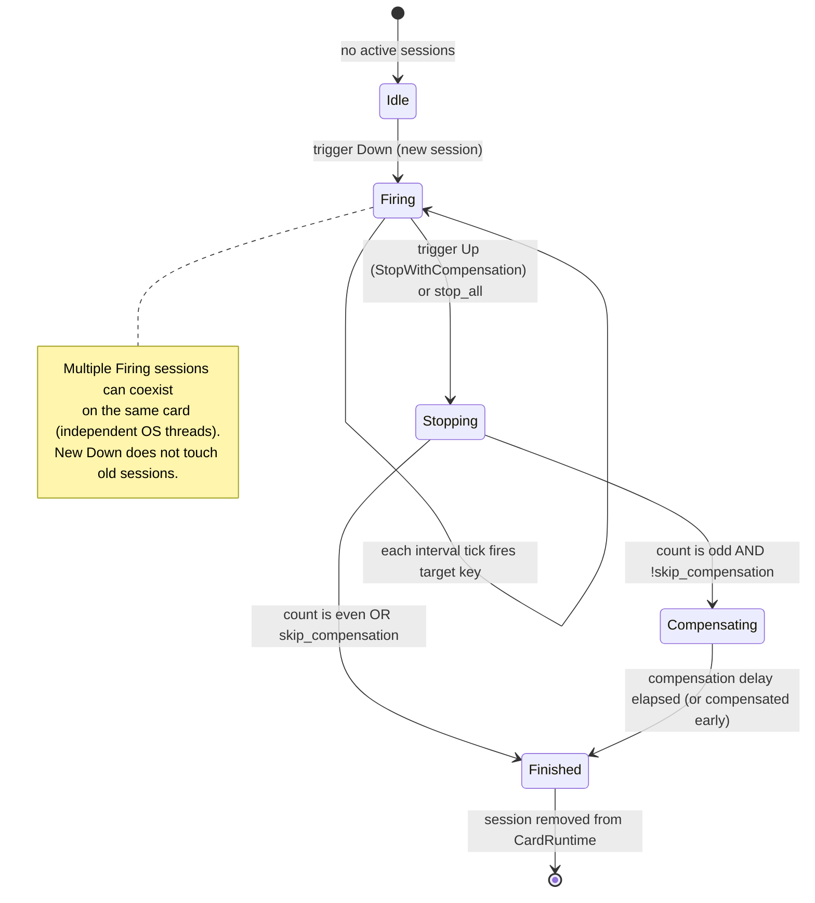

# Rapidfire

## Purpose

The Rapidfire feature auto-fires a configured target key while the user holds down a trigger key. It is designed for Delta Force players who need to repeatedly press a key (for example, an in-game fire or interact key) at a configurable cadence. Each rapidfire **card** is an independent configuration channel with its own trigger key, target key, interval, jitter, minimum press spacing, and compensation policy. Cards are organized into **groups**, and each group can own a separate transparent overlay window.

The feature is built on the shared [`HotkeyManager`](../systems/hotkeys.md) hold mechanism: a trigger key is registered as a *hold* binding (not a tap hotkey), so `HoldAction::Down` starts firing and `HoldAction::Up` stops it. Each trigger-down event spawns an independent **session** on its own OS worker thread, so pressing the same trigger key rapidly never cancels or aborts the previous session. This per-session isolation is the defining property of the rapidfire state machine.

## Directory layout

```
src-tauri/src/rapidfire/
├── mod.rs          # RapidfireState = ToolState<RapidfireLogic>, session state machine, hold callbacks, worker threads, transparent & position windows, stop_all
├── types.rs        # RapidfireSettings, RapidfireCard, RapidfireGroup, RapidfireBootstrap, RapidfireRunState, RapidfireRunStatus, RapidfireRect, selection outcome
├── events.rs       # event name constants: STATE_CHANGED, HOTKEY_ERROR
└── settings.rs     # rapidfire_settings.json load/save

src/components/app/
├── rapidfire-page.tsx   # frontend container: workbench, display overlay, position overlay, card config, drag reorder
└── rapidfire-types.ts   # frontend types, constants, settings<->form conversion, validation, status helpers
```

## Key abstractions

| Abstraction | Rust / TS location | Role |
|---|---|---|
| `RapidfireState` | `src-tauri/src/rapidfire/mod.rs` (`RapidfireState = ToolState<RapidfireLogic>`) | Generic ToolBase state holding settings + per-card runtimes. See [../systems/tool-base.md](../systems/tool-base.md). |
| `RapidfireLogic` | `src-tauri/src/rapidfire/mod.rs` | ToolLogic impl. Owns `runs: HashMap<cardId, CardRuntime>` and `pending_position`. |
| `CardRuntime` | `src-tauri/src/rapidfire/mod.rs` | Per-card aggregate of all active sessions + a shared `last_press_at` for min-spacing enforcement. |
| `RapidfireSessionRuntime` | `src-tauri/src/rapidfire/mod.rs` | One firing session: `count`, `status`, an `mpsc::Sender<SessionControl>` control channel, and a `compensate_now` flag. |
| `RapidfireSessionWorker` | `src-tauri/src/rapidfire/mod.rs` | Snapshot of card parameters carried into the OS worker thread; owns the `control_rx` end of the channel. |
| `RapidfireSettings` | `src-tauri/src/rapidfire/types.rs` | Top-level persisted config: master switch, groups, cards, global compensation delay, legacy-global defaults. Persisted to `rapidfire_settings.json`. |
| `RapidfireCard` | `src-tauri/src/rapidfire/types.rs` | Per-channel config: trigger/target key, interval, press jitter range, min press spacing, trigger jitter, cancel-on-release, skip-compensation, ignore-trigger-key, enabled. |
| `RapidfireGroup` | `src-tauri/src/rapidfire/types.rs` | Group of cards sharing one transparent overlay window (id/name/enabled/showOverlay/overlayPosition/overlayWidth). |
| `RapidfireRunState` | `src-tauri/src/rapidfire/types.rs` | Frontend-facing per-card run snapshot: `cardId`, `status` (Idle/Firing/PendingCompensation), `count`. |
| `RapidfireBootstrap` | `src-tauri/src/rapidfire/types.rs` | Full state snapshot returned by `rapidfire_get_bootstrap`: settings + runs + hotkey_error. |
| `ConflictPolicy::AllowHold` | `src-tauri/src/hotkey_types.rs` | The rapidfire hold scope declares AllowHold so it can coexist with timer/counter normal hotkey scopes on the same key. See [../systems/hotkeys.md](../systems/hotkeys.md). |
| `SessionControl` | `src-tauri/src/rapidfire/mod.rs` | `StopWithCompensation` vs `Cancel` control message sent from the main thread to the worker. |
| `WorkerDecision` | `src-tauri/src/rapidfire/mod.rs` | Worker loop decision: `Fire { stop_after_fire }`, `Stop`, or `Cancel`. |
| `TargetFirePlan` | `src-tauri/src/rapidfire/mod.rs` | Resolved plan for one target-key press: whether to release the held trigger first (same-key case) then Press + Release the target. |
| KeySuppressor | `src-tauri/src/hotkeys.rs` via `HotkeyManager::suppress_key` | When `ignore_trigger_key` is set, the physical trigger key is swallowed at the WH_KEYBOARD_LL hook so it never reaches the foreground app, while the hold callback still fires. See [../systems/key-suppressor.md](../systems/key-suppressor.md). |
| Transparent overlay window | `src-tauri/src/rapidfire/mod.rs` + `src-tauri/src/overlay_utils.rs` | Per-group borderless, transparent, always-on-top, click-through window showing trigger->target mapping and live count. See [../systems/overlay-windows.md](../systems/overlay-windows.md). |

## How it works

### Hold mechanism and scope registration

Rapidfire does **not** use tap hotkeys. It registers a single hold scope named `"rapidfire"` on the shared `HotkeyManager` via `replace_hold_scope` / `clear_hold_scope` (see [../systems/hotkeys.md](../systems/hotkeys.md)). Each binding maps a trigger-key string to a list of enabled card IDs sharing that trigger key. The conflict policy is `ConflictPolicy::AllowHold`, which permits the rapidfire hold scope to coexist on the same physical key with timer/counter *normal* scopes (the runtime dispatches hold Down/Up first, then the normal tap hotkey). Morse uses `ConflictPolicy::Strict` and is therefore rejected if it conflicts.

When the keyboard hook fires:
- `HoldAction::Down` -> `handle_key_down` creates a new session per matching card and spawns a worker thread per session.
- `HoldAction::Up` -> `handle_key_up` stops the *latest active* session for each matching card with `SessionControl::StopWithCompensation`.

`restart_hotkey_listeners` is idempotent: it compares the new trigger-key-to-card-IDs map against the in-memory previous map and skips `replace_hold_scope` when unchanged, so an autosave while the user is holding a key does not disrupt the active hold callback.

### Combined trigger keys

A trigger key may be a single key (`F1`) or a combination including Ctrl/Alt/Shift/Win (`Shift+-`). The willhook hold mechanism dispatches by physical key state, which produces an important co-firing behavior:

- Pressing the **modified** binding (e.g. `Shift+1`) also triggers the **bare** binding (e.g. `1`) if both are registered, creating a session for each card. Releasing the modifier only stops the modified session; the bare-key session continues firing until its own Up event.
- Pressing the bare key first and then the modifier only **adds** the modified session; it does not restart or abort the already-running bare session.

This is intentional and tested: each Down event is an independent session. The bare and modified bindings are independent hold entries that happen to share a primary key.

### Session lifecycle (per trigger Down)

Each trigger Down creates a brand-new session. Old sessions are **never cancelled or aborted** by a new Down. They run to completion, exiting on their own Up event and applying their card's compensation policy. This is the core invariant that makes rapidfire safe under rapid re-pressing.



The worker thread (`run_session_worker`) executes this sequence:

1. **Initial settle delay** (`RAPIDFIRE_INITIAL_SETTLE_MS` = 8ms): lets the physical trigger-key event reach the foreground app before the first synthetic target-key press, avoiding an input ordering race where enigo's SendInput target key arrives before the trigger key.
2. **Trigger jitter window** (`trigger_jitter_max_ms`): if non-zero, the worker waits up to this duration before the first fire. If `cancel_jitter_on_release` is true and the user releases during this window, the worker fires once immediately and jumps to the compensation stage. If `cancel_jitter_on_release` is false, the release is ignored and the jitter continues.
3. **Main firing loop**: every `interval_ms` it calls `ensure_press_spacing` (per-card `min_press_spacing_ms`, enforced via a shared `last_press_at` `Arc<Mutex<Instant>>`) then performs one `Press -> press_jitter_duration_ms(press_jitter_min_ms, press_jitter_max_ms) -> Release` cycle of the target key using enigo. It listens on `control_rx` for `StopWithCompensation` or `Cancel` between ticks. If `StopWithCompensation` arrives when `count == 0`, it fires exactly once (`stop_after_fire`) so the user always gets at least one press.
4. **Compensation stage**: after the loop exits, if `should_compensate_count(count, skip_compensation)` is true (i.e. count is odd and `skip_compensation` is false), the worker waits a random `compensation_delay_min_ms..=compensation_delay_max_ms` (polling `compensate_now` every 10ms so an external force can short-circuit), then fires one extra target key to make the total even. If `skip_compensation` is true, the session exits with the odd count as-is.
5. **Finish**: `finish_session` removes the session from `CardRuntime`. If the card has no remaining sessions, the `CardRuntime` entry is dropped, returning the card to `Idle`.

> **enigo note**: The target key is driven with a real `Direction::Press` followed by a jittered sleep then `Direction::Release`. It never uses `Direction::Click`. When the trigger key and target key are the same physical key, enigo first releases the held trigger key (`ReleaseHeldTrigger`) with a `RAPIDFIRE_TRIGGER_RELEASE_SETTLE_MS` (2ms) settle, then presses and releases the target, because a held physical key will not produce a fresh Press event.

### Per-card fields vs legacy global fields

The card owns the authoritative per-channel timing:

| Field | Default | Range / rule | Role |
|---|---|---|---|
| `interval_ms` | 100 | min 1 (`RAPIDFIRE_MIN_INTERVAL_MS`) | Firing cadence. |
| `press_jitter_min_ms` / `press_jitter_max_ms` | 8 / 12 | 1..=2000; min <= max | Duration each target-key press is held. |
| `min_press_spacing_ms` | 80 | 0..=10000 | Minimum spacing between consecutive target-key presses on this card; enforced via shared `last_press_at`. |
| `trigger_jitter_max_ms` | 0 | 0..=99999; 0 disables | Startup jitter: max wait after trigger Down before first fire. |
| `cancel_jitter_on_release` | true | bool | If true, releasing during the trigger-jitter window fires once and jumps to compensation. |
| `skip_compensation` | false | bool | If true, odd-count compensation is disabled; the session exits with the raw count. |
| `ignore_trigger_key` | false | bool | If true, the physical trigger key is swallowed at the WH_KEYBOARD_LL hook via `HotkeyManager::suppress_key` so it does not reach the foreground app. See [../systems/key-suppressor.md](../systems/key-suppressor.md). |

`RapidfireSettings.min_press_spacing_ms`, `trigger_jitter_max_ms`, and `cancel_jitter_on_release` at the settings level are **legacy global defaults only**. During deserialization (`RapidfireCard::deserialize`), any card field that is absent inherits from these global values, then the global values are kept purely for backwards-compatible deserialization. New saves always write per-card values; the settings-level copies are mirrored back from the default group on save.

### Stop semantics

- `rapidfire_stop` and the global master switch (`global_set_enabled(false)` -> `rapidfire::stop_all`) send `SessionControl::Cancel` to every active session. Cancel exits the worker immediately without compensation and without a final fire.
- `handle_key_up` (the natural trigger release) sends `StopWithCompensation` to the *latest* active session only (`stop_latest_active_session` walks `active_session_ids` from the top). Older sessions that are still firing are untouched; they continue until their own Up arrives.
- `stop_all_sessions` (used by `stop_all` and `shutdown`) clears `active_session_ids` and sends the control message to every session.
- `stop_removed_or_disabled_sessions` (called on save) cancels sessions for cards that were removed or disabled in the new settings.

### Key suppression lifecycle

When at least one card in a trigger-key batch has `ignore_trigger_key` enabled, `handle_key_down` calls `HotkeyManager::suppress_key` for each distinct trigger key in the batch. The suppression installs a WH_KEYBOARD_LL hook that swallows the physical key. On `handle_key_up`, suppression is removed only when no remaining `ignore_trigger_key` card has an active session for that key. On save, suppression state is reconciled: trigger keys that no longer have any enabled ignore-card are unsuppressed, and if no ignore-cards remain the entire KeySuppressor hook is stopped.

### Transparent and position windows

- **Display window** label: `rapidfire-display` (default group) or `rapidfire-display-<sanitized-group-id>` for custom groups. Created borderless, transparent, always-on-top, click-through (`set_ignore_cursor_events(true)`), `skip_taskbar`, not focused. Width is per-group, clamped to 320..=800px; height is computed from enabled card count. URL: `index.html?mode=rapidfire-display&groupId=<encoded>`.
- **Position window** label: `rapidfire-position` (or `rapidfire-position-<group-id>`). A draggable calibration overlay opened by `rapidfire_begin_position_selection`. The position is staged via `rapidfire_position_moved` and committed with `rapidfire_position_commit` (Enter) or cancelled with `rapidfire_position_cancel` (Esc). Window destruction sends `RapidfireSelectionKind::Closed`.

Both window types follow the shared overlay conventions in [../systems/overlay-windows.md](../systems/overlay-windows.md).

### Frontend

`RapidfirePage` (`src/components/app/rapidfire-page.tsx`) branches on `?mode=rapidfire-display` / `?mode=rapidfire-position` to render the overlay/position components, otherwise it renders the workbench. The workbench uses the standard bootstrap/form dual-state pattern with autosave (400ms debounce) via `rapidfire_save_settings`. Cards support drag reorder using pointer events (`pointerdown` on a drag handle starts a drag, `pointerenter` on another card reorders immediately, a global `pointerup` ends the drag); `moveRapidfireCard` performs the array reorder. Up/down buttons remain as an accessibility fallback.

The display overlay subscribes to `RAPIDFIRE_EVENTS.stateChanged` and renders one row per enabled card showing `triggerKey -> targetKey`, the card name, and the live `count`.

## Integration points

| Integration | How |
|---|---|
| [../systems/tool-base.md](../systems/tool-base.md) | `RapidfireState = ToolState<RapidfireLogic>`; `RapidfireLogic` implements `ToolLogic` (`load_settings`, `save_settings`, `build_bootstrap`, `emit_state`). Shared `settings` + `hotkey_error` live in `ToolStateInner`; tool-specific `runs` and `pending_position` live in `RapidfireLogic`. |
| [../systems/hotkeys.md](../systems/hotkeys.md) | Registers the `"rapidfire"` hold scope with `ConflictPolicy::AllowHold`. Coexists with timer/counter normal scopes; conflicts with Morse Strict scopes. `restart_hotkey_listeners` is idempotent and skips re-registration when the binding map is unchanged. |
| [../systems/key-suppressor.md](../systems/key-suppressor.md) | `ignore_trigger_key` per-card triggers `HotkeyManager::suppress_key` / `unsuppress_key` / `stop_suppressor`. Suppression is reconciled on every save and on every Up event. |
| [../systems/overlay-windows.md](../systems/overlay-windows.md) | Per-group display windows and per-group position windows. Shared `overlay_utils` helpers (`destroy_stale_windows`, `destroy_windows_with_prefix`, `safe_label_component`, `encoded_query_value`) handle label sanitization and cleanup. |
| Global state (`src-tauri/src/global_state.rs`) | `global_set_enabled(false)` calls `rapidfire::stop_all`, which cancels every session, clears all suppressions, stops the suppressor hook, and emits the idle bootstrap. |
| Profile system (`src-tauri/src/profile/mod.rs`) | `rapidfire_save_settings` calls `profile::update_active_profile_snapshot` with `ActiveProfileSnapshotPatch::Rapidfire` so the active profile snapshot stays in sync. Profile apply reuses `restart_hotkey_listeners`, `ensure_overlay_window`, and `emit_state`. |
| Frontend events | Emits `rapidfire://state-changed` (to `main` and each group display label) and `rapidfire://hotkey-error` (to `main`). Constants in `src/lib/tauri-events.ts` as `RAPIDFIRE_EVENTS`. |

## Entry points for modification

- **Add a new per-card timing field**: extend `RapidfireCard` in `src-tauri/src/rapidfire/types.rs` (with a `#[serde(default)]` via `RapidfireCardInput`), thread it through `normalize_card` and `RapidfireSessionWorker`, then mirror it in `src/components/app/rapidfire-types.ts` (`RapidfireCard` + `RapidfireCardForm`), `parseRapidfireSettingsForm`, and `rapidfireSettingsToForm`. Add a UI control in `RapidfireCardEditor`.
- **Change the compensation policy**: edit `should_compensate_count` and the compensation stage in `run_session_worker` in `src-tauri/src/rapidfire/mod.rs`.
- **Change hold registration behavior**: edit `restart_hotkey_listeners` in `src-tauri/src/rapidfire/mod.rs`; the conflict policy is `ConflictPolicy::AllowHold`. Cross-scope rules live in [../systems/hotkeys.md](../systems/hotkeys.md).
- **Change transparent window geometry**: edit `RAPIDFIRE_DISPLAY_MIN_WIDTH` / `RAPIDFIRE_DISPLAY_MAX_WIDTH` / `display_height` and `ensure_overlay_window_for_group` in `src-tauri/src/rapidfire/mod.rs`; mirror the width constants in `src/components/app/rapidfire-types.ts`.
- **Add a new Tauri command**: register it in `generate_handler![]` in `src-tauri/src/lib.rs` (under the rapidfire group) and, if it performs privileged native operations, add the capability in `src-tauri/capabilities/default.json`.

## Key source files

| File | Purpose |
|---|---|
| `src-tauri/src/rapidfire/mod.rs` | State, session state machine, hold callbacks, worker threads, window management, all Tauri commands, stop_all/shutdown, tests. |
| `src-tauri/src/rapidfire/types.rs` | Settings/card/group/bootstrap/run-state/rect DTOs, serde camelCase, legacy-global-to-card default migration, defaults tests. |
| `src-tauri/src/rapidfire/events.rs` | `STATE_CHANGED` and `HOTKEY_ERROR` event name constants. |
| `src-tauri/src/rapidfire/settings.rs` | `rapidfire_settings.json` load/save via shared `settings` helpers. |
| `src/components/app/rapidfire-page.tsx` | Workbench, display overlay, position overlay, card editor with drag reorder, hotkey recording, autosave wiring. |
| `src/components/app/rapidfire-types.ts` | Frontend types, constants, `rapidfireSettingsToForm` / `parseRapidfireSettingsForm`, key normalization, status helpers, `moveRapidfireCard`. |
| `src/lib/tauri-events.ts` | `RAPIDFIRE_EVENTS` constant object and `listenEvent<T>` helper. |
