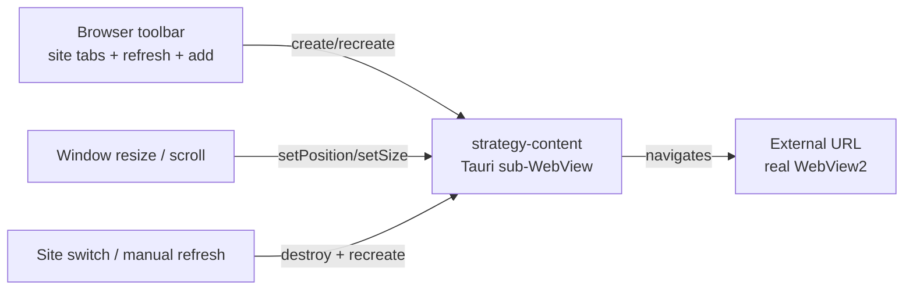

# Strategy browser

The strategy browser embeds a real WebView2 instance inside the main application window so players can browse community guide websites without leaving the tool. It is not an iframe or a proxied HTML renderer; it is a genuine Chromium WebView2 navigating external URLs directly.

## Directory layout

```
src-tauri/src/strategy/
├── mod.rs          # module declaration
├── webview.rs      # strategy_open_window (compat per-host top-level window)
├── fetch.rs        # strategy_fetch_page (compat HTTP fetcher with JS redirect following)
└── types.rs        # request/response DTOs

src/components/app/
├── strategy-page.tsx   # frontend: browser toolbar + embedded WebView host
└── strategy-utils.ts   # site constants, refresh tiers, localStorage helpers
```

## Key abstractions

| Type | File | Description |
|------|------|-------------|
| `StrategyOpenWindowRequest` | `src-tauri/src/strategy/types.rs` | URL + optional title/label for the compat window command |
| `StrategyOpenWindowResponse` | `src-tauri/src/strategy/types.rs` | Returns the window label and whether it was reused |
| `StrategyFetchResponse` | `src-tauri/src/strategy/types.rs` | HTML + final URL + optional challenge info from the compat fetcher |
| `ChallengeInfo` | `src-tauri/src/strategy/types.rs` | CC-check detection result (`kind`, `message`) |
| `StrategyPage` | `src/components/app/strategy-page.tsx` | Frontend container: toolbar, site tabs, embedded content host |

## How it works

The main UI path creates a Tauri sub-WebView with the label `strategy-content` directly inside the main window. This sub-WebView navigates the external URL using real WebView2, so cookies, JavaScript, localStorage, CAPTCHAs, and same-origin APIs are all handled by the site itself.



### Content lifecycle

- **Site switch** - Destroys the existing `strategy-content` sub-WebView and creates a new one pointing to the new site URL.
- **Manual refresh** - Same destroy-and-recreate cycle.
- **Auto-refresh** - Each site can have a refresh tier (off / 30s / 1m / 2m / 5m / 10m) persisted to `localStorage` under `delta-auto-tools:strategy:<site>:refresh-seconds`. When the timer fires, the sub-WebView is recreated.
- **Layout sync** - On window resize, layout changes, or scroll, the frontend calls `setPosition` and `setSize` on the sub-WebView so it stays within its host area.
- **Cleanup** - When the component unmounts (e.g. switching to another tool page), the `strategy-content` sub-WebView is closed so it does not overlap the main UI.

### Custom sites

Users can add and delete custom sites, persisted to `localStorage` under `delta-auto-tools:strategy:user-sites`. Adding a site uses an inline panel below the toolbar (not a Dialog or SelectContent overlay), which pushes the content host area down.

### Compat commands

Two Rust commands exist for backward compatibility and experimentation but are not the main UI path:

- `strategy_open_window` - Creates or reuses a per-host top-level WebView2 window (a separate OS window). The main UI does not call this.
- `strategy_fetch_page` - Fetches a page using Chrome 135 headers, shares a cookie jar, sniffs JavaScript redirects (`document.cookie`, `location.href`, `location.replace`), follows up to 3 redirects, and detects CC-check challenge pages. Returns raw HTML. The main UI does not render this; it is a research/compat entry point.

## Integration points

- **Tauri WebviewWindow API** - The frontend creates and manages the `strategy-content` sub-WebView via the Tauri window API.
- **localStorage** - Site lists and per-site refresh tiers are stored client-side, not in Rust.
- **No hotkey integration** - Strategy browser does not register any hotkeys.

## Entry points for modification

To add a new built-in site, add it to the site constants in `src/components/app/strategy-utils.ts`. To change the refresh tier options, update the tier list in `strategy-utils.ts` and the persistence key format. To adjust the WebView bounds synchronization, modify the resize/scroll effect in `src/components/app/strategy-page.tsx`.

## Key source files

| File | Purpose |
|------|---------|
| `src-tauri/src/strategy/webview.rs` | Compat `strategy_open_window` command (per-host top-level window) |
| `src-tauri/src/strategy/fetch.rs` | Compat `strategy_fetch_page` command (Chrome headers, JS redirect following, CC check) |
| `src-tauri/src/strategy/types.rs` | Request/response DTOs for both compat commands |
| `src/components/app/strategy-page.tsx` | Frontend container: toolbar, site tabs, embedded WebView host, auto-refresh |
| `src/components/app/strategy-utils.ts` | Built-in site list, refresh tiers, localStorage read/write helpers |
