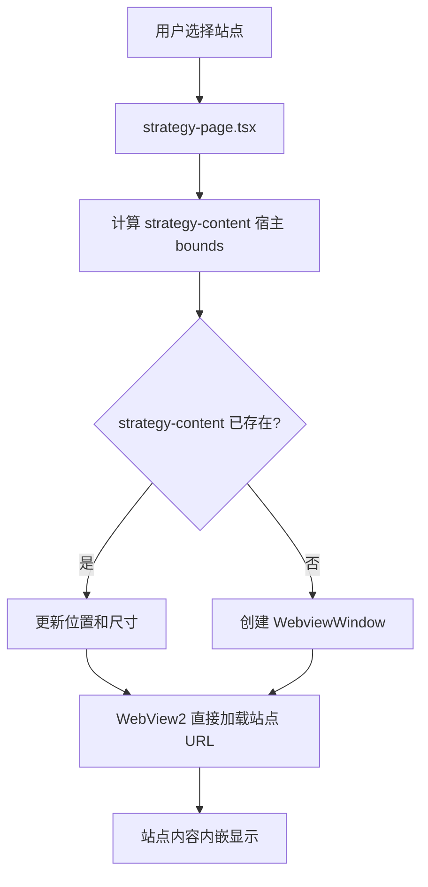

# 攻略网站

## 目的

攻略网站（Strategy）模块在主窗口内嵌《三角洲行动》攻略/工具站点，让玩家无需切出应用即可查阅攻略。

当前实现只有一条路径：前端 `strategy-page.tsx` 创建并维护 label 为 `strategy-content` 的 Tauri 子 `WebviewWindow`。不创建独立浏览器窗口，不使用 iframe/srcDoc，不走 HTTP 抓取或 HTML 转译。

## 目录结构

```text
src/components/app/
├── strategy-page.tsx    # 前端容器页：站点切换、自定义站点 CRUD、刷新档位、内嵌网页区域
└── strategy-utils.ts    # 纯逻辑工具：内置站点常量、用户站点 CRUD、本地存储读写、bounds 规范化
```

## 关键抽象

| 抽象 | 定义位置 | 职责 |
|------|---------|------|
| `BUILTIN_STRATEGY_SITES` | `strategy-utils.ts` | 内置站点常量（`kkrb` / `orzice`） |
| `StrategySite` | `strategy-utils.ts` | 站点结构：id / shortLabel / label / url / favicon / description / builtin |
| `StrategyContentBounds` | `strategy-utils.ts` | 内嵌网页区域物理坐标与尺寸 |
| `CONTENT_WEBVIEW_LABEL` | `strategy-page.tsx` | 子 WebView 固定 label：`strategy-content` |

## 工作原理

### 前端嵌入模式

`strategy-page.tsx` 在主窗口内嵌一个 `strategy-content` 子 WebView，通过 `WebviewWindow.getByLabel` 定位并按宿主容器 bounds 调整其位置与尺寸。

功能：
- **站点切换**：内置站点（`kkrb` / `orzice`）+ 用户自定义站点的 Tab 切换
- **自定义站点 CRUD**：内联面板新增/删除用户站点（`user_{random}` ID）
- **刷新档位**：可选自动刷新间隔，到点重建/刷新内嵌网页
- **当前 URL 展示**：mono 小字横向压缩显示当前站点 URL
- **bounds 同步**：监听宿主容器尺寸变化，规范化后更新子 WebView 的 `PhysicalPosition` / `PhysicalSize`
- **界面浮层保护**：打开全局设置 Dialog 或顶部 Profile 菜单时关闭 `strategy-content` 子 WebView，关闭浮层后按当前站点重建，避免原生 WebView2 覆盖 DOM 浮层

### 流程图



## 集成点

### Tauri API

前端直接使用 `@tauri-apps/api/webviewWindow`：

| API | 作用 |
|-----|------|
| `WebviewWindow.getByLabel("strategy-content")` | 查找现有子 WebView |
| `new WebviewWindow("strategy-content", options)` | 创建主窗口内嵌子 WebView |
| `setPosition` / `setSize` | 同步宿主区域物理坐标和尺寸 |
| `close` | 浮层遮挡或切换工具页时关闭子 WebView |

### 约束

- 主窗口内嵌 `strategy-content` 子 WebView，**不创建独立浏览器窗口**，**不使用 iframe/srcDoc**
- **不得隐藏 Left Index Rail**
- 新增站点和刷新档位使用内联面板，不使用 Dialog/SelectContent 等浮层
- 用户新增站点使用 `user_{random}` ID，避免与内置站点冲突

### 前端本地存储

- 用户自定义站点：localStorage（key 前缀 `delta-auto-tools:`）
- 刷新档位：localStorage，按站点 ID 独立存储

## 修改入口

| 需求 | 修改位置 |
|------|---------|
| 新增内置站点 | `strategy-utils.ts` 的 `BUILTIN_STRATEGY_SITES` 常量 + `BuiltinStrategySiteId` 类型 |
| 调整内嵌区域 bounds 逻辑 | `strategy-utils.ts` 的 `normalizeStrategyContentBounds` / `normalizeVisibleStrategyContentBounds` |
| 调整 WebView 创建/关闭行为 | `strategy-page.tsx` 中 `CONTENT_WEBVIEW_LABEL` 相关逻辑 |
| 调整自定义站点存储 | `strategy-utils.ts` 的 `readStoredUserSites` / `writeStoredUserSites` |

## 关键源文件

| 文件 | 仓库根路径 |
|------|-----------|
| 前端容器页 | `src/components/app/strategy-page.tsx` |
| 前端工具函数 | `src/components/app/strategy-utils.ts` |

## 相关系统

- [透明叠加窗](../systems/overlay-windows.md)
- [模式与约定](../how-to-contribute/patterns-and-conventions.md)
