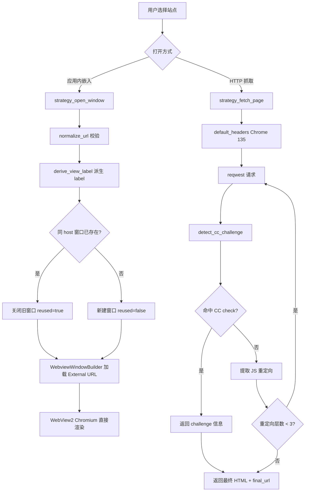

# 攻略网站

## 目的

攻略网站（Strategy）模块在应用内嵌入《三角洲行动》攻略/工具站点，让玩家无需切出应用即可查阅攻略。它提供两种接入方式：

1. **WebView2 直接嵌入**（`strategy_open_window`）：在 Tauri 主进程下新建一个 `WebviewWindow`，由真正的 WebView2 Chromium 直接渲染目标站点本身，不走任何代理或前端转译。
2. **HTTP 抓取**（`strategy_fetch_page`）：使用 reqwest 以 Chrome 135 身份请求目标 URL，检测 CC check 安全验证页面并跟随 JS 重定向（最多 3 层），返回 HTML 内容与 challenge 信息。

前端通过站点切换、自定义站点 CRUD、刷新档位控制内嵌网页区域的展示，主窗口内嵌 `strategy-content` 子 WebView（不创建独立浏览器窗口，不使用 iframe/srcDoc）。

## 目录结构

```text
src-tauri/src/strategy/
├── mod.rs       # 模块入口，声明子模块
├── webview.rs   # strategy_open_window 命令：URL 校验 + WebView2 窗口创建/复用
├── fetch.rs     # strategy_fetch_page 命令：Chrome 135 头 + CC check 检测 + JS 重定向跟随
└── types.rs     # 请求/响应 DTO（StrategyOpenWindowRequest/Response、StrategyFetchResponse、ChallengeInfo）

src/components/app/
├── strategy-page.tsx    # 前端容器页：站点切换、自定义站点 CRUD、刷新档位、内嵌网页区域
└── strategy-utils.ts    # 纯逻辑工具：内置站点常量、用户站点 CRUD、本地存储读写、bounds 规范化
```

## 关键抽象

| 抽象 | 定义位置 | 职责 |
|------|---------|------|
| `StrategyOpenWindowRequest` | `strategy/types.rs` | 打开窗口请求：`url`（必填）+ 可选 `title` / `label` |
| `StrategyOpenWindowResponse` | `strategy/types.rs` | 响应：窗口 `label` + `reused`（是否复用已有窗口） |
| `StrategyFetchResponse` | `strategy/types.rs` | 抓取响应：`html` + `final_url` + `challenge`（CC check 信息，可选） |
| `ChallengeInfo` | `strategy/types.rs` | CC check 验证信息：`kind`（当前固定 `"ccCheck"`）+ `message` |
| `normalize_url` | `strategy/webview.rs` | 校验 URL 非空且 scheme 为 http/https |
| `derive_view_label` | `strategy/webview.rs` | 从 host 派生稳定窗口 label（`strategy-view-{sanitized-host}`），同一 host 复用窗口 |
| `default_headers` | `strategy/fetch.rs` | 构造 Chrome 135 on Windows 请求头（UA、sec-ch-ua、sec-fetch-* 等） |
| `detect_cc_challenge` | `strategy/fetch.rs` | 检测响应 HTML 是否命中 CC check / CDN Shield 验证页面 |
| `BUILTIN_STRATEGY_SITES` | `strategy-utils.ts` | 内置站点常量（`kkrb` / `orzice`，不允许删除） |
| `StrategySite` | `strategy-utils.ts` | 站点结构：id / shortLabel / label / url / favicon / description / builtin |
| `StrategyContentBounds` | `strategy-utils.ts` | 内嵌网页区域物理坐标与尺寸 |

## 工作原理

### strategy_open_window

`strategy_open_window` 在 Tauri 主进程下新建一个 `WebviewWindow` 加载外部 URL（top-level navigation），由 WebView2 Chromium 直接渲染目标站点本身。

流程：
1. `normalize_url` 校验 URL 非空且 scheme 为 `http`/`https`
2. 从 host 派生窗口 label（`strategy-view-{host}`，仅保留 `[a-z0-9-]`），或使用调用方传入的 `label`
3. 同一 host 复用窗口：若已存在则关闭并重建（避免堆叠多个同站子窗口），`reused=true`
4. 构建 `WebviewWindowBuilder`，默认尺寸 1024×720，最小 480×360，可调整、带装饰、自动聚焦可见

### strategy_fetch_page

`strategy_fetch_page` 使用 reqwest 以 Chrome 135 身份请求目标 URL，用于抓取需要 JS 重定向跟随的页面。

流程：
1. `default_headers` 构造 Chrome 135 on Windows 请求头（User-Agent、sec-ch-ua、sec-fetch-dest/mode/site/user、upgrade-insecure-requests 等）
2. 发起请求获取 HTML
3. `detect_cc_challenge` 检测响应是否命中 CC check 安全验证页面（`<title>CC check</title>` 或 `/cdn-shield/` 路径）
4. 跟随 JS 重定向（正则提取 `location.href`/`location.replace` 等），最多 `MAX_REDIRECT_DEPTH=3` 层
5. 返回 `StrategyFetchResponse`：最终 HTML、最终 URL、可选 challenge 信息

### 前端嵌入模式

前端 `strategy-page.tsx` 在主窗口内嵌一个 `strategy-content` 子 WebView（label 常量 `CONTENT_WEBVIEW_LABEL`），不创建独立浏览器窗口。通过 `WebviewWindow.getByLabel` 定位并按宿主容器 bounds 调整其位置与尺寸。

功能：
- **站点切换**：内置站点（`kkrb` / `orzice`）+ 用户自定义站点的 Tab 切换
- **自定义站点 CRUD**：内联面板新增/删除用户站点（`user_{random}` ID，内置站点不可删）
- **刷新档位**：可选自动刷新间隔，到点重新加载内嵌网页
- **当前 URL 展示**：mono 小字横向压缩显示当前站点 URL
- **bounds 同步**：监听宿主容器尺寸变化，规范化后更新子 WebView 的 `PhysicalPosition` / `PhysicalSize`
- **界面浮层保护**：打开全局设置 Dialog 或顶部 Profile 菜单时关闭 `strategy-content` 子 WebView，关闭浮层后按当前站点重建，避免原生 WebView2 覆盖 DOM 浮层。

### 流程图



## 集成点

### Tauri commands

| 命令 | 作用 |
|------|------|
| `strategy_open_window` | 新建/复用 WebviewWindow 加载外部 URL（WebView2 直接渲染）。同 host 复用窗口。URL 必须 http/https |
| `strategy_fetch_page` | 用 reqwest + Chrome 135 头抓取页面，检测 CC check 并跟随 JS 重定向（最多 3 层）。返回 HTML + final_url + challenge |

### 约束

- 主窗口内嵌 `strategy-content` 子 WebView，**不创建独立浏览器窗口**，**不使用 iframe/srcDoc**
- **不得隐藏 Left Index Rail**
- 内置站点（`kkrb` / `orzice`）不允许用户删除
- `strategy_open_window` 的 URL 必须是 `http`/`https`，否则报错
- 新增 Tauri command 必须同时注册到 `src-tauri/src/lib.rs` 的 `generate_handler![]` 和 `src-tauri/capabilities/default.json`

### 前端本地存储

- 用户自定义站点：localStorage（key 前缀 `delta-auto-tools:`），首次启动写入内置预置站点
- 刷新档位：localStorage，按站点 ID 独立存储

## 修改入口

| 需求 | 修改位置 |
|------|---------|
| 新增内置站点 | `strategy-utils.ts` 的 `BUILTIN_STRATEGY_SITES` 常量 + `BuiltinStrategySiteId` 类型 |
| 调整窗口尺寸/行为 | `webview.rs` 的 `DEFAULT_INNER_WIDTH/HEIGHT`、`MIN_INNER_WIDTH/HEIGHT` 与 `WebviewWindowBuilder` 链 |
| 调整 Chrome 伪装头 | `fetch.rs` 的 `default_headers` |
| 新增 CC check 检测规则 | `fetch.rs` 的 `detect_cc_challenge` |
| 调整 JS 重定向跟随 | `fetch.rs` 的重定向正则与 `MAX_REDIRECT_DEPTH` |
| 调整内嵌区域 bounds 逻辑 | `strategy-utils.ts` 的 `normalizeStrategyContentBounds` / `normalizeVisibleStrategyContentBounds` |
| 新增 Tauri command | `strategy/` 对应子模块定义 + `src-tauri/src/lib.rs` `generate_handler!` 注册 + `capabilities/default.json` |

## 关键源文件

| 文件 | 仓库根路径 |
|------|-----------|
| 模块入口 | `src-tauri/src/strategy/mod.rs` |
| WebView2 窗口命令 | `src-tauri/src/strategy/webview.rs` |
| HTTP 抓取命令 | `src-tauri/src/strategy/fetch.rs` |
| 请求/响应 DTO | `src-tauri/src/strategy/types.rs` |
| 前端容器页 | `src/components/app/strategy-page.tsx` |
| 前端工具函数 | `src/components/app/strategy-utils.ts` |

## 相关系统

- [工具基座](../systems/tool-base.md)
- [热键系统](../systems/hotkeys.md)
- [透明叠加窗](../systems/overlay-windows.md)
