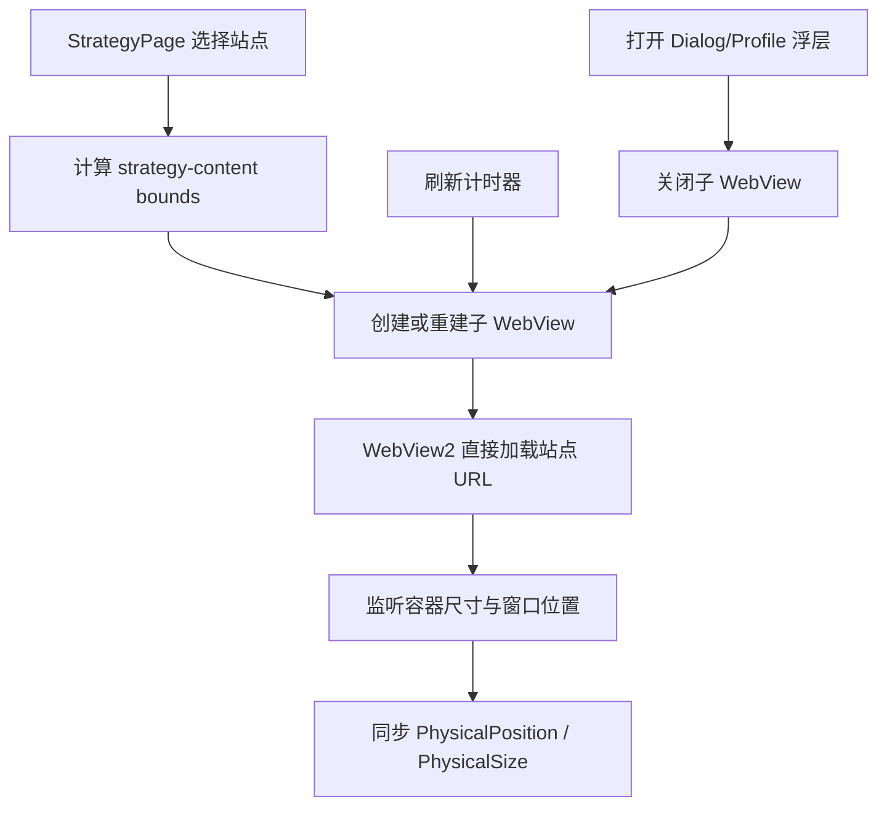

# 攻略网站

攻略页在主窗口内嵌 `strategy-content` 子 WebView，由 WebView2 直接加载当前站点。应用不创建独立浏览器窗口，不使用 `iframe` / `srcDoc`，也不经过 Rust HTTP 抓取代理。

## 源码结构

```text
src/components/app/
├── strategy-page.tsx   # 页面编排、子 WebView 生命周期与 bounds 同步
└── strategy-utils.ts  # 站点、刷新档位、bounds 与 localStorage 工具
```

Strategy 没有专用 Rust module 或 Tauri command。前端直接使用 `@tauri-apps/api/webviewWindow` 管理子 WebView。

## 站点模型

`StrategySite` 包含：

- `id`：站点唯一标识
- `shortLabel` / `label`：Left Index Rail 与内容区文案
- `url`：WebView2 加载地址
- `favicon`：站点图标
- `description`：站点摘要
- `builtin`：是否为不可删除的内置站点

内置站点为 `kkrb` 与 `orzice`。用户站点保存在带 `delta-auto-tools:` 前缀的 localStorage key 中。

## 运行流程



## 主要功能

- **Left Index Rail**：切换内置或用户站点，始终保持可见
- **新增/删除站点**：用户站点可编辑，内置站点不可删除
- **刷新档位**：可配自动刷新间隔，到点重建当前子 WebView
- **bounds 同步**：容器尺寸或窗口位置变化时更新子 WebView 物理坐标
- **浮层保护**：打开全局设置 Dialog 或 Profile 菜单时关闭子 WebView，关闭浮层后重建，避免原生 WebView2 覆盖 DOM 浮层

## 布局

黑标不套 `BlackmarkPage` 英雄区。站点 Tab、地址栏、新增/删除/刷新留在顶条；其下 `strategy-content` 铺到 dock 上沿。子 WebView 是原生窗口，铺到窗口底会盖住 dock，不能再收。外层页面不滚动，滚动只发生在 WebView 内。战地控制台同样是当前窗口铺满，不套第二层页面滚动。

## 约束

- 必须使用主窗口内嵌 `strategy-content` 子 WebView
- 不得创建独立浏览器窗口
- 不得使用 `iframe` / `srcDoc`
- 不得隐藏 Left Index Rail
- 新增站点必须通过 `http` / `https` URL 校验
- 不得让应用壳与 WebView 同时出现纵向滚动条

## 修改入口

| 需求 | 修改位置 |
|------|---------|
| 新增内置站点 | `strategy-utils.ts` 的 `BUILTIN_STRATEGY_SITES` |
| 调整站点持久化/刷新档位 | `strategy-utils.ts` |
| 调整子 WebView 生命周期 | `strategy-page.tsx` |
| 调整内嵌区域 bounds | `normalizeStrategyContentBounds` / `normalizeVisibleStrategyContentBounds` |

## 相关系统

- [全局总开关](../systems/global-state.md)
- [主题引擎](../systems/theme-engine.md)
