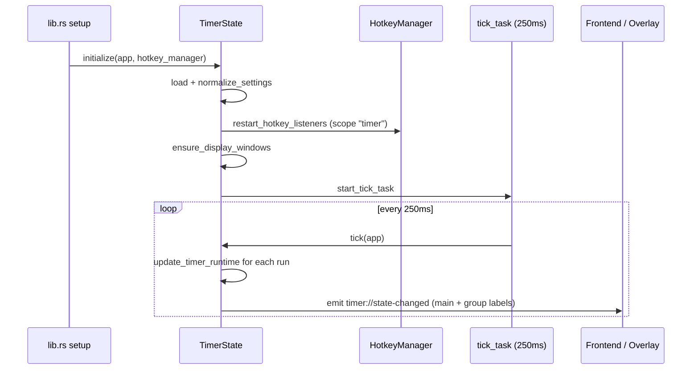
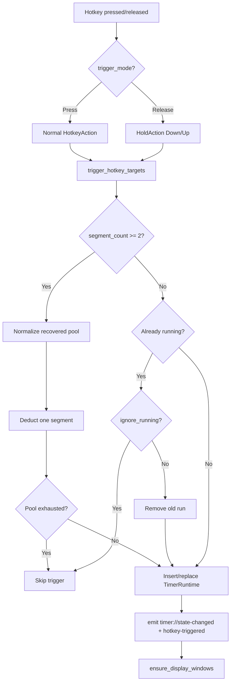

# Timer board

## Purpose

The timer board is a multi-timer task sequencing panel. It lets players define any number of timer cards, each with its own hotkey, duration, direction (countdown or countup), and optional multi-segment recovery mode. Triggering a hotkey starts (or restarts) the matching timers; the progress is rendered on a transparent, always-on-top, click-through overlay window that sits over the game so the player never has to alt-tab.

Timers sharing the same hotkey are grouped into one hotkey action and fire together. A running single-segment timer ignores repeat hotkey triggers until it finishes (or, if `ignoreRunning` is off, restarts from the beginning). Multi-segment timers consume one segment worth of the remaining recovery pool on each trigger instead of restarting.

## Directory layout

Backend (Rust):

```
src-tauri/src/timer/
├── mod.rs          # TimerState, TimerLogic, tick loop, transparent/position windows, commands, stop_all, shutdown, initialize
├── types.rs        # TimerSettings, TimerItem, TimerGroup, TimerDisplaySettings, TimerBootstrap, TimerRunState, enums, selection outcome
├── events.rs       # event name string constants (STATE_CHANGED, HOTKEY_TRIGGERED, HOTKEY_ERROR)
└── settings.rs     # timer_settings.json load/save helpers
```

Frontend (React/TypeScript):

```
src/components/app/
├── timer-page.tsx           # Timer page container: bootstrap/form state, autosave, card list, display/position UI
├── timer-types.ts            # Frontend type definitions + constants (TIMER_DISPLAY_WIDTH, DEFAULT_TIMER_GROUP_ID, etc.)
├── timer-utils.ts            # settingsToForm/parseForm, progress calc, countdown formatting, overlay bootstrap hook, moveTimerItem
├── sync-overlay-window.tsx   # Shared TimerDisplayOverlay + TimerPositionOverlay components (also used by counter)
└── sync-card-list.tsx        # Shared card list layout with AddCardButton + drag reorder section grid
```

Persistence:

```
<app_config_dir>/timer_settings.json   # user config: timer cards, groups, display rect, font opacity, master switch
```

## Key abstractions

| Abstraction | Location | Description |
|-------------|----------|-------------|
| `TimerState` | `src-tauri/src/timer/mod.rs` | Wraps `ToolState<TimerLogic>` and holds the `tick_task` (250ms loop handle). |
| `TimerLogic` | `src-tauri/src/timer/mod.rs` | Implements `ToolLogic`; owns `runs: HashMap<String, TimerRuntime>` and `pending_position`. |
| `TimerRuntime` | `src-tauri/src/timer/mod.rs` | Per-timer running state: started/ends timestamps, current/remaining seconds, direction, status, multi-segment pool. |
| `TimerSettings` | `src-tauri/src/timer/types.rs` | Root config: `timer_enabled`, `display`, `timer_groups`, `timers`. |
| `TimerItem` | `src-tauri/src/timer/types.rs` | One timer card: `id`, `group_id`, `name`, `duration_seconds`, `hotkey`, `direction`, `trigger_mode`, `enabled`, `ignore_running`, `segment_count`. |
| `TimerGroup` | `src-tauri/src/timer/types.rs` | A display group with its own `display` rect/opacity; multiple groups get separate overlay windows. |
| `TimerBootstrap` | `src-tauri/src/timer/types.rs` | Snapshot sent to frontend: `settings` + `runs` + `hotkey_error`. |
| `TimerRunState` | `src-tauri/src/timer/types.rs` | Read-only run snapshot for a single timer, emitted to frontend and overlay windows. |
| `TimerDirection` | `src-tauri/src/timer/types.rs` | `Countdown` (duration → 0) or `Countup` (0 → duration). |
| `TimerTriggerMode` | `src-tauri/src/timer/types.rs` | `Press` (fire on key down) or `Release` (fire on key up; uses the hold mechanism). |
| `TimerSelectionOutcome` | `src-tauri/src/timer/types.rs` | Result of a position-selection flow: `Selected` / `Cancelled` / `Closed` + `rect` + `group_id`. |

## How it works

### Initialization and the tick loop

`initialize()` (`src-tauri/src/timer/mod.rs`) loads and normalizes settings, registers hotkey listeners (if `timer_enabled`), ensures display windows exist, and starts a 250ms tick task. The tick task calls `tick()` which locks the inner state, advances every running `TimerRuntime` via `update_timer_runtime()`, and if anything changed, rebuilds the bootstrap and emits `timer://state-changed` to both the `main` window and every group's display window.



### Hotkey trigger flow

`restart_hotkey_listeners()` groups enabled timers by hotkey string. Timers with `trigger_mode = Press` become normal `HotkeyAction` bindings; timers with `trigger_mode = Release` become hold bindings (`HoldAction::Down` fires the press-group, `HoldAction::Up` fires the release-group). Both use `ConflictPolicy::AllowHold` so they can coexist with counter and rapidfire scopes.

When a hotkey fires, `trigger_hotkey_targets()` locks the inner state and for each target timer:

- **Single-segment**: if already running and `ignore_running` is true, the trigger is skipped. If `ignore_running` is false, the existing run is removed and a fresh run starts. A new `TimerRuntime` is inserted with `ends_at_ms = now + duration * 1000`.
- **Multi-segment** (`segment_count >= 2`): `trigger_multisegment_runtime()` first normalizes the recovered pool (advancing `current_seconds` by elapsed time since `started_at_ms`), then deducts one segment duration from the pool. If the pool is exhausted the trigger is skipped. This allows repeated hotkey presses to "consume" segments of the total duration without restarting.

After mutation the bootstrap is emitted and `ensure_display_windows()` is called. `timer://hotkey-triggered` is emitted with the list of triggered timer IDs.



### Transparent overlay windows

Each timer group gets its own display window. The label is `timer-display` for the default group (`DEFAULT_TIMER_GROUP_ID = "default-timer-group"`) and `timer-display-<groupId>` for custom groups. The query mode is `timer-display&groupId=<encoded>`. Windows are created borderless, transparent, always-on-top, click-through (`set_ignore_cursor_events(true)`), skipped from the taskbar, and non-focused. Minimum width is 320px (`TIMER_DISPLAY_WIDTH`); height is computed by `display_height(item_count)` = `max(96, 48 + max(1, count) * 30)`.

`ensure_display_windows()` destroys stale display windows (labels no longer matching any group) via `destroy_stale_windows`.

Position setting uses a separate window with label `timer-position` (or `timer-position-<groupId>`), mode `timer-position&groupId=<encoded>`. It is created focused and visible, uses a `oneshot` channel to communicate the outcome back to `timer_begin_position_selection`, and commits via `timer_position_commit` / cancels via `timer_position_cancel`. Drag updates flow through `timer_position_moved`.

See `../systems/overlay-windows.md` for the shared overlay/position window infrastructure.

### Master switch and shutdown

`timer_save_settings()` normalizes and saves settings, restarts hotkey listeners, retains only enabled timers' runs, and if `timer_enabled` is false clears all runs and hides display windows. It also pushes the new settings to the active profile snapshot via `profile::update_active_profile_snapshot`.

`stop_all()` clears all runs and emits state (does not destroy windows). `shutdown()` clears hotkey scopes, stops the tick task, and destroys all position and display windows.

### Multi-segment recovery pool

Multi-segment timers track a `recovery_start_pool` (seconds already consumed from the total `segment_count * duration_seconds` pool). Between backend ticks (250ms), the frontend overlay uses `requestAnimationFrame` to interpolate a smooth display value and progress bar based on `recovery_start_pool * 1000 + (now - started_at_ms)`, capped at the total duration. This avoids the seconds counter jumping in 250ms steps.

## Integration points

- **ToolBase** (`../systems/tool-base.md`): `TimerLogic` implements `ToolLogic`; shared `settings` and `hotkey_error` live in `ToolStateInner<TimerLogic>`.
- **Hotkeys** (`../systems/hotkeys.md`): Registers scope `"timer"` with `ConflictPolicy::AllowHold`. Release-trigger timers use the hold mechanism (`replace_hold_scope`). Conflicts with counter and rapidfire scopes are allowed; conflicts with morse (Strict) are rejected.
- **Overlay windows** (`../systems/overlay-windows.md`): Display and position windows use the shared helpers in `src-tauri/src/overlay_utils.rs` (`destroy_stale_windows`, `destroy_window`, `hide_window`, `safe_label_component`, `encoded_query_value`).
- **Profile** (`src-tauri/src/profile/`): `timer_save_settings` and `timer_position_commit` push `ActiveProfileSnapshotPatch::Timer` to keep the active profile snapshot in sync.
- **GlobalState** (`src-tauri/src/global_state.rs`): Disabling the global switch calls `timer::stop_all`, which clears all running timers.
- **Frontend events** (`src/lib/tauri-events.ts`): `TIMER_EVENTS.stateChanged`, `.hotkeyTriggered`, `.hotkeyError` centralize the event names from `src-tauri/src/timer/events.rs`.

## Entry points for modification

| Task | Start here |
|------|-----------|
| Add a new timer field | `TimerItem` in `src-tauri/src/timer/types.rs` → `normalize_timer` / `normalize_settings` in `src-tauri/src/timer/mod.rs` → `timer-types.ts` + `timer-utils.ts` (settingsToForm/parseForm) → `timer-page.tsx` UI |
| Change tick interval or logic | `start_tick_task` / `tick` / `update_timer_runtime` in `src-tauri/src/timer/mod.rs` |
| Change transparent window creation | `ensure_overlay_window` / `ensure_display_windows` in `src-tauri/src/timer/mod.rs` |
| Change overlay rendering | `TimerDisplayOverlay` in `src/components/app/sync-overlay-window.tsx` |
| Add a new Tauri command | Define in `src-tauri/src/timer/mod.rs` → register in `lib.rs` `generate_handler![]` → add to `src-tauri/capabilities/default.json` |
| Change position window behavior | `timer_begin_position_selection` / `timer_position_commit` / `timer_position_cancel` / `timer_position_moved` + `PositionOverlay` in `src/components/ui/position-overlay.tsx` |
| Change hotkey conflict policy | `restart_hotkey_listeners` in `src-tauri/src/timer/mod.rs` (see `../systems/hotkeys.md`) |

## Key source files

| File | Role |
|------|------|
| `src-tauri/src/timer/mod.rs` | Core state machine, tick loop, hotkey registration, transparent/position windows, all Tauri commands, `initialize`/`shutdown`/`stop_all` |
| `src-tauri/src/timer/types.rs` | All DTOs and enums with `#[serde(rename_all = "camelCase")]` |
| `src-tauri/src/timer/events.rs` | Event name constants: `STATE_CHANGED`, `HOTKEY_TRIGGERED`, `HOTKEY_ERROR` |
| `src-tauri/src/timer/settings.rs` | `timer_settings.json` load/save via shared `settings` helpers |
| `src/components/app/timer-page.tsx` | Frontend container: bootstrap/form dual-state, autosave, card list, display/position UI |
| `src/components/app/timer-types.ts` | Frontend TypeScript types + constants |
| `src/components/app/timer-utils.ts` | Settings↔form conversion, progress %, countdown formatting, overlay bootstrap hook, `moveTimerItem`, dirty check |
| `src/components/app/sync-overlay-window.tsx` | Shared `TimerDisplayOverlay` (with smooth `requestAnimationFrame` interpolation) and `TimerPositionOverlay` |
| `src/components/app/sync-card-list.tsx` | Shared card list section grid with `AddCardButton` |
| `src/lib/tauri-events.ts` | `TIMER_EVENTS` constant object + `listenEvent<T>` helper |
