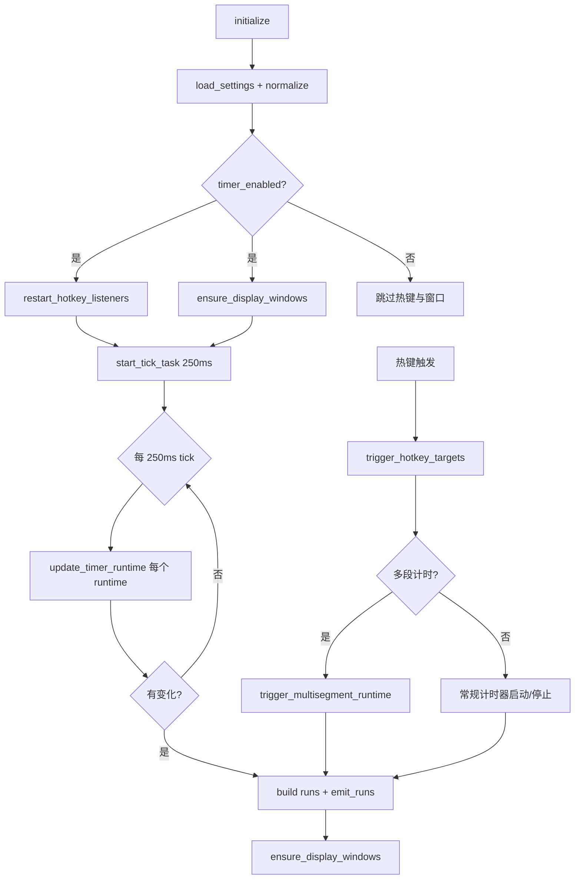

# 计时器

> 多计时器系统，每个分组拥有独立的透明叠加显示窗口。250ms tick 循环驱动倒计时/正计时，支持多段计时与按下/释放两种触发模式。

## 用途

计时器模块为《三角洲行动》玩家提供游戏内倒计时/正计时辅助。典型场景包括技能冷却、复活倒计时、物资刷新等。计时器以透明叠加窗形式覆盖在游戏画面之上，保持置顶与点击穿透，不干扰游戏操作。

核心能力：

- **多计时器**：不限数量的计时器条目，按分组组织，每个分组拥有独立的透明显示窗口。
- **双向计时**：`Countdown`（倒计时）与 `Countup`（正计时）两种方向。
- **多段计时**：通过 `segmentCount` 将单个计时器拆分为多个等长时段，每次触发推进一段，剩余时段池随时间恢复。
- **双触发模式**：`Press`（按下触发）与 `Release`（释放触发，需按住热键，配合 hold scope）。
- **热键驱动**：每个计时器绑定独立热键，支持跨 scope 共享按键（详见 [热键系统](../systems/hotkeys.md)）。
- **位置校准**：每个分组可通过独立的位置设置窗口拖拽定位透明显示窗。

> 计时器与计数器原为同一工具，于 v0.15.3（2026-06-15）拆分为两个独立工具，各自拥有独立页面与独立的状态管理。

## 目录结构

```
src-tauri/src/timer/
├── mod.rs          # 模块入口：状态、tick 循环、commands、透明窗口管理
├── types.rs        # TimerSettings / TimerItem / TimerGroup / TimerRuntime / TimerRunState 等类型
├── settings.rs     # load_settings / save_settings（持久化到 timer_settings.json）
└── events.rs       # 事件名常量

src/components/app/
├── timer-page.tsx          # 计时器页面组件（配置、运行态、透明窗预览）
├── timer-types.ts          # 前端 TypeScript 类型（含计数器类型）
└── timer-utils.ts          # settingsToForm / parseSettingsForm 等表单转换
```

## 关键抽象

| 抽象 | 定义位置 | 职责 |
|------|----------|------|
| `TimerSettings` | `timer/types.rs` | 顶层配置：总开关、显示设置、分组列表、计时器列表 |
| `TimerItem` | `timer/types.rs` | 单个计时器配置：duration、hotkey、direction、triggerMode、segmentCount |
| `TimerGroup` | `timer/types.rs` | 计时器分组：id、name、enabled、display（独立透明窗位置与透明度） |
| `TimerDirection` | `timer/types.rs` | 计时方向枚举：`Countdown` / `Countup` |
| `TimerTriggerMode` | `timer/types.rs` | 触发模式枚举：`Press` / `Release` |
| `TimerRuntime` | `timer/mod.rs` | 运行态（非序列化）：started_at_ms、ends_at_ms、current_seconds、remaining_seconds、status、多段池 |
| `TimerRunState` | `timer/types.rs` | 序列化的运行态快照：随 Bootstrap 或 `runs-changed` 返回前端 |
| `TimerRunsChanged` | `timer/types.rs` | 轻量运行态事件载荷，仅含 `runs`，不含 settings |
| `TimerRunStatus` | `timer/types.rs` | 运行状态枚举：`Running` / `Finished` |
| `TimerLogic` | `timer/mod.rs` | `SyncToolLogic` + `RunsSync` 实现，持有 `runs: HashMap<String, TimerRuntime>` 与位置设置会话 |
| `TimerState` | `timer/mod.rs` | 顶层状态：`ToolState<TimerLogic>` + tick 任务句柄 |
| `TimerBootstrap` | `timer/types.rs` | 前端拉取的完整快照：settings + runs + hotkey_error |

## 工作原理

### 生命周期



### Tick 循环

`start_tick_task` 启动一个 250ms 间隔的 tokio 定时任务。每次 tick：

1. 锁定 `ToolStateInner`，对每个 `TimerRuntime` 调用 `update_timer_runtime`。
2. 单段计时器：根据 `started_at_ms` 与 `ends_at_ms` 计算 `current_seconds` / `remaining_seconds`，归零时标记 `Finished`。
3. 多段计时器：根据 `recovery_start_pool` + 已经过的秒数计算恢复后的池值。
4. 若任一 runtime 发生变化，仅构建 `TimerRunsChanged` 并通过 `timer://runs-changed` 推送到主窗口与各分组显示窗口；tick 不 clone/序列化 settings。

### 多段计时（Segment）

当 `TimerItem.segmentCount >= 2` 时，计时器进入多段模式：

- **总时长** = `segmentCount * durationSeconds`
- **段时长** = `durationSeconds`
- 每次热键触发从总池中扣除一段 `segment_duration`，启动一段新的倒计时/正计时。
- 剩余池值随时间恢复（`recovery_start_pool` + 经过秒数），模拟「技能充能」机制。
- `deduct_multisegment_pool` 在扣除前先归一化已恢复的池值，保留亚秒级余量，避免 backend tick 之间触发导致的精度丢失。

### 热键绑定

`SyncToolLogic::build_hotkey_bindings` 按 `triggerMode` 分流：

- **Press 模式**：注册为普通 scope 快捷键（`bindings.normal`），按下即触发。
- **Release 模式**：注册为 hold scope（`bindings.hold`），按下时触发 Down（Press 列表），释放时触发 Up（Release 列表）。

冲突策略为 `ConflictPolicy::AllowHold`（`SyncToolLogic` 默认值），允许计时器普通 scope 与计数器普通 scope、连发器 hold scope 共享同一热键。详见 [热键系统](../systems/hotkeys.md)。

### 透明显示窗口

每个启用的分组拥有独立的透明显示窗口：

- 窗口 label：默认分组为 `timer-display`，其他分组为 `timer-display-{groupId}`。
- 窗口属性：无边框（`decorations(false)`）、透明（`transparent(true)`）、置顶（`always_on_top(true)`）、点击穿透（`set_ignore_cursor_events(true)`）、跳过任务栏。
- 查询参数：`?mode=timer-display&groupId={groupId}`，前端据此渲染对应分组的计时器列表。
- `ensure_display_windows` 在每次状态变更后同步窗口位置、大小与可见性，并销毁已不存在的分组窗口。

### 位置校准（复用共享状态机）

计时器位置校准复用 `sync_tool` 模块的共享位置状态机：

- `timer_begin_position_selection` 启动一个独立的校准窗口（`timer-position` label），用户拖拽定位后：
- `timer_position_moved`：调用 `apply_position_event` 处理 `Moved` 事件，实时更新 `staged_rect` 并移动校准窗口。
- `timer_position_commit`：调用 `apply_position_event` 处理 `Commit` 事件，将 `staged_rect` 写入分组 display 配置并持久化，关闭校准窗口。
- `timer_position_cancel`：调用 `apply_position_event` 处理 `Cancel` 事件，回滚到 `original_rect`，关闭校准窗口。
- 窗口被关闭（非正常流程）时通过 `on_window_event` 发送 `Closed` 信号。

`TimerRect` 实现 `SyncRect` trait，`TimerSelectionKind` 实现 `PositionKinds` trait。详见 [同步工具基座](../systems/sync-tool.md)。

### 全局开关行为

全局开关关闭时，`stop_all` 清空所有 `TimerRuntime`（计时器运行态不持久化），并通过 `hide_windows_with_prefix` **隐藏**（而非销毁）透明窗口。重新打开时 `ensure_display_windows` 直接 `show` 恢复，避免窗口重建导致的 label 冲突与加载空白。

## 集成点

| 集成方 | 关系 |
|--------|------|
| [工具基座](../systems/tool-base.md) | `TimerLogic` 实现 `ToolLogic` trait，复用 `ToolState<T>` / `ToolStateInner<T>` / `get_bootstrap` 泛型基座 |
| [同步工具基座](../systems/sync-tool.md) | `TimerLogic` 实现 `SyncToolLogic` + `RunsSync`，复用 `normalize_sync_settings`、`restart_sync_hotkeys`、`apply_position_event`；`TimerSettings` 实现 `SyncSettings`，`TimerItem`/`TimerGroup` 实现 `SyncItem`/`SyncGroup` |
| [热键系统](../systems/hotkeys.md) | scope 名 `"timer"`，冲突策略 `AllowHold`；Press 模式用普通 scope，Release 模式用 hold scope |
| [透明叠加窗](../systems/overlay-windows.md) | 每个分组一个透明显示窗 + 位置校准窗，均无边框/透明/置顶/点击穿透 |
| Profile | `ActiveProfileSnapshotPatch::Timer` 在保存设置时同步到当前 Profile 快照 |

### 持久化

| 文件 | 内容 |
|------|------|
| `timer_settings.json` | 完整配置（总开关、分组、计时器列表、显示位置） |

> 计时器运行态（`TimerRuntime`）**不持久化**，应用重启后所有计时器归零。这与计数器不同（计数器运行态独立持久化到 `counter_state.json`）。

## Tauri Commands

| Command | 签名 | 说明 |
|---------|------|------|
| `timer_get_bootstrap` | `() -> TimerBootstrap` | 拉取完整快照（settings + runs + hotkey_error） |
| `timer_save_settings` | `(settings: TimerSettings) -> TimerBootstrap` | 规范化并保存配置，重启热键监听，刷新透明窗口 |
| `timer_trigger` | `(timerIds: string[]) -> TimerBootstrap` | 手动/热键触发指定计时器 |
| `timer_begin_position_selection` | `(groupId?: string) -> TimerSelectionOutcome` | 启动位置校准流程（async） |
| `timer_position_commit` | `() -> TimerBootstrap` | 提交校准位置并持久化 |
| `timer_position_cancel` | `() -> void` | 取消校准，回滚位置 |
| `timer_position_moved` | `(x, y) -> TimerRect` | 校准过程中实时更新暂存位置 |

## 事件

| 事件名 | 常量 | Payload | 说明 |
|--------|------|---------|------|
| `timer://state-changed` | `events::STATE_CHANGED` | `TimerBootstrap` | settings 或结构变化广播到主窗口与各显示窗口 |
| `timer://runs-changed` | `events::RUNS_CHANGED` | `TimerRunsChanged` | tick、触发、停止产生的轻量运行态更新 |
| `timer://hotkey-error` | `events::HOTKEY_ERROR` | `String` | 热键触发执行失败时的错误信息 |
| `timer://hotkey-triggered` | `events::HOTKEY_TRIGGERED` | `string[]` | 成功触发的计时器 ID 列表 |

前端通过 `src/lib/tauri-events.ts` 的 `TIMER_EVENTS` 常量与显式泛型 `subscribeTauriEvent` 订阅。工作台把 runs 保存在独立 state，运行态事件不会触发 settings→form 转换。

## 修改入口

| 需求 | 修改位置 |
|------|----------|
| 新增计时器配置字段 | `timer/types.rs`（`TimerItem`）+ `timer/mod.rs`（`normalize_timer`、`trigger_hotkey_targets`）+ `timer-types.ts` + `timer-utils.ts` |
| 调整 tick 频率 | `timer/mod.rs` 的 `start_tick_task`（`Duration::from_millis(250)`） |
| 修改多段计时逻辑 | `timer/mod.rs` 的 `update_timer_runtime`、`multisegment_pool_ms`、`deduct_multisegment_pool`、`trigger_multisegment_runtime` |
| 新增透明窗口行为 | `timer/mod.rs` 的 `ensure_overlay_window` / `ensure_display_windows` |
| 新增 Tauri command | `timer/mod.rs`（`#[tauri::command]`）+ `src-tauri/src/lib.rs`（`generate_handler!`）+ `src-tauri/capabilities/default.json` |
| 新增事件 | `timer/events.rs`（常量）+ `src/lib/tauri-events.ts`（`TIMER_EVENTS`） |

## 关键源文件

| 文件 | 路径 |
|------|------|
| 模块入口 | `src-tauri/src/timer/mod.rs` |
| 类型定义 | `src-tauri/src/timer/types.rs` |
| 设置持久化 | `src-tauri/src/timer/settings.rs` |
| 事件常量 | `src-tauri/src/timer/events.rs` |
| 同步工具基座 | `src-tauri/src/sync_tool.rs` |
| 工具泛型基座 | `src-tauri/src/tool_base.rs` |
| 热键管理 | `src-tauri/src/hotkeys.rs` |
| 叠加窗工具 | `src-tauri/src/overlay_utils.rs` |
| 前端页面 | `src/components/app/timer-page.tsx` |
| 前端类型 | `src/components/app/timer-types.ts` |
| 前端表单转换 | `src/components/app/timer-utils.ts` |
| 事件订阅 | `src/lib/tauri-events.ts` |
## 当前行为补充

- 空的 enabled 分组不会创建 display WebView；至少有一个 enabled timer 的分组才需要透明显示窗口。
- `timer_save_settings` 保存配置后异步 reconcile display 窗口，避免 WebView 创建阻塞 autosave 返回；reconcile 带 generation guard，旧 autosave 任务不会覆盖新保存后的窗口状态。
