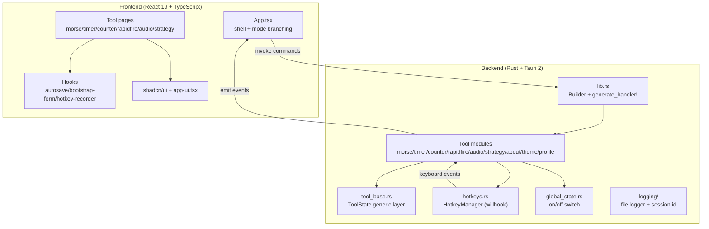

# Architecture

Delta Auto Tools is a single Tauri 2 desktop application with a React 19 frontend and a Rust backend. The two halves communicate exclusively through Tauri's IPC layer: the frontend invokes Rust commands and subscribes to Rust-emitted events. There is no HTTP server, no separate database process, and no web API.

## High-level structure

## Frontend entry chain

`index.html` -> `src/main.tsx` -> `src/App.tsx`. App.tsx does not use a router. It switches tools via `useState<ToolId>` and branches into overlay windows via `?mode=` query parameters (`overlay`, `timer-display`, `timer-position`, `counter-display`, `counter-position`, `rapidfire-display`, `rapidfire-position`, `audio-overlay`). These modes early-return separate window contents and must not be replaced by routing.

The desktop shell is a three-part mechanical interface: a 48px Top Manifest Bar, a 240px Left Index Rail, and a Main Work Grid. On screens under 1024px the rail collapses into a top tab bar.

## Backend entry chain

`src-tauri/src/main.rs` -> `src-tauri/src/lib.rs::run()`. The `setup` callback initializes every tool module (`morse::initialize`, `timer::initialize`, `counter::initialize`, `rapidfire::initialize`, `audio::initialize`, `theme::initialize`, `profile::initialize`), creates the shared `HotkeyManager`, the `GlobalState`, and the logger, then registers them all via `app.manage()`. The `generate_handler![]` macro registers every Tauri command, grouped by module.

On window close, `on_window_event` triggers a shutdown sequence that stops all running sessions, clears key suppressions, and flushes the log writer.

## Tool base generic layer

All tools that persist settings and expose a bootstrap follow the same generic pattern defined in `src-tauri/src/tool_base.rs`:

- `ToolLogic` trait - each tool implements `load_settings`, `save_settings`, `build_bootstrap`, `emit_state`, plus an associated `Settings` and `Bootstrap` type and a `NAME` constant.
- `ToolState<T: ToolLogic>` - wraps `Arc<Mutex<ToolStateInner<T>>>`.
- `ToolStateInner<T>` - holds `logic: T` (tool-specific fields), `settings: T::Settings`, `hotkey_error: Option<String>`.
- `get_bootstrap<T>` - generic command implementation; each module provides a thin `#[tauri::command]` wrapper.

This eliminates per-module boilerplate for the settings/bootstrap/error-handling cycle.

## IPC and events

Frontend calls Rust via `invoke<Bootstrap>("tool_action", { params })`. Rust pushes updates to the frontend via `app.emit_to("main", event_name, payload)`. Event names are string constants defined per module in `events.rs` files and mirrored in `src/lib/tauri-events.ts` (`MORSE_EVENTS`, `TIMER_EVENTS`, `COUNTER_EVENTS`, `RAPIDFIRE_EVENTS`, `GLOBAL_EVENTS`, `THEME_EVENTS`, `PROFILE_EVENTS`). The frontend uses a typed `listenEvent<T>` helper to subscribe.

Overlay display windows also receive events (e.g. `timer://state-changed` is emitted to both `main` and `timer-display`).

## Bootstrap/form dual-state pattern

Every tool page maintains two state objects:

- `bootstrap` - the immutable canonical state returned by Rust (`xxx_get_bootstrap`).
- `form` - the local editable draft.

Dirty detection compares the two via `JSON.stringify`. When the form changes, a 400ms debounced autosave fires `xxx_save_settings`. An `autosaveVersionRef` guards against stale saves overwriting newer state. The hooks `use-bootstrap-form-logic` and `use-autosave` in `src/hooks/` implement this.

## Persistence

Each tool persists settings to a JSON file in the Tauri app config dir: `morse_settings.json`, `timer_settings.json`, `counter_settings.json`, `rapidfire_settings.json`, `audio_settings.json`, `theme_settings.json`, `profile_settings.json`. The counter additionally persists run-state separately in `counter_state.json` so user config and accumulated counts are decoupled. Log settings live in `log_settings.json`.

## Native shell detection

`useNativeShell()` checks for `__TAURI_INTERNALS__`. In browser preview mode (running Vite without Tauri), all native commands are disabled and the UI shows a placeholder notice. This lets the frontend be developed in a plain browser without the Rust backend.

## Language breakdown

The codebase is roughly two languages: TypeScript/TSX for the frontend and Rust for the backend. See [by the numbers](../by-the-numbers.md) for exact counts.
