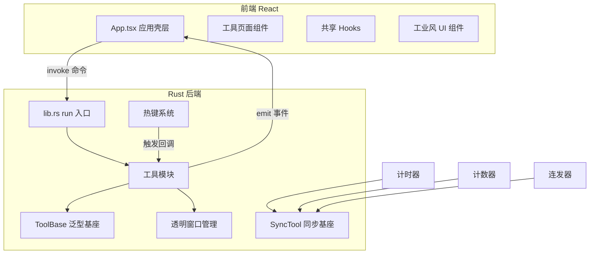
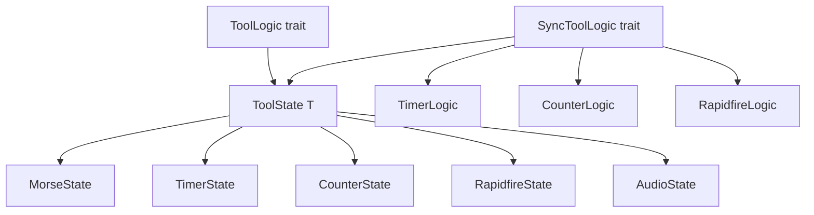

# 系统架构

Delta Auto Tools 采用 Tauri 2 桌面架构：Rust 后端处理原生能力（截屏、输入模拟、键盘钩子、窗口管理），React 前端通过 Tauri IPC 调用命令并监听事件。所有状态在 Rust 侧管理，前端通过 `invoke` 获取 bootstrap 数据、通过 `listen` 接收状态变更事件。

## 整体架构

## 前端入口链路

`index.html` -> `src/main.tsx` -> `src/App.tsx`

App.tsx 不使用路由库，通过 `useState<ToolId>` 切换工具页。透明窗口和区域选择通过 `?mode=` 查询参数分支进入以下模式：

| 模式 | 用途 |
|------|------|
| `overlay` | Morse 区域框选 |
| `timer-display` | 计时器透明显示 |
| `timer-position` | 计时器位置校准 |
| `counter-display` | 计数器透明显示 |
| `counter-position` | 计数器位置校准 |
| `rapidfire-display` | 连发器透明显示 |
| `rapidfire-position` | 连发器位置校准 |
| `audio-overlay` | 音频识色区域框选 |

### Bootstrap/Form 双状态模式

每个工具页遵循同一状态模式：

- **bootstrap**：Rust 返回的不可变规范态，包含 settings + 运行态数据
- **form**：本地可编辑草稿，脏检测通过 `JSON.stringify` 往返比较
- **Autosave**：表单变更后 debounce 400ms 调用 `xxx_save_settings`，`autosaveVersionRef` 防止陈旧保存覆盖

共享 hooks 在 `src/hooks/` 中实现：
- `useBootstrapForm`（`src/hooks/use-bootstrap-form.ts`）：管理 bootstrap + form 双状态、syncBootstrap、saveSettings（含 stale guard）
- `useAutosave`（`src/hooks/use-autosave.ts`）：debounce + versionRef 防陈旧覆盖 + 卸载清理
- `useHotkeyRecorder`（`src/hooks/use-hotkey-recorder.ts`）：热键录制循环
- `useNativeShell`（`src/hooks/use-native-shell.ts`）：检测 `__TAURI_INTERNALS__`，浏览器预览模式禁用原生命令

## Rust 后端模块

| 模块 | 路径 | 职责 |
|------|------|------|
| tool_base | `src-tauri/src/tool_base.rs` | 工具模块共享泛型基座：ToolLogic trait、ToolState<T> |
| sync_tool | `src-tauri/src/sync_tool.rs` | 同步工具基座：分组/条目规范化、热键重启、位置状态机、全局停止注册表 |
| global_state | `src-tauri/src/global_state.rs` | 全局总开关与 enabled-changed 事件 |
| morse | `src-tauri/src/morse/` | 截屏 -> 二值化 -> 轮廓检测 -> 摩斯解码 -> 自动输入 |
| timer | `src-tauri/src/timer/` | 多计时器，250ms tick 循环，透明窗口 |
| counter | `src-tauri/src/counter/` | 多计数器，运行态独立持久化 |
| rapidfire | `src-tauri/src/rapidfire/` | 按住触发键连发，每 session 独立 OS worker 线程 |
| audio | `src-tauri/src/audio/` | 快捷键/区域监听/识色三种触发模式播放音频 |
| strategy | `src-tauri/src/strategy/` | 攻略网站 WebView2 嵌入与 HTTP 抓取 |
| hotkeys | `src-tauri/src/hotkeys.rs` | 全局共享 willhook 键盘钩子，scope 注册，冲突检测 |
| key_suppressor | `src-tauri/src/key_suppressor.rs` | WH_KEYBOARD_LL 钩子吞噬指定按键 |
| theme | `src-tauri/src/theme/` | 5 套内置主题 + 自定义 + token override |
| profile | `src-tauri/src/profile/` | 多配置快照切换（5 份工具 settings） |
| logging | `src-tauri/src/logging/` | 混合格式日志 + 按天轮转 + 链路追踪 |
| about | `src-tauri/src/about/` | 关于面板 + Tauri 官方更新器 |

### 工具基座层级

`ToolLogic` trait（`src-tauri/src/tool_base.rs`）定义了所有工具共享的 Settings 持久化、Bootstrap 构建、事件 emit 和运行时锁检查。`SyncToolLogic` trait（`src-tauri/src/sync_tool.rs`）在此基础上扩展了分组/条目规范化、热键重启、位置状态机和全局停止注册表，供计时器、计数器、连发器复用。

## Tauri IPC 模式

- **命令调用**：`invoke<XxxBootstrap>("tool_action", { params })`
- **事件监听**：`listen<XxxPayload>("tool://event-name", callback)`，事件名格式 `{tool}://{event}`
- 后端在 `src-tauri/src/*/events.rs` 定义事件常量，前端通过 `src/lib/tauri-events.ts` 的 `MORSE_EVENTS` / `TIMER_EVENTS` / `COUNTER_EVENTS` / `RAPIDFIRE_EVENTS` / `AUDIO_EVENTS` / `GLOBAL_EVENTS` / `ABOUT_EVENTS` / `THEME_EVENTS` / `PROFILE_EVENTS` 和 `listenEvent<T>` helper 订阅

## 设置持久化

所有工具设置以 JSON 文件保存在 Tauri app config 目录（`%APPDATA%/org.izrino.delta-auto-tools/`）：

| 文件 | 内容 |
|------|------|
| `morse_settings.json` | 摩斯识别配置 |
| `timer_settings.json` | 计时器配置 |
| `counter_settings.json` | 计数器配置 |
| `counter_state.json` | 计数器运行态（独立持久化） |
| `rapidfire_settings.json` | 连发器配置 |
| `audio_settings.json` | 音频触发器配置 |
| `theme_settings.json` | 主题配置 |
| `profile_settings.json` | 配置快照元数据 |

通用读写逻辑在 `src-tauri/src/settings.rs` 中实现。

## 透明窗口系统

两类机制：

1. **同窗口 overlay**（Morse 区域框选、音频识色框选）：`?mode=overlay` / `?mode=audio-overlay` -> 全屏透明拖拽框选，坐标通过对应命令提交
2. **独立窗口 overlay**（Timer/Counter/Rapidfire 透明显示与位置设置）：各自有 display 和 position 两种模式，position 模式拖拽定位坐标提交

透明窗口必须无边框、透明、置顶、点击穿透。位置设置窗口可保留校准靶风格。窗口管理工具函数在 `src-tauri/src/overlay_utils.rs` 中。

## 设计方向

UI 采用 Swiss Industrial Print x Declassified Tactical Control Board 风格（详见 `DESIGN.md`）。主基底 Carbon `#0C0C0B` / Slate `#171715`，Chalk `#D8D4CC` 粗粉笔结构线，Amber `#E8A000` 仅占 3-8% 画面。90 度直角，禁止圆角卡片、柔和阴影、玻璃态、渐变。通过 5 套内置主题可切换亮/暗/红/绿/琥珀配色，主题切换通过 CSS 变量覆盖实现。
