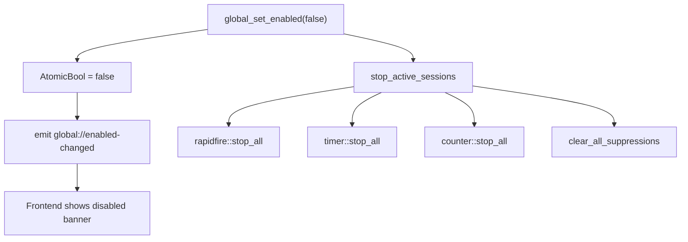

# Global state

The global state in `src-tauri/src/global_state.rs` is a single `AtomicBool` on/off switch. When off, all hotkey callbacks are suspended, all running sessions are stopped, and all key suppressions are cleared.

## How it works

The `HotkeyManager` listener checks `GlobalState::enabled()` on every keyboard event. When false, it skips all callback dispatch. This means hotkeys do not fire at all when the global switch is off, rather than firing and then being rejected downstream.

## Commands

| Command | Description |
|---------|-------------|
| `global_get_enabled` | Returns the current boolean |
| `global_set_enabled(enabled)` | Sets the switch, emits `global://enabled-changed`, and stops all sessions if turning off |

## Event

`global://enabled-changed` is emitted to the `main` window with a boolean payload. The frontend `useGlobalEnabled` hook (`src/hooks/use-global-enabled.tsx`) subscribes and updates the UI. When disabled, a red banner appears: "[ 全局总开关已关闭 ] 所有自动化功能与热键均已暂停".

## Frontend integration

The `GlobalEnabledProvider` in `src/hooks/use-global-enabled.tsx` wraps the app. The Top Manifest Bar shows a switch with green (enabled) or red (disabled) styling. The `GlobalDisabledBanner` component renders the warning text when disabled.

## Key source files

| File | Purpose |
|------|---------|
| `src-tauri/src/global_state.rs` | `GlobalState` struct, `global_get_enabled` / `global_set_enabled` commands |
| `src/hooks/use-global-enabled.tsx` | Frontend provider and hook |
| `src/App.tsx` | `GlobalSwitch` and `GlobalDisabledBanner` components |
