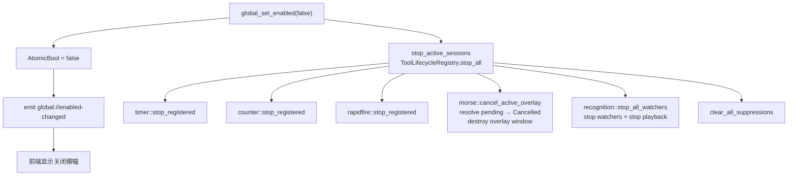

# 全局总开关

`src-tauri/src/global_state.rs` 中的全局总开关是一个 `AtomicBool` 开关。关闭时，所有热键回调暂停，所有运行态会话停止，所有按键抑制清除。v0.17.5 起关闭时改为隐藏窗口而非销毁，重开时恢复热键监听并推送状态。

## 工作原理

`HotkeyManager` 监听线程在每个键盘事件上检查 `GlobalState::enabled()`。为 false 时跳过所有回调分发。这意味着全局开关关闭时热键完全不触发，而非触发后在下游被拒绝。

### 关闭与恢复

关闭时（`enabled = false`）：
- 调用 `ToolLifecycleRegistry.stop_all()` 统一停止所有工具运行态会话
  - timer/counter/rapidfire: 各自 `stop_registered` 停止运行态会话
  - morse: `cancel_active_overlay` 销毁 overlay 窗口并将 pending sender resolve 为 Cancelled
  - recognition: `stop_all_watchers` 停止所有区域监听 watcher
- 调用 `clear_all_suppressions()` 清除所有按键抑制
- 隐藏所有透明显示窗口（v0.17.5 起改为隐藏而非销毁）

重新打开时（`enabled = true`）：
- 调用各工具的 `ensure_display_windows` / `ensure_overlay_window` 恢复透明窗口
- 调用各工具的 `restart_hotkey_listeners` 重启热键监听
- 向前端推送最新状态

## 命令

| 命令 | 说明 |
|------|------|
| `global_get_enabled` | 返回当前布尔值 |
| `global_set_enabled(enabled)` | 设置开关，emit `global://enabled-changed`，关闭时停止所有会话 |

## 事件

`global://enabled-changed` emit 到 `main` 窗口，payload 为布尔值。前端 `useGlobalEnabled` hook（`src/hooks/use-global-enabled.tsx`）订阅并更新 UI。关闭时显示红色横幅：「[ 全局总开关已关闭 ] 所有自动化功能与热键均已暂停」。

## 前端集成

`GlobalEnabledProvider`（`src/hooks/use-global-enabled.tsx`）包裹整个应用。顶栏显示带绿色（开启）或红色（关闭）样式的开关组件。`GlobalDisabledBanner` 组件在关闭时渲染警告文本。攻略网站页面不受全局开关影响。

## 集成点

- [热键系统](hotkeys.md) 监听线程每个事件检查 `GlobalState::enabled()`
- [同步工具基座](sync-tool.md) 的 `ToolLifecycleRegistry` 提供所有工具的全局停止入口
- [按键抑制器](key-suppressor.md) 的 `clear_all_suppressions` 在关闭时调用
- [计时器](../features/timer.md)、[计数器](../features/counter.md)、[连发器](../features/rapidfire.md) 在恢复时重建窗口和热键

## 关键源文件

| 文件 | 用途 |
|------|------|
| `src-tauri/src/global_state.rs` | `GlobalState` 结构体、`global_get_enabled` / `global_set_enabled` 命令、`restore_active_windows` |
| `src/hooks/use-global-enabled.tsx` | 前端 Provider 和 hook |
| `src/App.tsx` | `GlobalSwitch` 和 `GlobalDisabledBanner` 组件 |
