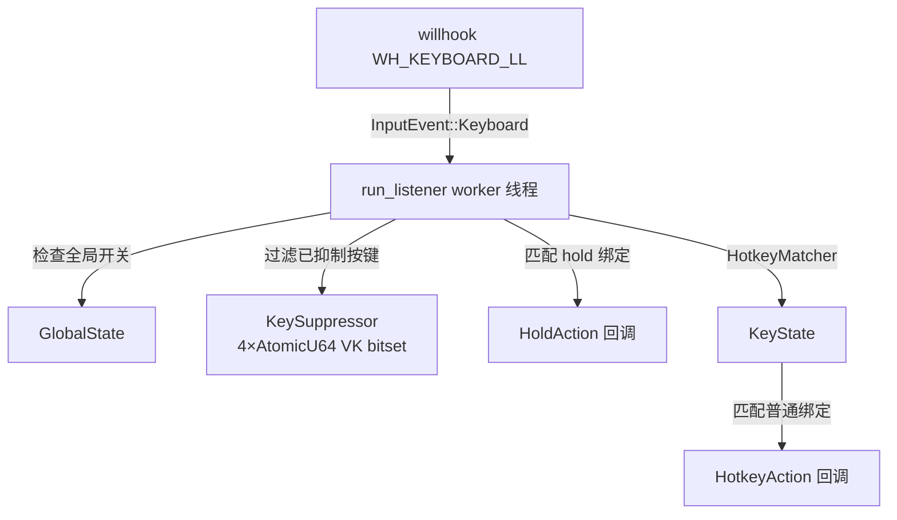

# 热键系统

`src-tauri/src/hotkeys.rs` 和 `src-tauri/src/hotkey_types.rs` 中的热键系统提供单一共享全局键盘钩子，所有工具向其注册。它使用 `willhook` crate 在 Windows 上安装 `WH_KEYBOARD_LL` 钩子，按绑定匹配将按键事件分发到已注册的 scope。

## 用途

- 统一管理所有工具的全局热键，避免每个工具各自安装键盘钩子
- 支持 scope 注册与冲突检测，防止不同工具的热键互相干扰
- 支持普通热键（按下触发）和 hold 热键（按下/松开双向回调，供连发器与识别持续触发使用）

## 关键抽象

| 类型 | 文件 | 说明 |
|------|------|------|
| `HotkeyManager` | `src-tauri/src/hotkeys.rs` | 共享管理器，持有 willhook 钩子、worker 线程和所有注册项 |
| `HotkeyBinding` | `src-tauri/src/hotkey_types.rs` | 解析后的按键绑定：`primary: PrimaryKey` + `modifiers: HashSet<ModifierKey>` |
| `HotkeyRegistration` | `src-tauri/src/hotkey_types.rs` | 普通 scope 热键注册项：scope、binding、enabled、action 回调、冲突策略 |
| `HoldRegistration` | `src-tauri/src/hotkey_types.rs` | hold scope 热键注册项：按下触发 Down，松开触发 Up |
| `ConflictPolicy` | `src-tauri/src/hotkey_types.rs` | `Strict`（禁止跨 scope 复用）或 `AllowHold`（允许与 hold scope 共存） |
| `HotkeyAction` | `src-tauri/src/hotkey_types.rs` | `Arc<dyn Fn(AppHandle) + Send + Sync>`，普通热键回调 |
| `HoldActionCallback` | `src-tauri/src/hotkey_types.rs` | `Arc<dyn Fn(AppHandle, HoldAction) + Send + Sync>`，hold 热键回调 |
| `PrimaryKey` | `src-tauri/src/hotkey_types.rs` | 字母、数字、功能键、命名键（Space/Enter 等）、符号键 |
| `ModifierKey` | `src-tauri/src/hotkey_types.rs` | Ctrl、Alt、Shift、Super(Win) |

## 工作原理

启动时通过 `HotkeyManager::start(app)` 创建唯一 `HotkeyManager`。它安装一个 `willhook::keyboard_hook()`，并启动 worker 线程（`run_listener`）每 1ms 轮询钩子通道。

监听线程处理两个事件源：普通 willhook 事件和 [按键抑制器](key-suppressor.md) 转发的已抑制事件。对每个键盘事件：

1. 检查 `GlobalState::enabled()`；全局关闭时仍更新普通/hold 按键状态，只跳过 callback 分发
2. 检查按键是否被 KeySuppressor 抑制，跳过 willhook 事件（已抑制事件会通过抑制通道到达）
3. 匹配 hold 绑定，触发 `HoldAction::Down` 或 `Up` 回调
4. 将事件送入 `HotkeyMatcher`，它跟踪修饰键状态，在主键按下时触发普通热键回调

### KeySuppressor 生命周期

`HotkeyManager` 首次收到抑制请求时安装 KeySuppressor。`stop_suppressor()` 只清空当前 suppression，不销毁 hook、sender、receiver 或 callback context；下一次 `start_suppressor()` 复用原实例。`HotkeyManager` drop 时才最终卸载抑制 hook 并 join worker，因此成功安装后同一 manager 生命周期内不会安装第二个抑制 hook。显式安装错误和正常 drop 会设置 stop 状态，按共享 Windows thread ID 唤醒消息循环后 join；安装超时则请求停止并 detach，进程级 active slot 会在该 worker 退出前拒绝重试，避免累积 detached worker。worker 晚于 stop 启动时会在安装 hook 前退出。

跨 `HotkeyManager` 生命周期时，新 hook 会替换进程级 callback context；安装失败或卸载只清理仍属于自身的 context，避免 stale bitset、stale sender 和旧 worker 清理新实例。抑制 callback 通过 `RwLock::try_read` 获取当前 context，并通过 `try_send` 非阻塞转发事件。锁竞争时立即放行；队列满时继续吞键并增加 `dropped_events`。

### Scope 注册

工具通过 scope 名称注册热键：

- `replace_scope(scope, bindings, display_name, conflict_policy)`：普通热键，替换该 scope 的所有现有注册
- `replace_hold_scope(scope, bindings, display_name, conflict_policy)`：hold 热键
- `replace_mixed_scope(scope, bindings, hold_bindings, display_name, conflict_policy)`：一次解析、校验并原子替换同一 scope 的普通与 hold 注册
- `clear_scope(scope)` / `clear_hold_scope(scope)`：清除该 scope 的所有注册
- `set_scope_enabled(scope, enabled)`：同时临时禁用该 scope 的普通与 hold 注册（热键录制时使用）

### 冲突检测

注册前，`validate_scope_conflicts` 和 `validate_hold_scope_conflicts` 检查新绑定与所有其他已启用 scope 的冲突。策略矩阵：

| Scope A | Scope B | 允许？ |
|---------|---------|--------|
| Morse（Strict） | 任何其他 scope，同键 | 否 |
| Timer/Counter（AllowHold） | Rapidfire hold（AllowHold），同键 | 是 |
| Timer/Counter（AllowHold） | Recognition hold（AllowHold），同键 | 是 |
| Timer/Counter（AllowHold） | 其他普通 scope，同键 | 否 |
| Rapidfire hold（AllowHold） | Timer/Counter 普通（AllowHold），同键 | 是 |
| Recognition 普通与 hold（同 scope） | 同键 | 是 |

运行时，同一按键同时触发 hold 和普通绑定时，先分发 hold Down/Up，再分发普通热键。这样单个按键可以同时启动连发器会话和触发计时器。

### 组合修饰键

hold 匹配器处理组合触发键（如 `Shift+-`）。按下 `Shift+1` 会同时触发 `Shift+1` 绑定和裸 `1` 绑定。松开 Shift 只停止 `Shift+1` 会话，裸 `1` 会话继续。先按 `1` 再按 Shift 只新增 `Shift+1` 会话，不重启裸 `1`。

### HotkeyBinding 解析

`HotkeyBinding::parse` 解析字符串如 `"Ctrl+Shift+F2"`、`"Alt+Space"`、裸 `"Alt"`。修饰键顺序规范化为 Ctrl > Alt > Shift > Super。

## 集成点

- 每个工具模块在 `save_settings` 时调用 `replace_scope` 或 `replace_hold_scope`
- [Morse](../features/morse.md) 使用 scope `"morse"`，策略 `Strict`
- [计时器](../features/timer.md) 和 [计数器](../features/counter.md) 使用 scope `"timer"`/`"counter"`，策略 `AllowHold`
- [连发器](../features/rapidfire.md) 使用 hold scope `"rapidfire"`，策略 `AllowHold`
- [识别触发](../features/recognition.md) 使用混合 scope `"recognition"`，策略 `AllowHold`
- [全局总开关](global-state.md)：监听线程每个事件都检查 `GlobalState::enabled()`
- [按键抑制器](key-suppressor.md)：共享原子 VK bitset 过滤重复事件，生命周期由 `HotkeyManager` 统一持有

## 修改入口

- 新增工具 scope：在工具的 `save_settings` 中调用 `replace_scope`（或 hold 工具调用 `replace_hold_scope`）
- 修改冲突规则：修改 `src-tauri/src/hotkeys.rs` 中的 `validate_scope_conflicts` / `validate_hold_scope_conflicts`
- 支持新按键：扩展 `src-tauri/src/hotkey_types.rs` 中的 `to_primary_key` / `to_modifier_key`

## 关键源文件

| 文件 | 用途 |
|------|------|
| `src-tauri/src/hotkeys.rs` | `HotkeyManager`、worker 线程、冲突检测、hold 匹配 |
| `src-tauri/src/hotkey_types.rs` | `HotkeyBinding`、`PrimaryKey`、`ModifierKey`、`ConflictPolicy`、注册结构体、解析器 |
