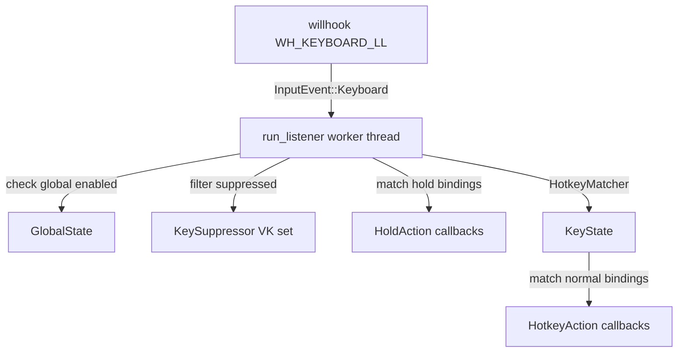

# Hotkeys

The hotkey system in `src-tauri/src/hotkeys.rs` and `src-tauri/src/hotkey_types.rs` provides a single shared global keyboard hook that all tools register with. It uses the `willhook` crate to install a `WH_KEYBOARD_LL` hook on Windows and distributes key events to registered scopes based on binding matches.

## Key abstractions

| Type | File | Description |
|------|------|-------------|
| `HotkeyManager` | `src-tauri/src/hotkeys.rs` | The shared manager; owns the willhook hook, the worker thread, and all registrations |
| `HotkeyBinding` | `src-tauri/src/hotkey_types.rs` | A parsed key binding: `primary: PrimaryKey` + `modifiers: HashSet<ModifierKey>` |
| `HotkeyRegistration` | `src-tauri/src/hotkey_types.rs` | A registered normal-scope hotkey: scope, binding, enabled flag, action callback, conflict policy |
| `HoldRegistration` | `src-tauri/src/hotkey_types.rs` | A registered hold-scope hotkey (rapidfire): fires Down on key-down, Up on key-up |
| `ConflictPolicy` | `src-tauri/src/hotkey_types.rs` | `Strict` (no cross-scope reuse) or `AllowHold` (allows coexistence with hold scopes) |
| `HotkeyAction` | `src-tauri/src/hotkey_types.rs` | `Arc<dyn Fn(AppHandle) + Send + Sync>` - the callback for normal hotkeys |
| `HoldActionCallback` | `src-tauri/src/hotkey_types.rs` | `Arc<dyn Fn(AppHandle, HoldAction) + Send + Sync>` - the callback for hold hotkeys |
| `HoldAction` | `src-tauri/src/hotkey_types.rs` | Enum: `Down` or `Up` |
| `PrimaryKey` | `src-tauri/src/hotkey_types.rs` | Letters, digits, function keys, named keys (Space, Enter, etc.), symbols |
| `ModifierKey` | `src-tauri/src/hotkey_types.rs` | Ctrl, Alt, Shift, Win |

## How it works

One `HotkeyManager` is created at startup via `HotkeyManager::start(app)`. It installs a single `willhook::keyboard_hook()` and spawns a worker thread (`run_listener`) that polls the hook channel every 1ms.

The listener processes two event sources: normal willhook events and suppressed-key events forwarded by the [key suppressor](key-suppressor.md). For each keyboard event:

1. Check `GlobalState::enabled()` - skip all callbacks if the global switch is off.
2. Check if the key is being suppressed by the KeySuppressor - skip the willhook event (it will arrive via the suppressed channel instead).
3. Match hold bindings and fire `HoldAction::Down` or `Up` callbacks.
4. Feed the event to `HotkeyMatcher`, which tracks modifier state and fires normal hotkey callbacks on primary key-down.

### Scope registration

Tools register their hotkeys by scope name:

- `replace_scope(scope, bindings, display_name, conflict_policy)` - Normal hotkeys. Replaces all existing registrations for that scope.
- `replace_hold_scope(scope, bindings, display_name, conflict_policy)` - Hold hotkeys (rapidfire only).
- `clear_scope(scope)` / `clear_hold_scope(scope)` - Remove all registrations for a scope.
- `set_scope_enabled(scope, enabled)` - Temporarily disable a scope (used during hotkey recording).

### Conflict detection

Before registering, `validate_scope_conflicts` and `validate_hold_scope_conflicts` check the new bindings against all other enabled scopes. The policy matrix:

| Scope A | Scope B | Allowed? |
|---------|---------|----------|
| Morse (Strict) | any other scope, same key | No |
| Timer/Counter (AllowHold) | Rapidfire hold (AllowHold), same key | Yes |
| Timer/Counter (AllowHold) | other normal scope, same key | No |
| Rapidfire hold (AllowHold) | Timer/Counter normal (AllowHold), same key | Yes |

At runtime, when the same key triggers both a hold and a normal binding, hold Down/Up fires first, then the normal hotkey fires. This lets a single key start a rapidfire session and trigger a timer simultaneously.

### Combined modifier keys

The hold matcher handles combined trigger keys (e.g. `Shift+-`). Pressing `Shift+1` fires both the `Shift+1` binding and the bare `1` binding. Releasing Shift only stops the `Shift+1` session; the bare `1` session continues. Pressing `1` first then Shift only adds the `Shift+1` session without restarting the bare one.

### HotkeyMatcher

The `HotkeyMatcher` struct tracks pressed modifiers and the active primary key. It only fires a normal hotkey on the primary key's Down event (not auto-repeat, not Up). This prevents double-firing.

## Integration points

- Every tool module calls `replace_scope` or `replace_hold_scope` during `save_settings`.
- [Morse](../features/morse.md) uses scope `"morse"` with `Strict` policy.
- [Timer](../features/timer.md) and [Counter](../features/counter.md) use scopes `"timer"`/`"counter"` with `AllowHold`.
- [Rapidfire](../features/rapidfire.md) uses hold scope `"rapidfire"` with `AllowHold`.
- [Audio](../features/audio.md) uses scope `"audio"`.
- [Global state](global-state.md) - The listener checks `GlobalState::enabled()` on every event.
- [Key suppressor](key-suppressor.md) - Shares the VK set to filter duplicate events.

## Entry points for modification

To add a new tool scope, call `replace_scope` (or `replace_hold_scope` for hold-based tools) from the tool's `save_settings` handler. To change conflict rules, modify `validate_scope_conflicts` / `validate_hold_scope_conflicts` in `src-tauri/src/hotkeys.rs`. To support a new key, extend `to_primary_key` / `to_modifier_key` in `src-tauri/src/hotkey_types.rs`.

## Key source files

| File | Purpose |
|------|---------|
| `src-tauri/src/hotkeys.rs` | `HotkeyManager`, worker thread, conflict detection, hold matching |
| `src-tauri/src/hotkey_types.rs` | `HotkeyBinding`, `PrimaryKey`, `ModifierKey`, `ConflictPolicy`, registration structs, parser |
