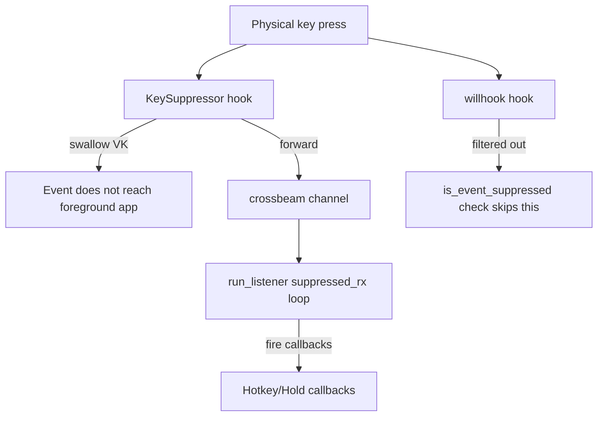

# Key suppressor

The key suppressor in `src-tauri/src/key_suppressor.rs` is a second `WH_KEYBOARD_LL` hook that swallows physical key events so they do not reach the foreground application, while still allowing hotkey callbacks to fire. It is used by the rapidfire module when a card has `ignore_trigger_key` enabled.

## How it works

The `HotkeyManager` owns an optional `KeySuppressor` that is lazily started only when at least one card needs key suppression. It installs a second low-level keyboard hook that intercepts specified virtual key codes and returns non-zero from the hook procedure (swallowing the event), then forwards the event via a `crossbeam-channel` to the hotkey listener so callbacks still fire.

Without this deduplication, the same physical key press would be processed twice: once by willhook and once by the suppressor's forwarded channel. The `is_event_suppressed` function checks the shared VK set and tells the willhook path to skip events that the suppressor is handling.

## Lifecycle

- `start_suppressor()` - Lazily installs the hook on first use. Idempotent.
- `suppress_key(key)` - Adds a VK to the suppressed set. Ensures the suppressor is started.
- `unsuppress_key(key)` - Removes a VK from the suppressed set.
- `stop_suppressor()` - Removes all keys and drops the hook.
- `clear_all_suppressions()` - Clears all VKs (called on app shutdown and global switch off).

## Integration points

- [Hotkeys](hotkeys.md) - `HotkeyManager` owns the suppressor and checks `is_event_suppressed` in its listener loop.
- [Rapidfire](../features/rapidfire.md) - Calls `suppress_key` when a card enables `ignore_trigger_key`, so the trigger key does not also type into the game while rapidfire is active.
- [Global state](global-state.md) - `clear_all_suppressions` is called when the global switch turns off.

## Key source files

| File | Purpose |
|------|---------|
| `src-tauri/src/key_suppressor.rs` | `KeySuppressor`, VK conversion, hook installation, channel forwarding |
| `src-tauri/src/hotkeys.rs` | `is_event_suppressed`, `start_suppressor`/`stop_suppressor`/`suppress_key`/`unsuppress_key` wrappers on `HotkeyManager` |
