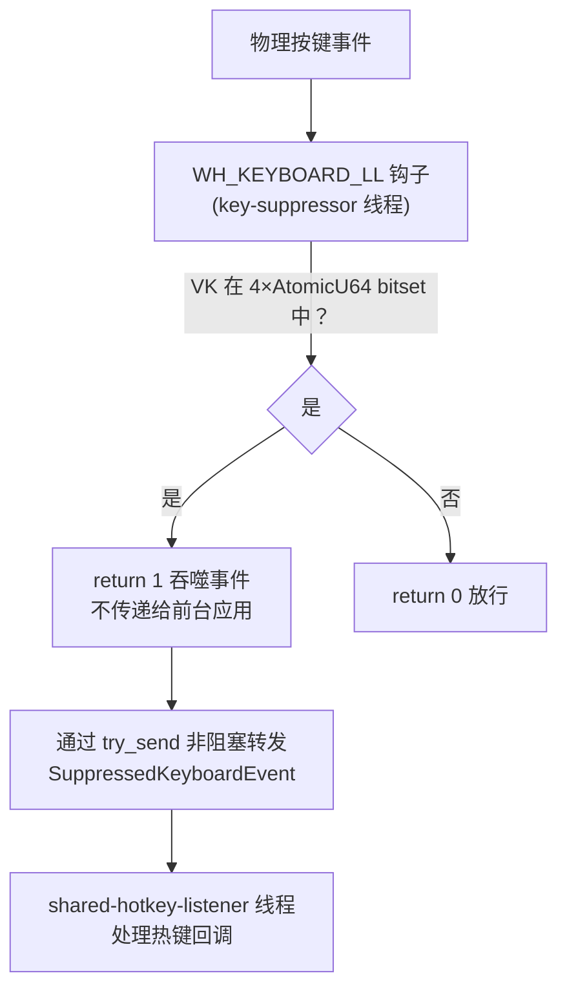

# 按键抑制器

`src-tauri/src/key_suppressor.rs` 中的按键抑制器是第二个 `WH_KEYBOARD_LL` 钩子，用于吞噬物理按键事件使其不到达前台应用，同时仍允许热键回调触发。连发器模块在卡片启用 `ignore_trigger_key` 时使用。

## 用途

解决物理按键自动重复问题。当用户物理按住触发键且启用 `ignore_trigger_key` 时，Windows 会每约 30ms 产生自动重复 KEYDOWN。仅通过 enigo 合成 Release 无法解决，因为物理按住时系统持续产生事件。按键抑制器在事件到达前台应用前将其吞噬（return 1），同时通过 crossbeam channel 将事件转发给热键监听线程，使热键回调仍能正常触发。

## 工作原理

### 懒加载

KeySuppressor 不在启动时安装。仅当连发器卡片启用 `ignore_trigger_key` 时，`HotkeyManager` 才懒加载创建 KeySuppressor；单个 `HotkeyManager` 生命周期内最多安装一次：

1. 将目标 VK 加入覆盖 `0..=255` 的无锁 `VkBitset`
2. 如果 KeySuppressor 尚未启动，启动 worker 线程安装第二个 `WH_KEYBOARD_LL` 钩子
3. worker 线程将吞噬的事件通过 crossbeam channel 转发给热键监听线程
4. 热键监听线程通过共享 `VkBitset` 过滤 willhook 的重复事件（同一物理事件不会被两个钩子各处理一次）

进程级 `CALLBACK_CONTEXT` 是可替换的 `RwLock<Option<Arc<CallbackContext>>>`。每次安装 hook 前写入当前 `VkBitset`、sender 和丢弃计数；安装失败或卸载后仅在 slot 仍指向自身时清理，避免旧 worker 清除新 context。钩子 callback 只调用 `try_read`，不获取 `Mutex`，锁竞争时立即放行；持有的 `Arc` 保证读取期间 context 不被释放。

callback 不执行阻塞发送。channel 满时仍返回 `1` 吞键，`dropped_events` 递增并丢弃本次转发事件。

### 清理

当所有 `ignore_trigger_key` 卡片被禁用或删除时，`stop_suppressor()` 只清空 `VkBitset`，保留 hook、sender 和 receiver。后续启用会复用同一实例与 callback context。`HotkeyManager` drop 时最终卸载 hook、清理对应 callback context 并 join KeySuppressor worker；新 manager 安装时会替换 slot，不会读取旧实例的 bitset 或 sender。

worker 通过共享 `AtomicU32` 发布 Windows thread ID。父线程停止时先设置 `stopped`，已发布 ID 则用 `PostThreadMessageW` 唤醒 `GetMessageW`；ID 尚未发布时，worker 发布 ID 后检查 `stopped`，取消 hook 安装并直接退出。显式安装失败和正常 drop 执行 stop + wake + join；安装超时只请求停止并 detach，避免 `SetWindowsHookExW` 卡住时阻塞调用方。该系统调用返回后，worker 会在进入消息循环前检查 `stopped`、卸载 hook 并清理 callback context。

## 关键抽象

| 类型 | 文件 | 说明 |
|------|------|------|
| `KeySuppressor` | `src-tauri/src/key_suppressor.rs` | 抑制器主体，持有 `VkBitset`、worker 线程句柄、事件发送端和丢弃计数 |
| `VkBitset` | `src-tauri/src/key_suppressor.rs` | 4 个 `AtomicU64` 覆盖 Windows VK `0..=255`，供 callback 和 willhook 去重查询 |
| `SuppressedKeyboardEvent` | `src-tauri/src/key_suppressor.rs` | 被抑制的键盘事件：`vk_code`、`scan_code`、`is_key_up`、`is_injected` |

## 集成点

- [热键系统](hotkeys.md) 的 `HotkeyManager` 懒加载管理 KeySuppressor 生命周期
- [连发器](../features/rapidfire.md) 通过 `ignore_trigger_key` 卡片选项触发抑制
- [全局总开关](global-state.md) 关闭时调用 `clear_all_suppressions()` 清除所有抑制

## 修改入口

- 修改抑制的按键范围：调整 `VkBitset` 的添加/移除逻辑
- 修改事件转发：调整 `try_forward_suppressed_event` 和 crossbeam channel 的接收逻辑
- 新增使用抑制器的工具：在 `HotkeyManager` 中调用抑制器的 `add` / `remove` 方法

## 关键源文件

| 文件 | 用途 |
|------|------|
| `src-tauri/src/key_suppressor.rs` | `KeySuppressor`、`SuppressedKeyboardEvent`、worker 线程、`WH_KEYBOARD_LL` 回调 |
