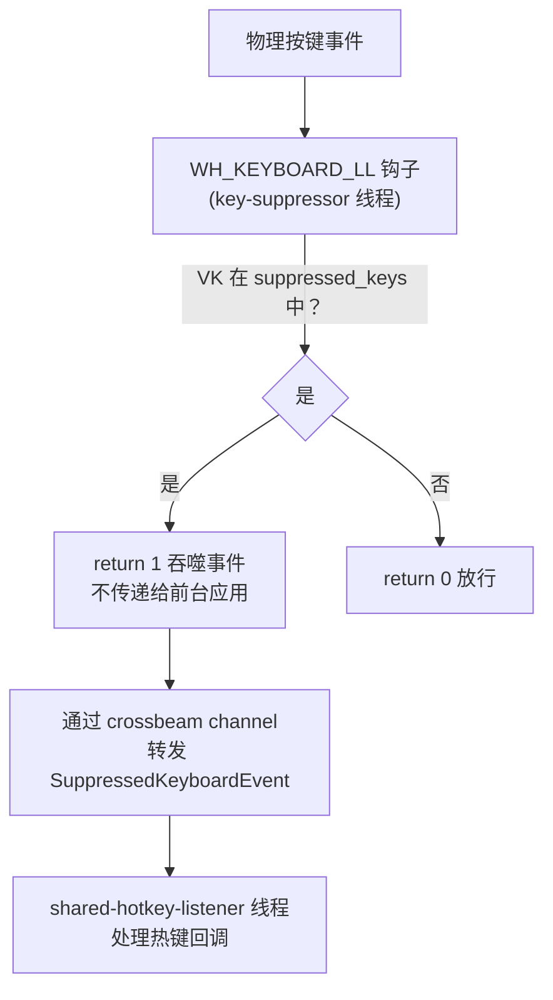

# 按键抑制器

`src-tauri/src/key_suppressor.rs` 中的按键抑制器是第二个 `WH_KEYBOARD_LL` 钩子，用于吞噬物理按键事件使其不到达前台应用，同时仍允许热键回调触发。连发器模块在卡片启用 `ignore_trigger_key` 时使用。

## 用途

解决物理按键自动重复问题。当用户物理按住触发键且启用 `ignore_trigger_key` 时，Windows 会每约 30ms 产生自动重复 KEYDOWN。仅通过 enigo 合成 Release 无法解决，因为物理按住时系统持续产生事件。按键抑制器在事件到达前台应用前将其吞噬（return 1），同时通过 crossbeam channel 将事件转发给热键监听线程，使热键回调仍能正常触发。

## 工作原理

### 懒加载

KeySuppressor 不在启动时安装。仅当连发器卡片启用 `ignore_trigger_key` 时，`HotkeyManager` 才懒加载创建 KeySuppressor：

1. 将目标 VK 加入 `suppressed_keys` 集合
2. 如果 KeySuppressor 尚未启动，启动 worker 线程安装第二个 `WH_KEYBOARD_LL` 钩子
3. worker 线程将吞噬的事件通过 crossbeam channel 转发给热键监听线程
4. 热键监听线程通过 `suppressed_vk_set` 过滤 willhook 的重复事件（同一物理事件不会被两个钩子各处理一次）

### 清理

当所有 `ignore_trigger_key` 卡片被禁用或删除时，`clear_all_suppressions()` 清空 `suppressed_keys` 集合。KeySuppressor worker 线程在应用关闭时停止。

## 关键抽象

| 类型 | 文件 | 说明 |
|------|------|------|
| `KeySuppressor` | `src-tauri/src/key_suppressor.rs` | 抑制器主体，持有 `suppressed_keys`、worker 线程句柄、事件发送端 |
| `SuppressedKeyboardEvent` | `src-tauri/src/key_suppressor.rs` | 被抑制的键盘事件：`vk_code`、`scan_code`、`is_key_up`、`is_injected` |

## 集成点

- [热键系统](hotkeys.md) 的 `HotkeyManager` 懒加载管理 KeySuppressor 生命周期
- [连发器](../features/rapidfire.md) 通过 `ignore_trigger_key` 卡片选项触发抑制
- [全局总开关](global-state.md) 关闭时调用 `clear_all_suppressions()` 清除所有抑制

## 修改入口

- 修改抑制的按键范围：调整 `suppressed_keys` 集合的添加/移除逻辑
- 修改事件转发：调整 crossbeam channel 的发送/接收逻辑
- 新增使用抑制器的工具：在 `HotkeyManager` 中调用抑制器的 `add` / `remove` 方法

## 关键源文件

| 文件 | 用途 |
|------|------|
| `src-tauri/src/key_suppressor.rs` | `KeySuppressor`、`SuppressedKeyboardEvent`、worker 线程、`WH_KEYBOARD_LL` 回调 |
