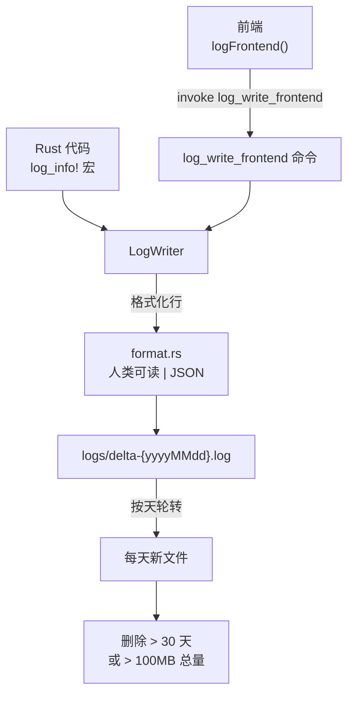

# 日志系统

`src-tauri/src/logging/` 中的日志系统提供文件日志，支持按天轮转、自动清理、级别过滤、链路追踪和 session ID。Rust 和前端日志写入同一批文件。

## 目录结构

```
src-tauri/src/logging/
├── mod.rs      # LogLevel、LogSettings、FrontendLogRequest、TraceContext、session_id、命令
├── format.rs   # 日志行格式化（人类可读 | JSON 结构化）
├── writer.rs   # LogWriter：BufWriter + Mutex + 按天轮转 + 清理 + 级别过滤
└── macros.rs   # log_error! / log_warn! / log_info! / log_debug! / log_trace! 宏
```

## 关键抽象

| 类型 | 文件 | 说明 |
|------|------|------|
| `LogLevel` | `src-tauri/src/logging/mod.rs` | Error/Warn/Info/Debug/Trace，`value()` 用于过滤（Error=0 ... Trace=4） |
| `LogSettings` | `src-tauri/src/logging/mod.rs` | 全局级别 + 按模块覆盖，持久化到 log_settings.json |
| `LogWriter` | `src-tauri/src/logging/writer.rs` | BufWriter + Mutex，按天轮转，30 天清理，100MB 上限 |
| `TraceContext` | `src-tauri/src/logging/mod.rs` | 线程局部 trace_id，用于请求关联 |
| `FrontendLogRequest` | `src-tauri/src/logging/mod.rs` | 前端日志提交 DTO |
| `session_id` | `src-tauri/src/logging/mod.rs` | 6 字符字母数字，启动时通过 LazyLock 生成一次 |

## 工作原理



### 日志格式

每行采用混合格式：人类可读前缀 + JSON payload。字段顺序：时间戳、级别、来源、位置、trace、session、消息、json_payload。`format.rs` 模块处理宽度填充和截断。

### 宏

`macros.rs` 中的宏（`log_error!` 到 `log_trace!`）自动注入来源（`[RUST]·{source}`）、位置（`{file}:{line}`）、thread_id 和 trace_id。Debug 级别还注入 `memory_kb`。

### 前端日志

前端 `src/lib/logging.ts` 提供 `initLogging()`、`logFrontend()`、`generateTraceId()`、`setTraceId()`/`clearTraceId()` 和便捷 `log` 对象。`src/main.tsx` 启动时调用 `initLogging()`。生产环境下 `console.log/warn/error` 被劫持，同时通过 `log_write_frontend` 写入日志文件。

### 级别过滤

`LogSettings` 存储全局级别和可选的按模块覆盖（如 `"morse": "debug"`）。过滤在格式化之前进行。`log_set_level` 命令同时更新内存阈值和持久化 JSON。`log_get_level` 命令返回当前设置。

### 文件位置

日志首先写入 `{install_dir}/logs/`，回退到 `%LocalAppData%\org.izrino.delta-auto-tools\logs\`。文件命名为 `delta-{yyyyMMdd}.log`。

## 命令

| 命令 | 说明 |
|------|------|
| `log_write_frontend` | 接收 `FrontendLogRequest` 并写入 |
| `log_get_session_id` | 返回 6 字符 session ID |
| `log_get_level` | 返回当前 `LogSettings` |
| `log_set_level` | 更新级别设置（持久化 + 内存） |

## 集成点

- 每个 Rust 模块可使用 `log_*!` 宏
- `src/main.tsx` 初始化前端日志并在生产环境劫持 console
- Tauri command 入口设置 `TraceContext`，退出时清除
- 应用关闭时调用 `logging::shutdown()` 刷新 BufWriter

## 关键源文件

| 文件 | 用途 |
|------|------|
| `src-tauri/src/logging/mod.rs` | 公共 API、类型、命令、session_id、TraceContext |
| `src-tauri/src/logging/format.rs` | 行格式化，含宽度/截断规则 |
| `src-tauri/src/logging/writer.rs` | LogWriter，含轮转、清理、级别过滤 |
| `src-tauri/src/logging/macros.rs` | `log_error!` 到 `log_trace!` 宏 |
| `src/lib/logging.ts` | 前端日志接口 |
