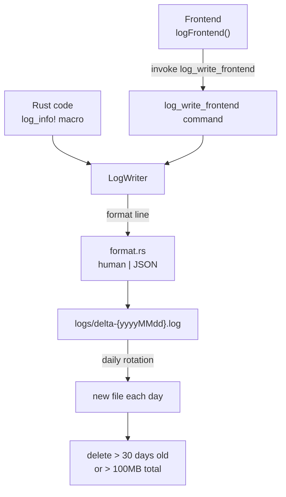

# Logging

The logging system in `src-tauri/src/logging/` provides file-based logging with daily rotation, automatic cleanup, level filtering, trace context, and a session ID. Both Rust and frontend logs write to the same files.

## Directory layout

```
src-tauri/src/logging/
├── mod.rs      # LogLevel, LogSettings, FrontendLogRequest, TraceContext, session_id, commands
├── format.rs   # Log line formatting (human-readable | JSON structured)
├── writer.rs   # LogWriter: BufWriter + Mutex + daily rotation + cleanup + level filter
└── macros.rs   # log_error! / log_warn! / log_info! / log_debug! / log_trace! macros
```

## Key abstractions

| Type | File | Description |
|------|------|-------------|
| `LogLevel` | `src-tauri/src/logging/mod.rs` | Error/Warn/Info/Debug/Trace with `value()` for filtering (Error=0 ... Trace=4) |
| `LogSettings` | `src-tauri/src/logging/mod.rs` | Global level + per-module overrides, persisted to log_settings.json |
| `LogWriter` | `src-tauri/src/logging/writer.rs` | BufWriter + Mutex, daily rotation, 30-day cleanup, 100MB cap |
| `TraceContext` | `src-tauri/src/logging/mod.rs` | Thread-local trace_id for request correlation |
| `FrontendLogRequest` | `src-tauri/src/logging/mod.rs` | DTO for frontend log submissions |
| `session_id` | `src-tauri/src/logging/mod.rs` | 6-char alphanumeric, generated once at startup via LazyLock |

## How it works



### Log format

Each line has a hybrid format: a human-readable prefix followed by a JSON payload. Fields in order: timestamp, level, origin, location, trace, session, message, json_payload. The `format.rs` module handles width padding and truncation.

### Macros

The macros in `macros.rs` (`log_error!`, `log_warn!`, `log_info!`, `log_debug!`, `log_trace!`) auto-inject origin (`[RUST]·{source}`), location (`{file}:{line}`), thread_id, and trace_id. Debug level also injects `memory_kb`.

### Frontend logging

The frontend `src/lib/logging.ts` provides `initLogging()`, `logFrontend()`, `generateTraceId()`, `setTraceId()`/`clearTraceId()`, and a convenience `log` object. `src/main.tsx` calls `initLogging()` on startup. In production, `console.log/warn/error` are hijacked to also write to the log file via `log_write_frontend`.

### Level filtering

`LogSettings` stores a global level and optional per-module overrides (e.g. `"morse": "debug"`). Filtering happens before formatting. The `log_set_level` command updates both the in-memory threshold and the persisted JSON. The `log_get_level` command returns current settings.

### File location

Logs go to `{install_dir}/logs/` first, falling back to `%LocalAppData%\org.izrino.delta-auto-tools\logs\`. Files are named `delta-{yyyyMMdd}.log`.

## Commands

| Command | Description |
|---------|-------------|
| `log_write_frontend` | Receives a `FrontendLogRequest` and writes it |
| `log_get_session_id` | Returns the 6-char session ID |
| `log_get_level` | Returns current `LogSettings` |
| `log_set_level` | Updates level settings (persisted + in-memory) |

## Integration points

- Every Rust module can use the `log_*!` macros.
- `src/main.tsx` initializes frontend logging and hijacks console in production.
- Tauri command entry points set `TraceContext` on entry and clear on exit.
- App shutdown calls `logging::shutdown()` to flush the BufWriter.

## Key source files

| File | Purpose |
|------|---------|
| `src-tauri/src/logging/mod.rs` | Public API, types, commands, session_id, TraceContext |
| `src-tauri/src/logging/format.rs` | Line formatting with width/truncation rules |
| `src-tauri/src/logging/writer.rs` | LogWriter with rotation, cleanup, level filtering |
| `src-tauri/src/logging/macros.rs` | `log_error!` through `log_trace!` macros |
| `src/lib/logging.ts` | Frontend logging interface |
