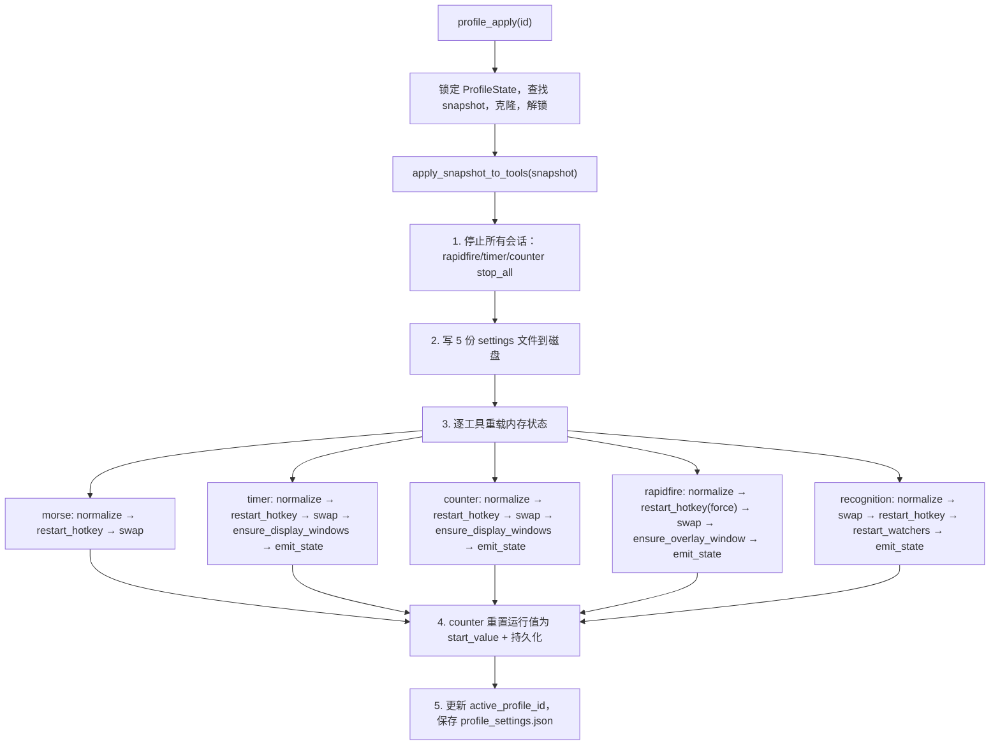
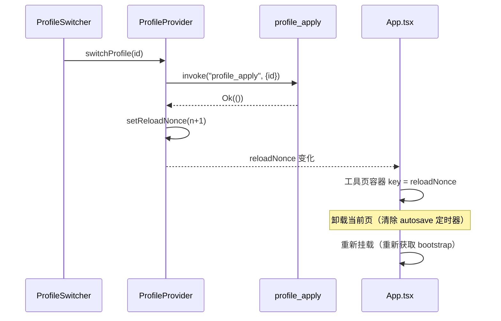

# 配置系统

多配置 Profile 系统（`src-tauri/src/profile/` + `src/hooks/use-profile.tsx` + `src/components/app/profile-*.tsx`）允许用户将全部 5 个工具的 settings 快照为命名配置并在运行时切换。切换 profile 时写入 5 份 settings JSON 文件到磁盘，重载各工具内存状态（复用各工具的 `pub(crate)` 热键/窗口/emit 函数），重置计数器运行值，更新 `active_profile_id`。写命令执行成功后 emit `profile://changed` 事件到 main 窗口，前端 `ProfileProvider` 监听该事件刷新 bootstrap。前端使用 `reloadNonce` 强制重挂载当前工具页，清除待处理的 autosave 定时器并重新获取配置。

顶栏 Profile 切换器提供新增、复制、重命名、删除、导入、导出入口。删除当前激活 Profile 会被拒绝；复制沿用当前运行态快照创建新 Profile 并切换到副本；导入/导出只处理单个 Profile JSON，导入时生成新 ID、刷新时间戳并加入列表，不自动切换当前运行态。

## 用途

- 将 5 个工具的当前内存 settings 快照为单个 `Profile`，存储在 `profile_settings.json`
- 应用 profile 时写入 5 份文件到磁盘，然后重载各工具运行时状态而无需重启应用；settings 写入通过同目录临时文件替换目标 JSON，避免进程中断留下半截配置
- 切换时重置计数器运行值为目标 profile 的 `start_value` 并持久化 `counter_state.json`
- 主题独立于 profile，不打包进快照

## 目录结构

```
src-tauri/src/profile/
├── mod.rs       # ProfileState、命令、apply_snapshot_to_tools 跨工具编排
├── events.rs    # profile://changed 事件名常量
├── types.rs     # ToolSettingsSnapshot、Profile、ProfileSettings、ProfileBootstrap
└── settings.rs  # profile_settings.json 读写

src/hooks/
└── use-profile.tsx   # ProfileProvider：bootstrap 获取、事件监听、reloadNonce

src/components/app/
├── profile-switcher.tsx  # 顶栏配置切换下拉
├── profile-types.ts      # TS 类型
└── profile-utils.ts      # 工具函数 + 测试
```

## 关键抽象

| 抽象 | 路径 | 角色 |
|------|------|------|
| `ToolSettingsSnapshot` | `src-tauri/src/profile/types.rs` | 5 工具快照：`{ morse, timer, counter, rapidfire, recognition }` |
| `Profile` | `src-tauri/src/profile/types.rs` | `{ id, name, created_at, updated_at, snapshot }`，命名配置 |
| `ProfileSettings` | `src-tauri/src/profile/types.rs` | 持久化状态：`profiles`、`active_profile_id`、`next_profile_number` |
| `ProfileState` | `src-tauri/src/profile/mod.rs` | 运行时持有者：`Mutex<ProfileSettings>` |
| `apply_snapshot_to_tools` | `src-tauri/src/profile/mod.rs` | 核心编排：停止会话 -> 写 5 文件 -> 重载各工具 -> 重置计数器 |
| `emit_profile_changed` | `src-tauri/src/profile/mod.rs` | 写命令成功后 emit `profile://changed` 到 main 窗口 |
| `snapshot_current_settings` | `src-tauri/src/profile/mod.rs` | 从各工具内存 State 读取当前 settings |
| `ProfileProvider` | `src/hooks/use-profile.tsx` | React context：bootstrap、事件监听、`reloadNonce` |
| `reloadNonce` | `src/hooks/use-profile.tsx` | 切换 profile 后递增，`App.tsx` 用作工具页容器 `key` |

## 工作原理

### 应用流程

`profile_apply(id)` 的关键路径，纯 Rust 侧操作：



### 前端重载机制



`reloadNonce` 是关键集成点：`App.tsx` 将其用作工具页容器的 `key`。递增时 React 卸载当前页（清除 400ms autosave debounce 的 `setTimeout`），重新挂载新实例调用 `xxx_get_bootstrap` 加载新 profile 的 settings。

### 自动默认 profile

`profile_get_bootstrap` 首次调用时如 `profiles` 为空，会快照当前 settings 创建 `配置1` profile。`profile_create_default` 使用 `Default` 值创建工厂默认配置。

### 写命令 emit profile://changed

写命令（`save_current` / `create_default` / `apply` / `delete` / `rename` / `import`）执行成功后，调用 `emit_profile_changed(app, &build_bootstrap(&state))`，向 main 窗口 emit `profile://changed` 事件，payload 为最新 `ProfileBootstrap`。前端 `ProfileProvider` 监听该事件并刷新 bootstrap。`export` / `export_to_path` 只读，不 emit。

只读命令 `get_bootstrap` 不 emit，避免噪声事件。

事件名常量定义在 `events.rs`：`CHANGED = "profile://changed"`，与前端 `tauri-events.ts` 的 `PROFILE_EVENTS.changed` 一致。

### 名称预留

`reserve_config_name` 生成 `配置N`，其中 `N = max(next_profile_number, max_existing + 1, 1)`，跳过已存在的名称。

## 集成点

- `src-tauri/src/lib.rs`：`profile::initialize()` 在 `setup` 中调用，6 个命令注册到 `generate_handler![]`
- 各工具模块：`apply_snapshot_to_tools` 依赖各工具的 `pub(crate)` 函数（`normalize_settings`、`restart_hotkey_listeners`、`ensure_display_windows`、`emit_state`、`stop_all`）
- `src/App.tsx`：使用 `reloadNonce` 作为工具页容器 `key`
- [主题引擎](theme-engine.md)：显式不参与 profile 快照

## 修改入口

- 新增第 6 个工具到快照：在 `types.rs` 的 `ToolSettingsSnapshot` 添加字段（`#[serde(default)]`），更新 `snapshot_current_settings` 和 `build_default_snapshot`，添加 `apply_*_settings` 函数
- 修改自动命名：编辑 `reserve_config_name`
- 修改导入命名：编辑 `reserve_import_name`
- 修改重载触发：编辑 `ProfileProvider.switchProfile` 和 `App.tsx` 中的 `key` 用法

## 关键源文件

| 文件 | 用途 |
|------|------|
| `src-tauri/src/profile/mod.rs` | `ProfileState`、6 个命令、`apply_snapshot_to_tools`、各工具 `apply_*_settings`、`emit_profile_changed` |
| `src-tauri/src/profile/events.rs` | `profile://changed` 事件名常量 |
| `src-tauri/src/profile/types.rs` | `ToolSettingsSnapshot`、`Profile`、`ProfileSettings`、`ProfileBootstrap` |
| `src-tauri/src/profile/settings.rs` | `profile_settings.json` 读写 |
| `src/hooks/use-profile.tsx` | `ProfileProvider`：bootstrap、事件监听、`reloadNonce` |
| `src/components/app/profile-switcher.tsx` | 顶栏配置切换下拉 |
| `src/components/app/profile-utils.ts` | 工具函数 + 测试 |
