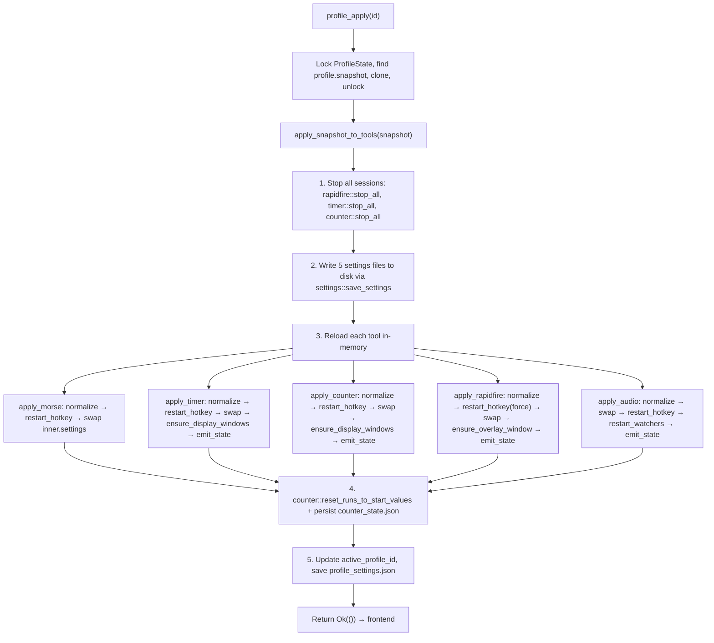
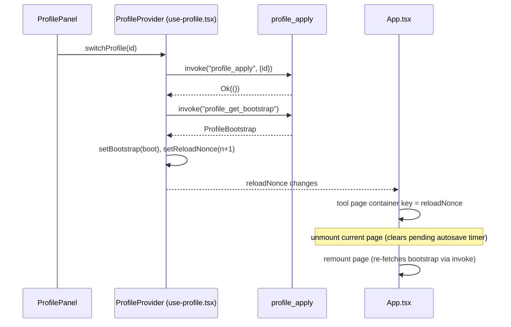

# Profile system

The multi-config Profile system (`src-tauri/src/profile/` + `src/hooks/use-profile.tsx` + `src/components/app/profile-*.tsx`) lets the user snapshot all 5 tool settings (morse, timer, counter, rapidfire, audio) into named configurations and switch between them at runtime. Switching a profile writes 5 settings JSON files to disk, reloads each tool's in-memory state (reusing each tool's `pub(crate)` hotkey/window/emit functions), resets counter run values, and updates `active_profile_id`. The frontend uses a `reloadNonce` to force-remount the current tool page so pending autosave timers are cleared and the new config is re-fetched.

## Purpose

- Snapshot the current in-memory settings of all 5 tools (`morse_settings.json`, `timer_settings.json`, `counter_settings.json`, `rapidfire_settings.json`, `audio_settings.json`) into a single `Profile` stored in `profile_settings.json`.
- Apply a profile by writing 5 files to disk, then reloading each tool's runtime state without restarting the app.
- Reset counter run values to the target profile's `start_value` and persist `counter_state.json` on switch.
- Keep theme independent — themes are **not** snapshotted (see `../systems/theme-engine.md`).
- Provide a frontend `ProfileProvider` that exposes `reloadNonce` so `App.tsx` can use it as the tool page container `key`, triggering unmount (clears pending autosave) → remount (re-fetches bootstrap).

## Directory layout

```
src-tauri/src/profile/
├── mod.rs       # ProfileState, commands, generate_profile_id, apply_snapshot_to_tools cross-tool orchestration
├── types.rs     # ToolSettingsSnapshot, Profile, ProfileSettings, ProfileBootstrap
└── settings.rs  # profile_settings.json load/save (reuses crate::settings helpers)

src/hooks/
└── use-profile.tsx   # ProfileProvider: bootstrap fetch, profile://changed listener, reloadNonce, saveCurrentAs/switchProfile/deleteProfile/renameProfile

src/components/app/
├── profile-panel.tsx   # ProfilePanel: list / new / switch / rename / delete
├── profile-types.ts    # TS types: ToolSettingsSnapshot, Profile, ProfileSettings, ProfileBootstrap
└── profile-utils.ts    # formatProfileTimestamp / validateProfileName / findProfile / snapshotTools / countIncludedTools / isActiveProfile + tests
```

## Key abstractions

| Abstraction | Path | Role |
|---|---|---|
| `ToolSettingsSnapshot` | `src-tauri/src/profile/types.rs` | `{ morse: Option<MorseSettings>, timer, counter, rapidfire, audio }` — 5-tool snapshot. `Option` allows partial snapshots in future; current impl always fills all 5. |
| `Profile` | `src-tauri/src/profile/types.rs` | `{ id, name, created_at, updated_at, snapshot }` — a named config with timestamps. |
| `ProfileSettings` | `src-tauri/src/profile/types.rs` | Persisted state: `profiles: Vec<Profile>`, `active_profile_id`, `next_profile_number`. Defaults empty. |
| `ProfileBootstrap` | `src-tauri/src/profile/types.rs` | One-shot payload to frontend: `profiles` + `active_profile_id`. |
| `ProfileState` | `src-tauri/src/profile/mod.rs` | Runtime holder: `Mutex<ProfileSettings>`. Not a `ToolState<T>`. |
| `apply_snapshot_to_tools` | `src-tauri/src/profile/mod.rs` | Core orchestration: stop sessions → write 5 files → reload each tool → reset counter runs. |
| `snapshot_current_settings` | `src-tauri/src/profile/mod.rs` | Reads current in-memory settings from each tool's `State` (avoids re-normalizing from disk). |
| `generate_profile_id` | `src-tauri/src/profile/mod.rs` | `"p" + now_ms() + 2-digit counter` — no uuid dependency. |
| `reserve_config_name` | `src-tauri/src/profile/mod.rs` | Auto-naming: `配置1`, `配置2`, … skips existing names; uses `max(next_profile_number, max_existing + 1)`. |
| `ProfileProvider` | `src/hooks/use-profile.tsx` | React context: bootstrap, `profile://changed` listener, `reloadNonce`, mutation methods. |
| `reloadNonce` | `src/hooks/use-profile.tsx` | Incremented after `switchProfile`; `App.tsx` uses it as tool page container `key`. |
| `update_active_profile_snapshot` | `src-tauri/src/profile/mod.rs` | `pub(crate)` helper to patch the active profile's snapshot when a tool saves (currently `#[allow(dead_code)]`, available for future write-back). |

## How it works

### Apply flow

`profile_apply(id)` is the critical path. It does **not** touch the frontend's form state — it operates purely on the Rust side:



### Tool reload reuses existing functions

Each `apply_*_settings` function reuses the tool's existing `pub(crate)` functions rather than reimplementing logic:
- **Morse**: `morse::normalize_settings` → `morse::restart_hotkey_listener` → swap `inner.settings`.
- **Timer**: `timer::normalize_settings` → `timer::restart_hotkey_listeners` → swap → `timer::ensure_display_windows` → `timer::emit_state`. Also retains only runs whose id exists in the new settings, clears all runs if disabled.
- **Counter**: `counter::normalize_settings` → `counter::restart_hotkey_listeners` → swap → `counter::ensure_display_windows` → `counter::emit_state`. Retains valid runs, inserts missing ones at `start_value`, resets all if disabled.
- **Rapidfire**: `rapidfire::normalize_settings` → `rapidfire::restart_hotkey_listeners(force=true)` → swap → `rapidfire::ensure_overlay_window` → `rapidfire::emit_state`. `stop_all` already cleared sessions, so no diff logic needed.
- **Audio**: `audio::normalize_settings` → swap `inner.settings` → `audio::restart_hotkey_listeners` → `audio::watcher::restart_watchers` → `emit_state`. If disabled, calls `stop_all_watchers`.

After all 5 are reloaded, `counter::reset_runs_to_start_values` resets every counter's run value to the new profile's `start_value` and persists `counter_state.json`.

### Snapshot current settings

`profile_save_current(name)` calls `snapshot_current_settings(app)` which reads each tool's in-memory `inner.settings` directly (via `try_state` + `lock_inner`), avoiding a re-read from disk and re-normalization. This ensures the snapshot reflects the live state, including any unsaved autosave that has already reached the backend.

### Frontend reload mechanism



The `reloadNonce` is the key integration: `App.tsx` uses `reloadNonce` as the `key` of the tool page container. When it increments, React unmounts the current page (which clears any pending `setTimeout` from the 400ms autosave debounce) and remounts a fresh instance that calls `xxx_get_bootstrap` to load the new profile's settings.

### Auto-default profile

`profile_get_bootstrap` checks if `profiles` is empty on first call. If so, it snapshots the current settings, creates a `配置1` profile via `reserve_config_name`, and persists it. This ensures a user always has at least one profile to fall back on. `profile_create_default` does the same but uses `build_default_snapshot()` (all tool `Default` values) and applies it, effectively resetting all tools to factory defaults under a new profile.

### Name reservation

`reserve_config_name` generates `配置N` where `N = max(next_profile_number, max_existing_number + 1, 1)`. It skips names that already exist, incrementing until a free name is found. This handles the case where a user manually named a profile `配置2` (bumping the auto-counter past it).

## Integration points

- **`src-tauri/src/lib.rs`** — `profile::initialize()` in `setup`; `profile_get_bootstrap`, `profile_save_current`, `profile_create_default`, `profile_apply`, `profile_delete`, `profile_rename` registered in `generate_handler![]` (profile group). `ProfileState` is `app.manage()`d.
- **`src-tauri/capabilities/default.json`** — all 6 profile commands must be permitted.
- **Tool modules** — `apply_snapshot_to_tools` depends on each tool exposing `pub(crate)` functions: `normalize_settings`, `restart_hotkey_listener(s)`, `ensure_display_windows` / `ensure_overlay_window`, `emit_state`, `stop_all`. See `../systems/tool-base.md` for the `ToolLogic` trait and `ToolState<T>` pattern.
- **`counter::reset_runs_to_start_values`** — counter-specific reset after profile apply; persists `counter_state.json`.
- **`src/main.tsx`** — `ProfileProvider` wraps the app so `useProfile()` is available everywhere.
- **`src/App.tsx`** — uses `reloadNonce` from `useProfile()` as the tool page container `key`.
- **`src/components/app/settings-page.tsx`** — `SettingsDialog` mounts `ProfilePanel` in the profile tab.
- **Theme** — explicitly **not** snapshotted. `ToolSettingsSnapshot` has no theme field; `apply_snapshot_to_tools` does not touch `ThemeState`.

## Entry points for modification

- **Add a 6th tool to the snapshot**: add a field to `ToolSettingsSnapshot` in `src-tauri/src/profile/types.rs` (with `#[serde(default)]`), update `snapshot_current_settings` and `build_default_snapshot` in `mod.rs`, add an `apply_*_settings` function, call it in `apply_snapshot_to_tools`, and update the frontend `ToolSettingsSnapshot` in `src/components/app/profile-types.ts` plus `snapshotTools` in `profile-utils.ts`.
- **Change auto-naming**: edit `reserve_config_name` in `src-tauri/src/profile/mod.rs`; tests cover the skip-existing and max-number cases.
- **Add write-back of live edits to the active profile**: use `update_active_profile_snapshot` (currently `#[allow(dead_code)]`) — call it from each tool's `save_settings` path with the appropriate `ActiveProfileSnapshotPatch`.
- **Change the reload trigger**: edit `ProfileProvider.switchProfile` → `refreshAfterSwitch` in `src/hooks/use-profile.tsx` and the `key` usage in `src/App.tsx`.

## Key source files

| File | Purpose |
|---|---|
| `src-tauri/src/profile/mod.rs` | `ProfileState`, all 6 commands, `apply_snapshot_to_tools`, per-tool `apply_*_settings`, `snapshot_current_settings`, `generate_profile_id`, `reserve_config_name`, `update_active_profile_snapshot`, tests. |
| `src-tauri/src/profile/types.rs` | `ToolSettingsSnapshot`, `Profile`, `ProfileSettings`, `ProfileBootstrap` + serde/default tests. |
| `src-tauri/src/profile/settings.rs` | `profile_settings.json` load/save via `crate::settings`. |
| `src/hooks/use-profile.tsx` | `ProfileProvider`: bootstrap, `profile://changed` listener, `reloadNonce`, mutation methods. |
| `src/components/app/profile-panel.tsx` | `ProfilePanel`: list / new / switch / rename / delete UI. |
| `src/components/app/profile-types.ts` | TS types matching Rust structs (camelCase). |
| `src/components/app/profile-utils.ts` | `formatProfileTimestamp`, `validateProfileName`, `findProfile`, `snapshotTools`, `countIncludedTools`, `isActiveProfile` + tests. |
| `src/lib/tauri-events.ts` | `PROFILE_EVENTS` + `listenEvent<T>` helper. |
