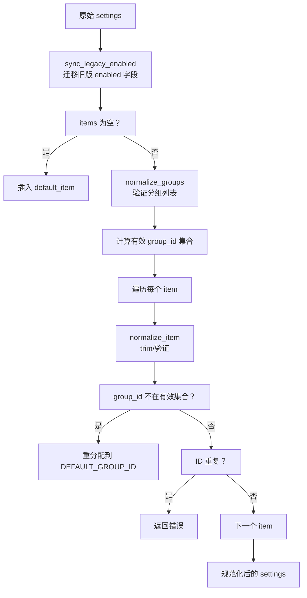

# 同步工具基座

`src-tauri/src/sync_tool.rs` 中的同步工具基座扩展 [工具基座](tool-base.md)，为计时器、计数器、连发器提供共享生命周期管理：分组/条目规范化、热键重启、位置状态机、全局停止注册表。v0.17.5（2026-06-24）新增，收敛了三个工具模块此前各自重复实现的生命周期代码。

## 用途

- 统一计时器/计数器/连发器的分组（group）和条目（item）数据模型与规范化逻辑
- 提供共享的热键重启管线（清除旧 scope -> 注册新 scope）
- 提供共享的透明窗口位置设置状态机（移动/提交/取消）
- 提供全局停止注册表，全局开关闭闭时统一停止所有运行态会话

## 关键抽象

| 类型 | 文件 | 说明 |
|------|------|------|
| `SyncItem` | `src-tauri/src/sync_tool.rs` | 条目 trait：`id()`、`group_id()`、`enabled()` |
| `SyncGroup` | `src-tauri/src/sync_tool.rs` | 分组 trait：`id()`、`enabled()` |
| `SyncSettings` | `src-tauri/src/sync_tool.rs` | 设置 trait：关联 `Item`/`Group` 类型，定义 `normalize_groups`、`normalize_item`、`default_item` 等 |
| `SyncToolLogic` | `src-tauri/src/sync_tool.rs` | 扩展 `ToolLogic`：`SCOPE`、`CONFLICT_POLICY`（默认 `AllowHold`）、`tool_enabled`、`build_hotkey_bindings`、`stop_all` |
| `HotkeyBindingSet` | `src-tauri/src/sync_tool.rs` | 热键绑定集合：`normal: Vec<(String, HotkeyAction)>` + `hold: Vec<(String, HoldActionCallback)>` |
| `PositionEvent` | `src-tauri/src/sync_tool.rs` | 位置事件枚举：`Moved { x, y }`、`Commit`、`Cancel` |
| `PendingPosition<R>` | `src-tauri/src/sync_tool.rs` | 待定位置设置：`group_id`、`original_rect`、`staged_rect` |
| `PositionDecision<R, K>` | `src-tauri/src/sync_tool.rs` | 位置事件决策：是否保存、是否发送通知、是否销毁窗口、是否移动窗口 |
| `SyncToolRegistry` | `src-tauri/src/sync_tool.rs` | 全局停止注册表，注册各工具的 `stop_all` 函数 |
| `RunsSync` | `src-tauri/src/sync_tool.rs` | runs 同步逻辑 trait：声明 `sync_runs_with_settings`，孤儿清理 + 缺失补齐 |
| `ToolLifecycleRegistry` | `src-tauri/src/sync_tool.rs` | 统一停止注册表，接纳所有工具（含 morse/audio）的 stop handler |

## 工作原理

### 设置规范化

`normalize_sync_settings` 是核心入口，执行以下步骤：

### 热键重启

`restart_sync_hotkeys` 在 `ToolState<L>` 上实现（`L: SyncToolLogic`）：

1. 如果工具总开关关闭：清除普通 scope 和 hold scope，返回
2. 调用 `build_hotkey_bindings` 获取绑定集合
3. 清除旧普通 scope 和 hold scope
4. 如有普通绑定，调用 `replace_scope`（策略 `AllowHold`）
5. 如有 hold 绑定，调用 `replace_hold_scope`（策略 `AllowHold`）
6. 清除 `hotkey_error`

### 位置状态机

`apply_position_event` 是泛型函数，处理三种位置事件：

| 事件 | 决策 |
|------|------|
| `Moved { x, y }` | 更新 `staged_rect`，移动窗口到新位置，不保存不销毁 |
| `Commit` | 清除 pending，保存设置，发送 `Selected` 通知，销毁位置窗口 |
| `Cancel` | 清除 pending，不保存，发送 `Cancelled` 通知，销毁位置窗口 |

计数器和计时器均直接使用此泛型函数；连发器因有额外逻辑而自行实现位置处理。

### Runs 同步（RunsSync trait）

`RunsSync` trait 扩展 `SyncToolLogic`，声明 `sync_runs_with_settings(runs, settings)` 方法，将 runs 收窄逻辑（孤儿清理 + 缺失补齐）从 `save_settings` 内联操作下沉到各 Logic 的 trait 实现：

1. **孤儿清理**：`retain(id ∈ settings items)` —— 配置中已删除但 runs 中残留的条目被移除。
2. **缺失补齐**：`entry(id).or_insert(default)` —— 新增条目但 runs 中缺失时用默认值补齐。

**不重置、不按 enabled 清理**：禁用计数器的累积值和全局关闭后的 runs 均完整保留。

`CounterLogic` 和 `TimerLogic` 各自实现 `RunsSync`，`save_settings` 函数体内委托调用 `sync_runs_with_settings`，不再有内联 runs 操作。

### 全局停止注册表

`SyncToolRegistry` 在 `lib.rs` 的 `setup` 中创建并注册：

- `"counter"` -> `counter::stop_registered`
- `"timer"` -> `timer::stop_registered`
- `"rapidfire"` -> `rapidfire::stop_registered`

### ToolLifecycleRegistry（统一停止入口）

`ToolLifecycleRegistry` 在 `lib.rs` 的 `setup` 中创建并注册，统一管理所有工具（含非 SyncToolLogic 工具）的停止入口：

- `"timer"` -> `timer::stop_registered`
- `"counter"` -> `counter::stop_registered`
- `"rapidfire"` -> `rapidfire::stop_registered`
- `"morse"` -> `morse::cancel_active_overlay`（销毁 overlay 窗口 + resolve pending 为 Cancelled）
- `"audio"` -> `audio::stop_all_watchers`（停止所有区域监听 watcher）

`stop_all` 按注册顺序调用各 handler，收集错误但不中断。幂等：第二次调用时所有 handler 被跳过（`stopped` 标记为 true）。`reset` 重置标记以允许全局开关重新打开后再关闭。

[全局总开关](global-state.md) 关闭时调用 `ToolLifecycleRegistry.stop_all(app)`，依次停止所有工具的运行态会话，无遗漏。

## 使用者

| 工具 | Logic | SyncSettings | RunsSync | 位置状态机 |
|------|-------|-------------|----------|-----------|
| [计时器](../features/timer.md) | `TimerLogic` | `TimerSettings` | ✅ `sync_runs_with_settings` | 复用 `apply_position_event` |
| [计数器](../features/counter.md) | `CounterLogic` | `CounterSettings` | ✅ `sync_runs_with_settings` | 复用 `apply_position_event` |
| [连发器](../features/rapidfire.md) | `RapidfireLogic` | `RapidfireSettings` | — | 自行实现 |

[Morse](../features/morse.md) 和 [音频触发器](../features/audio.md) 不使用 SyncTool：Morse 无分组概念，Audio 有自己的 watcher 生命周期。

## 集成点

- 扩展 [工具基座](tool-base.md) 的 `ToolLogic` trait
- 使用 [热键系统](hotkeys.md) 的 `replace_scope` / `replace_hold_scope`
- 位置状态机驱动 [透明叠加窗](overlay-windows.md) 的位置设置窗口
- [全局总开关](global-state.md) 通过 `ToolLifecycleRegistry` 停止所有会话（含 morse/audio），`SyncToolRegistry` 保留以兼容直接调用
- [配置系统](profile-system.md) 切换时复用各工具的 `restart_sync_hotkeys`

## 修改入口

- 新增同步工具：定义 `Logic` 实现 `SyncToolLogic`，定义 `Settings` 实现 `SyncSettings`，在 `lib.rs` 注册 `SyncToolRegistry`
- 修改规范化规则：调整 `normalize_sync_settings` 或各工具的 `normalize_groups` / `normalize_item`
- 修改位置状态机：调整 `apply_position_event`（注意计数器直接复用此函数）

## 关键源文件

| 文件 | 用途 |
|------|------|
| `src-tauri/src/sync_tool.rs` | `SyncItem`/`SyncGroup`/`SyncSettings`/`SyncToolLogic` trait、规范化、位置状态机、注册表 |
