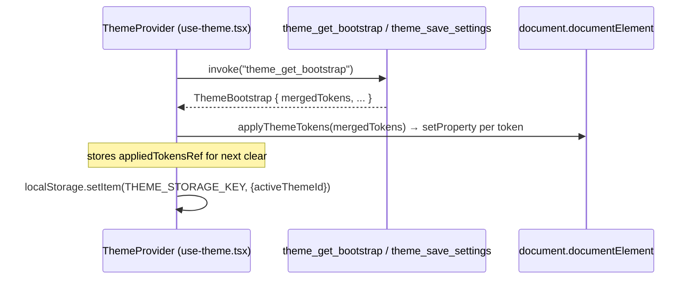
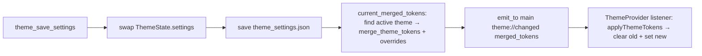

# Theme engine

The theme engine (`src-tauri/src/theme/` + `src/hooks/use-theme.tsx` + `src/components/app/theme-*.tsx`) provides runtime switching of the entire CSS variable palette without reloading the app. It ships 5 built-in themes, supports user-defined custom themes derived from builtins, and allows temporary `overrides` for live color tweaking. Themes are persisted to `theme_settings.json` and pushed to the frontend via the `theme://changed` event, where they are written atomically to `document.documentElement.style` as inline CSS variables (overriding `App.css` `:root` defaults).

## Purpose

- Define 5 built-in themes as Rust constants (industrial-light, industrial-dark, tactical-red, phosphor-green, paper-amber), each a complete set of ~60 CSS variable overrides (shadcn base vars + industrial semantic tokens + surface tokens).
- Allow user custom themes (`builtin: false`) stored alongside builtins in `theme_settings.json`.
- Support temporary `overrides` — per-token patches applied on top of the active theme for live preview, persisted independently of the theme definition.
- Merge theme tokens + overrides into a flat `merged_tokens` list on the Rust side, emit it via `theme://changed`, and have the frontend write each entry to `document.documentElement.style.setProperty(key, value)`.
- Keep theme independent of the Profile system (themes are not snapshotted — see `../systems/profile-system.md`).

## Directory layout

```
src-tauri/src/theme/
├── mod.rs        # ThemeState (Mutex<ThemeSettings>), commands, build_bootstrap, export_theme
├── types.rs      # ThemeTokenOverride, ThemeDefinition, ThemeSettings, ThemeBootstrap
├── apply.rs      # merge_theme_tokens / find_theme pure functions (cargo test)
├── builtins.rs   # 5 built-in theme constants + builtin_themes()
├── events.rs     # CHANGED = "theme://changed"
└── settings.rs   # theme_settings.json load/save (reuses crate::settings helpers)

src/hooks/
└── use-theme.tsx   # ThemeProvider: bootstrap fetch, theme://changed listener, applyThemeTokens, save/setActive/setOverrides/addCustom/deleteCustom/renameCustom

src/components/app/
├── theme-panel.tsx         # ThemePanel: presets / tokens edit / import-export
├── theme-types.ts           # TS types + BUILTIN_THEME_IDS, EDITABLE_TOKEN_KEYS, TOKEN_LABELS, THEME_STORAGE_KEY
├── theme-utils.ts           # applyThemeTokens / setThemeTokens / clearThemeTokens / mergeThemeTokens / findTheme / parseImportedTheme / serializeThemeForExport / normalizeHex
└── theme-color-picker.tsx   # ThemeColorPicker: react-colorful + Popover + native <input type="color"> + hex Input
```

## Key abstractions

| Abstraction | Path | Role |
|---|---|---|
| `ThemeTokenOverride` | `src-tauri/src/theme/types.rs` | `{ key: String, value: String }` — one CSS variable. `key` must start with `--`. |
| `ThemeDefinition` | `src-tauri/src/theme/types.rs` | `{ id, name, builtin: bool, tokens: Vec<ThemeTokenOverride> }` — a complete theme. Builtins have stable ids; custom themes use generated ids. |
| `ThemeSettings` | `src-tauri/src/theme/types.rs` | Persisted state: `active_theme_id`, `custom_themes`, `overrides`. Defaults to `industrial-light` with empty custom/overrides. |
| `ThemeBootstrap` | `src-tauri/src/theme/types.rs` | One-shot payload to frontend: `active_theme_id`, `builtin_themes`, `custom_themes`, `overrides`, `merged_tokens`. |
| `ThemeState` | `src-tauri/src/theme/mod.rs` | Runtime holder: `Mutex<ThemeSettings>`. Not a `ToolState<T>` — theme has no hotkeys/windows/run-state. |
| `merge_theme_tokens` | `src-tauri/src/theme/apply.rs` | Pure fn: theme.tokens as base, overrides replace same-key, append new keys, preserve base order. Duplicated override keys: last wins. |
| `find_theme` | `src-tauri/src/theme/apply.rs` | Pure fn: linear search by id in a `&[ThemeDefinition]`. |
| `builtin_themes()` | `src-tauri/src/theme/builtins.rs` | Returns `Vec<ThemeDefinition>` of all 5 builtins. |
| `ThemeProvider` | `src/hooks/use-theme.tsx` | React context: fetches bootstrap, listens `theme://changed`, atomically applies tokens to `documentElement`, exposes save/switch/override/add/delete/rename. |
| `applyThemeTokens` | `src/components/app/theme-utils.ts` | Frontend pure fn: clears previous tokens then sets new ones on `element.style`. Returns the new token list for next clear. |
| `ThemeColorPicker` | `src/components/app/theme-color-picker.tsx` | Color input: native `<input type="color">` + hex `Input` + `react-colorful` `HexColorPicker` in a `Popover`. The approved third-party color picker exception. |
| `EDITABLE_TOKEN_KEYS` | `src/components/app/theme-types.ts` | Whitelist of 16 semantic tokens exposed in the panel's TOKENS edit section (subset of the full ~60 tokens). |
| `THEME_STORAGE_KEY` | `src/components/app/theme-types.ts` | `"delta-auto-tools:theme:v1"` — localStorage key for browser-preview fallback (stores `activeThemeId` only). |

## How it works

### Bootstrap and apply flow



On save (`theme_save_settings`), the Rust side updates `ThemeState`, persists `theme_settings.json`, computes `current_merged_tokens`, and emits `theme://changed` to the `main` window. The frontend listener calls `applyTokens(payload)` which atomically clears the previous inline tokens and writes the new ones:



### Token merge semantics

`merge_theme_tokens(theme, overrides)` in `src-tauri/src/theme/apply.rs`:
1. Start with `theme.tokens` as the base, preserving order.
2. For each base token, if an override with the same `key` exists, use the override's value (last override wins for duplicate keys).
3. Append any override keys not present in the base, in override order.
4. Result is the flat list written to CSS variables.

The frontend `mergeThemeTokens` in `src/components/app/theme-utils.ts` mirrors this exactly for live preview (the panel computes merged tokens locally before saving).

### Built-in themes

All 5 themes define the **same token key set** (enforced by `every_builtin_theme_defines_same_token_keys` test). Structure/effect tokens (`--radius*`, `--shadow-*`, `--scanline`, `--stripe-warning`, `--misprint-offset`) are intentionally **not** part of theme switching — the industrial hard-edge aesthetic is constant. The token groups included are:
- shadcn base (`--background`, `--foreground`, `--card`, `--primary`, `--border`, etc.)
- industrial semantic (`--carbon`, `--slate`, `--iron`, `--chalk`, `--zinc`, `--dust`, `--seam`, `--amber`, `--rust`, `--moss`, `--void`, `--alert-red`, `--warning-amber`, `--valid-green`, `--terminal-green`, `--phosphor`)
- surface (`--surface-shell`, `--surface-panel`, `--surface-card`, `--surface-card-strong`, `--surface-tile`, `--surface-border`, `--surface-border-strong`, `--surface-hover`, `--surface-highlight`, `--surface-dot`)

| ID | Name | Character |
|---|---|---|
| `industrial-light` | 工业亮色 | Baseline; matches `App.css :root` defaults (white base, black chalk). |
| `industrial-dark` | 工业暗色 | Carbon/chalk inversion, amber brightened. |
| `tactical-red` | 战术红 | Deep grey base, alert-red as primary. |
| `phosphor-green` | 磷光绿 | CRT black base, terminal-green primary. |
| `paper-amber` | 纸面琥珀 | Warm paper base, deep amber accent. |

### Import / export

`theme_export` serializes a theme (by id, searching custom first then builtins) to pretty JSON via `serde_json::to_string_pretty`. `theme_import` parses JSON into a `ThemeDefinition`, validates every token key starts with `--`, and forces `builtin = false` on the frontend side (`parseImportedTheme`). The imported theme is not auto-saved — the user previews it in the panel and decides whether to add it as a custom theme.

### Live preview in the panel

`ThemePanel` maintains `localOverrides` state. When the user drags a color in `ThemeColorPicker`, `updateToken` patches `localOverrides`. A `useEffect` immediately computes `mergeThemeTokens(activeTheme, localOverrides)` and calls `applyThemeTokens(document.documentElement, merged, previewTokensRef.current)` for instant visual feedback — no round-trip to Rust. Pressing "save" calls `setOverrides(localOverrides)` which invokes `theme_save_settings`, persisting and emitting the final merged tokens.

### Browser preview mode

When `useNativeShell()` returns false (no `__TAURI_INTERNALS__`), `ThemeProvider` skips all `invoke` calls, sets `loading = false`, and leaves CSS variables at their `App.css :root` defaults. The `THEME_STORAGE_KEY` localStorage entry (written on each native bootstrap) stores only `activeThemeId` so the next native launch can quickly restore.

## Integration points

- **`src-tauri/src/lib.rs`** — `theme::initialize()` is called in `setup`; `theme_get_bootstrap`, `theme_save_settings`, `theme_export`, `theme_import` registered in `generate_handler![]` (theme group). `ThemeState` is `app.manage()`d.
- **`src-tauri/capabilities/default.json`** — the four theme commands must be permitted.
- **`src/App.css`** — `:root` and `@theme inline` define the fallback token values; inline styles from `applyThemeTokens` override them at runtime.
- **`src/main.tsx`** — `ThemeProvider` wraps the app so `useTheme()` is available everywhere.
- **`src/components/app/settings-page.tsx`** — `SettingsDialog` mounts `ThemePanel` in the theme tab.
- **Profile system** — theme is explicitly **not** part of `ToolSettingsSnapshot` (see `../systems/profile-system.md`). Switching profiles does not touch theme.
- **`react-colorful`** — the only approved third-party color picker (~3KB, zero style deps). Do not introduce shadcn's official color-picker or any other color library.

## Entry points for modification

- **Add a 6th built-in theme**: define a new `fn` returning `Vec<ThemeTokenOverride>` in `src-tauri/src/theme/builtins.rs`, add a `pub const NEW_ID`, append to `builtin_themes()`. Update `BUILTIN_THEME_IDS` in `src/components/app/theme-types.ts`. Ensure the token key set matches the other 5 (the `every_builtin_theme_defines_same_token_keys` test will catch mismatches).
- **Add an editable token to the panel**: add the key to `EDITABLE_TOKEN_KEYS` and a label to `TOKEN_LABELS` in `src/components/app/theme-types.ts`. The Rust builtins must already define it.
- **Change merge semantics**: edit `merge_theme_tokens` in `src-tauri/src/theme/apply.rs` **and** `mergeThemeTokens` in `src/components/app/theme-utils.ts`. Keep them in sync (both have parallel test suites).
- **Change the event name**: edit `CHANGED` in `src-tauri/src/theme/events.rs` and `THEME_EVENTS.changed` in `src/lib/tauri-events.ts`.

## Key source files

| File | Purpose |
|---|---|
| `src-tauri/src/theme/mod.rs` | `ThemeState`, commands, `build_bootstrap`, `current_merged_tokens`, `export_theme`, tests. |
| `src-tauri/src/theme/types.rs` | `ThemeTokenOverride`, `ThemeDefinition`, `ThemeSettings`, `ThemeBootstrap` + serde tests. |
| `src-tauri/src/theme/apply.rs` | `merge_theme_tokens`, `find_theme` pure functions + tests. |
| `src-tauri/src/theme/builtins.rs` | 5 built-in theme constants, `builtin_themes()`, id constants + consistency tests. |
| `src-tauri/src/theme/events.rs` | `CHANGED = "theme://changed"` constant. |
| `src-tauri/src/theme/settings.rs` | `theme_settings.json` load/save via `crate::settings`. |
| `src/hooks/use-theme.tsx` | `ThemeProvider`: bootstrap, event listener, `applyThemeTokens`, mutation methods. |
| `src/components/app/theme-panel.tsx` | `ThemePanel`: presets / tokens edit / import-export with live preview. |
| `src/components/app/theme-types.ts` | TS types, `BUILTIN_THEME_IDS`, `EDITABLE_TOKEN_KEYS`, `TOKEN_LABELS`, `THEME_STORAGE_KEY`. |
| `src/components/app/theme-utils.ts` | `applyThemeTokens` / `mergeThemeTokens` / `parseImportedTheme` / `normalizeHex` etc. + tests. |
| `src/components/app/theme-color-picker.tsx` | `ThemeColorPicker`: `react-colorful` + Popover + native color input + hex input. |
| `src/lib/tauri-events.ts` | `THEME_EVENTS` + `listenEvent<T>` helper. |
