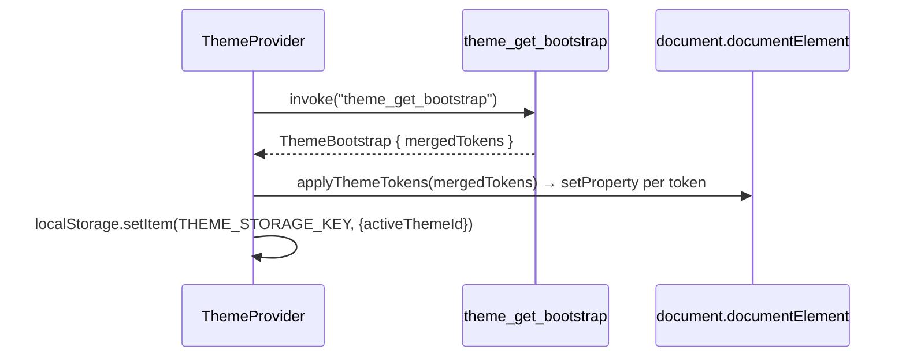

# 主题引擎

主题引擎（`src-tauri/src/theme/` + `src/hooks/use-theme.tsx` + `src/components/app/theme-*.tsx`）提供运行时切换 CSS 变量调色板的能力。内置 3 套 daisyUI 主题，支持基于内置主题派生的用户自定义主题，以及临时 `overrides` 用于实时调色。主题持久化到 `theme_settings.json`，通过 `theme://changed` 事件推送到前端，前端原子地写入 `document.documentElement.style` 作为内联 CSS 变量（覆盖 `App.css` `:root` 默认值）。

## 用途

- 定义 3 套内置主题（`olive-amber`、`valentine`、`arctic-blue`），默认主题为 `valentine`
- 主题 token 采用 daisyUI 命名体系：`--color-base-*`、`--color-primary`、`--color-error`、`--radius-*`、`--border`、`--depth`、`--noise`
- 允许用户自定义主题（`builtin: false`），与内置主题一同存储在 `theme_settings.json`
- 支持临时 `overrides`：在激活主题之上按 token 打补丁，用于实时预览，独立于主题定义持久化
- Rust 侧合并主题 tokens + overrides 为扁平 `merged_tokens` 列表，通过 `theme://changed` emit，前端逐条写入 `document.documentElement.style.setProperty(key, value)`
- 主题独立于配置系统（主题不打包进快照）
- **配色主题 ≠ 界面世界。** `olive-amber` / `valentine` / `arctic-blue` 只给战地控制台换 28 个 daisyUI token。黑标是另一条主窗口线路（壳、字、导航、组件全部不同），权威在 `DESIGN.md` 的 World B，视觉收口在 `blackmark-demo.html`。禁止用换色冒充黑标。overlay 窗口不吃黑标 token。
- **界面世界持久化。** `UiWorld`（`console` | `blackmark`）写 `localStorage` 键 `delta-auto-tools:ui-world`；黑标色相 `UiScheme`（`night` | `day`）写 `delta-auto-tools:ui-scheme`。两者都不进 `theme_settings.json`，也不进 Profile。默认黑标、夜航。显式选过战地的人继续战地。黑标顶栏日月按钮切换夜航/日间；日间把 daisyUI `--color-base-*` 接到 `--bm-*`，避免卡片仍吃战地暗色。overlay（`src/lib/overlay-windows.ts` 名单）强制当战地：不写 `data-ui-world` / `data-scheme`，根节点继续打落盘 daisyUI token。黑标切进来时 `presentThemeSession` **清掉**根节点 inline token，壳用 `--bm-*`，禁止把黑标映射进 28 个 daisyUI key。

## 目录结构

```text
src-tauri/src/theme/
├── mod.rs        # ThemeState、命令、build_bootstrap、export_theme
├── types.rs      # ThemeTokenOverride、ThemeDefinition、ThemeSettings、ThemeBootstrap
├── apply.rs      # merge_theme_tokens / find_theme 纯函数
├── builtins.rs   # 3 套 daisyUI 内置主题常量 + builtin_themes()
├── events.rs     # CHANGED = "theme://changed"
└── settings.rs   # theme_settings.json 读写

src/hooks/
└── use-theme.tsx   # ThemeProvider：bootstrap 获取、事件监听、applyThemeTokens、save/setActive/setOverrides

src/components/app/
├── theme-panel.tsx         # ThemePanel：预设 / token 编辑 / 导入导出
├── theme-types.ts          # TS 类型 + BUILTIN_THEME_IDS、EDITABLE_TOKEN_KEYS
├── theme-utils.ts          # applyThemeTokens / mergeThemeTokens / findTheme 等纯函数
└── theme-color-picker.tsx  # ThemeColorPicker：OKLCH 输入与颜色预览
```

## 关键抽象

| 抽象 | 路径 | 角色 |
|------|------|------|
| `ThemeTokenOverride` | `src-tauri/src/theme/types.rs` | `{ key, value }`，一个 CSS 变量。`key` 必须以 `--` 开头 |
| `ThemeDefinition` | `src-tauri/src/theme/types.rs` | `{ id, name, builtin, tokens }`，一套完整主题 |
| `ThemeSettings` | `src-tauri/src/theme/types.rs` | 持久化状态：`active_theme_id`、`custom_themes`、`overrides` |
| `ThemeBootstrap` | `src-tauri/src/theme/types.rs` | 一次性 payload：`active_theme_id`、`builtin_themes`、`custom_themes`、`overrides`、`merged_tokens` |
| `ThemeState` | `src-tauri/src/theme/mod.rs` | 运行时持有者：`Mutex<ThemeSettings>`。不走 `ToolState<T>` |
| `merge_theme_tokens` | `src-tauri/src/theme/apply.rs` | 纯函数：theme.tokens 为基底，overrides 替换同 key、追加新 key |
| `builtin_themes()` | `src-tauri/src/theme/builtins.rs` | 返回 3 套 daisyUI 内置主题的 `Vec<ThemeDefinition>` |
| `ThemeProvider` | `src/hooks/use-theme.tsx` | React context：获取 bootstrap、监听事件、原子应用 tokens |
| `applyThemeTokens` | `src/components/app/theme-utils.ts` | 前端纯函数：清除旧 tokens 后设置新 tokens |

## 工作原理

### Bootstrap 与应用流程



保存时（`theme_save_settings`），Rust 侧更新 `ThemeState`、持久化 `theme_settings.json`、计算 `current_merged_tokens`、emit `theme://changed` 到 `main` 窗口。前端监听器调用 `applyTokens(payload)`，原子地清除旧内联 tokens 并写入新 tokens。

### Token 合并语义

`merge_theme_tokens(theme, overrides)`：
1. 以 `theme.tokens` 为基底，保留顺序
2. 每个 base token 如有同 key override，使用 override 的值（重复 key 最后一个胜出）
3. 追加 base 中不存在的 override key

### 内置主题

3 套主题定义相同的 daisyUI token key 集合。`--border` 是 daisyUI 边框宽度，不再表示边框颜色；旧组件生成器/工业 token 不再作为迁移桥接层存在。

| ID | 名称 | 特征 |
|----|------|------|
| `olive-amber` | 橄榄琥珀 | 暗橄榄绿背景，琥珀主色 |
| `valentine` | 黑红控制台 | 默认主题，深色背景，铜缝，曳光红只作强调 |
| `arctic-blue` | 极地蓝红 | 浅蓝背景，红色主色 |

### 导入导出

`theme_export` 将主题序列化为 pretty JSON。`theme_import` 解析 JSON 为 `ThemeDefinition`，验证每个 token key 以 `--` 开头，前端侧强制 `builtin = false`。导入的主题不自动保存，用户在面板预览后决定是否添加为自定义主题。

## 集成点

- `src-tauri/src/lib.rs`：`theme::initialize()` 在 `setup` 中调用，4 个命令注册到 `generate_handler![]`
- `src/App.css`：`:root` 和 `@theme inline` 定义回退 token 值，运行时内联样式覆盖
- `src/main.tsx`：`ThemeProvider` 包裹应用
- `src/components/app/settings-page.tsx`：`SettingsDialog` 在主题 Tab 挂载 `ThemePanel`（战地）；黑标设置是 dock 整页
- `src/lib/overlay-windows.ts`：`?mode=` overlay 名单，供 `App.tsx` 与 `ThemeProvider` 共用
- [配置系统](profile-system.md)：主题与界面世界显式不参与 profile 快照

## 修改入口

- 新增第 4 套内置主题：在 `builtins.rs` 定义新函数返回 `Vec<ThemeTokenOverride>`，添加 ID 常量，追加到 `builtin_themes()`，更新前端 `BUILTIN_THEME_IDS`
- 新增面板可编辑 token：添加 key 到 `EDITABLE_TOKEN_KEYS`，添加标签到 `TOKEN_LABELS`
- 修改合并语义：同时修改 `apply.rs` 和 `theme-utils.ts`，保持同步

## 关键源文件

| 文件 | 用途 |
|------|------|
| `src-tauri/src/theme/mod.rs` | `ThemeState`、命令、`build_bootstrap`、`current_merged_tokens` |
| `src-tauri/src/theme/types.rs` | `ThemeTokenOverride`、`ThemeDefinition`、`ThemeSettings`、`ThemeBootstrap` |
| `src-tauri/src/theme/apply.rs` | `merge_theme_tokens`、`find_theme` 纯函数 |
| `src-tauri/src/theme/builtins.rs` | 3 套 daisyUI 内置主题常量、`builtin_themes()` |
| `src/hooks/use-theme.tsx` | `ThemeProvider`：bootstrap、事件监听、应用 tokens |
| `src/components/app/theme-panel.tsx` | `ThemePanel`：预设/token 编辑/导入导出 |
| `src/components/app/theme-utils.ts` | `applyThemeTokens` / `mergeThemeTokens` 等纯函数 |
| `src/components/app/theme-color-picker.tsx` | `ThemeColorPicker`：OKLCH 输入与颜色预览 |
