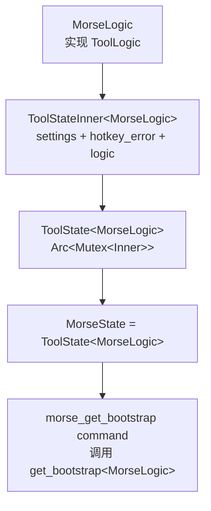

# 工具基座

`src-tauri/src/tool_base.rs` 中的工具基座层为每个工具模块提供共享的泛型结构，统一处理 settings 持久化、bootstrap 构造与错误处理。它消除了每个模块在 settings/bootstrap/error 循环上的重复样板代码。

## 用途

- 为所有工具模块提供统一的泛型基座，避免每个模块各自实现 settings 读取/保存、bootstrap 构造、错误返回逻辑
- 通过 `ToolLogic` trait 约定工具实现契约，通过 `ToolState<T>` 封装共享运行时状态
- 统一 mutex 损坏时的中文错误返回

## 关键抽象

| 类型 | 文件 | 说明 |
|------|------|------|
| `ToolLogic` | `src-tauri/src/tool_base.rs` | 每个工具实现的 trait：`load_settings`、`save_settings`、`build_bootstrap`、`emit_state`，以及关联类型 `Settings`/`Bootstrap` 和常量 `NAME` |
| `ToolState<T>` | `src-tauri/src/tool_base.rs` | 包装 `Arc<Mutex<ToolStateInner<T>>>`；每个模块起别名（如 `MorseState = ToolState<MorseLogic>`） |
| `ToolStateInner<T>` | `src-tauri/src/tool_base.rs` | 持有 `logic: T`（工具特有字段）、`settings: T::Settings`、`hotkey_error: Option<String>` |
| `get_bootstrap<T>` | `src-tauri/src/tool_base.rs` | 通用 command 实现；各模块提供薄 `#[tauri::command]` 包装 |

## 工作原理

每个工具模块定义一个 `Logic` 结构体（如 `MorseLogic`、`TimerLogic`、`RapidfireLogic`）实现 `ToolLogic`。该结构体持有工具特有的运行时字段，如历史记录、运行实例或待定选区。共享字段（`settings`、`hotkey_error`）放在 `ToolStateInner` 中。



访问内部状态始终通过 `state.lock_inner()`，它返回 `Result<MutexGuard<ToolStateInner<T>>, String>`。如果 mutex 中毒，会返回中文错误字符串，如 `"摩斯状态已损坏"`。

## Trait 契约

```rust
pub trait ToolLogic: Send + 'static {
    type Settings: Serialize + Deserialize + Default + Clone + Send + 'static;
    type Bootstrap: Serialize + Send + 'static;
    const NAME: &'static str;
    fn load_settings(app: &AppHandle) -> Result<Self::Settings, String>;
    fn save_settings(app: &AppHandle, settings: &Self::Settings) -> Result<(), String>;
    fn build_bootstrap(inner: &ToolStateInner<Self>) -> Self::Bootstrap;
    fn emit_state<R: Runtime>(app: &AppHandle<R>, bootstrap: &Self::Bootstrap);
}
```

`emit_state` 对每个工具是可选的：Morse 不会在每次状态变更时推送完整 bootstrap（只发送 `run-finished` 等特定事件），而 timer/counter/rapidfire 会发送带完整 bootstrap 的 `state-changed`。

## 使用者

- `MorseState = ToolState<MorseLogic>` - [Morse](../features/morse.md)
- `TimerState` 包装 `ToolState<TimerLogic>` 外加一个 `tick_task` 句柄 - [计时器](../features/timer.md)
- `CounterState` 包装 `ToolState<CounterLogic>` - [计数器](../features/counter.md)
- `RapidfireState = ToolState<RapidfireLogic>` - [连发器](../features/rapidfire.md)

> 计时器/计数器/连发器还在 ToolBase 之上扩展了 [同步工具基座](sync-tool.md)，共享分组/热键/位置等生命周期逻辑。

## 集成点

- `src-tauri/src/lib.rs` 的 `run()` 在 `setup` 中调用各工具的 `initialize`，返回的 `State` 通过 `app.manage()` 注册
- 各工具的 `xxx_get_bootstrap` command 调用泛型 `get_bootstrap<T>`
- [配置系统](profile-system.md) 在切换 profile 时复用各工具的 `pub(crate)` 函数重新加载内存状态

## 修改入口

- 新增工具：定义 `Logic` 结构体实现 `ToolLogic`，创建 `ToolState<T>` 别名，在 `lib.rs` 中 `initialize` 并 `app.manage()`
- 修改状态变更推送策略：调整工具 `emit_state` 实现
- 修改 mutex 错误文案：调整 `lock_inner` 中的中文错误字符串

## 关键源文件

| 文件 | 用途 |
|------|------|
| `src-tauri/src/tool_base.rs` | `ToolLogic` trait、`ToolState<T>`、`ToolStateInner<T>`、`get_bootstrap` |
