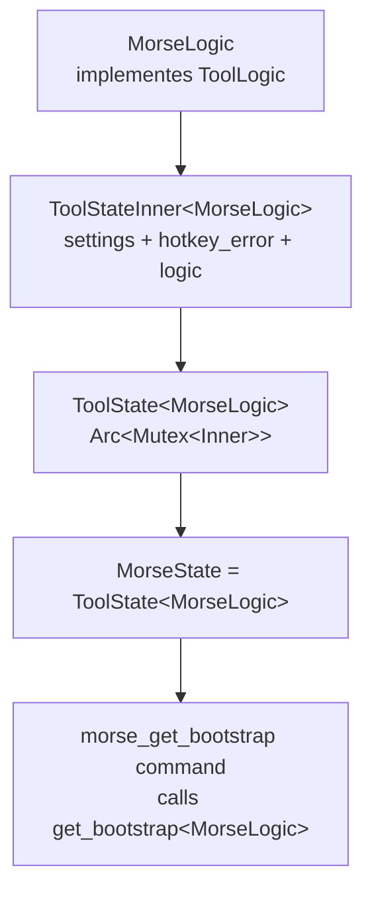

# Tool base

The tool base layer in `src-tauri/src/tool_base.rs` gives every tool module a shared generic structure for settings persistence, bootstrap construction, and error handling. It eliminates per-module boilerplate for the settings/bootstrap/error cycle.

## Key abstractions

| Type | File | Description |
|------|------|-------------|
| `ToolLogic` | `src-tauri/src/tool_base.rs` | Trait each tool implements: `load_settings`, `save_settings`, `build_bootstrap`, `emit_state`, plus associated `Settings`/`Bootstrap` types and `NAME` constant |
| `ToolState<T>` | `src-tauri/src/tool_base.rs` | Wraps `Arc<Mutex<ToolStateInner<T>>>`; each module aliases it (e.g. `MorseState = ToolState<MorseLogic>`) |
| `ToolStateInner<T>` | `src-tauri/src/tool_base.rs` | Holds `logic: T` (tool-specific fields), `settings: T::Settings`, `hotkey_error: Option<String>` |
| `get_bootstrap<T>` | `src-tauri/src/tool_base.rs` | Generic command implementation; modules provide thin `#[tauri::command]` wrappers |

## How it works

Each tool module defines a `Logic` struct (e.g. `MorseLogic`, `TimerLogic`, `RapidfireLogic`) that implements `ToolLogic`. The struct holds tool-specific runtime fields like history, runs, or pending selections. The shared fields (`settings`, `hotkey_error`) live in `ToolStateInner`.



Accessing the inner state always goes through `state.lock_inner()`, which returns `Result<MutexGuard<ToolStateInner<T>>, String>`. If the mutex is poisoned, it returns a Chinese error string like `"摩斯状态已损坏"` (corrupted).

## Trait contract

```rust
pub trait ToolLogic: Send + 'static {
    type Settings: Serialize + Deserialize + Default + Clone + Send + 'static;
    type Bootstrap: Serialize + Send + 'static;
    const NAME: &'static str;
    fn load_settings(app: &AppHandle) -> Result<Self::Settings, String>;
    fn save_settings(app: &AppHandle, settings: &Self::Settings) -> Result<(), String>;
    fn build_bootstrap(inner: &ToolStateInner<Self>) -> Self::Bootstrap;
    fn emit_state<R: Runtime>(app: &AppHandle<R>, bootstrap: &Self::Bootstrap);
}
```

`emit_state` is optional per tool: Morse does not push a full bootstrap on every state change (it only emits specific events like `run-finished`), while timer/counter/rapidfire emit `state-changed` with a full bootstrap.

## Users

- `MorseState = ToolState<MorseLogic>` - [Morse](../features/morse.md)
- `TimerState` wraps `ToolState<TimerLogic>` plus a `tick_task` handle - [Timer](../features/timer.md)
- `CounterState` wraps `ToolState<CounterLogic>` - [Counter](../features/counter.md)
- `RapidfireState = ToolState<RapidfireLogic>` - [Rapidfire](../features/rapidfire.md)

## Key source files

| File | Purpose |
|------|---------|
| `src-tauri/src/tool_base.rs` | `ToolLogic` trait, `ToolState<T>`, `ToolStateInner<T>`, `get_bootstrap` |
